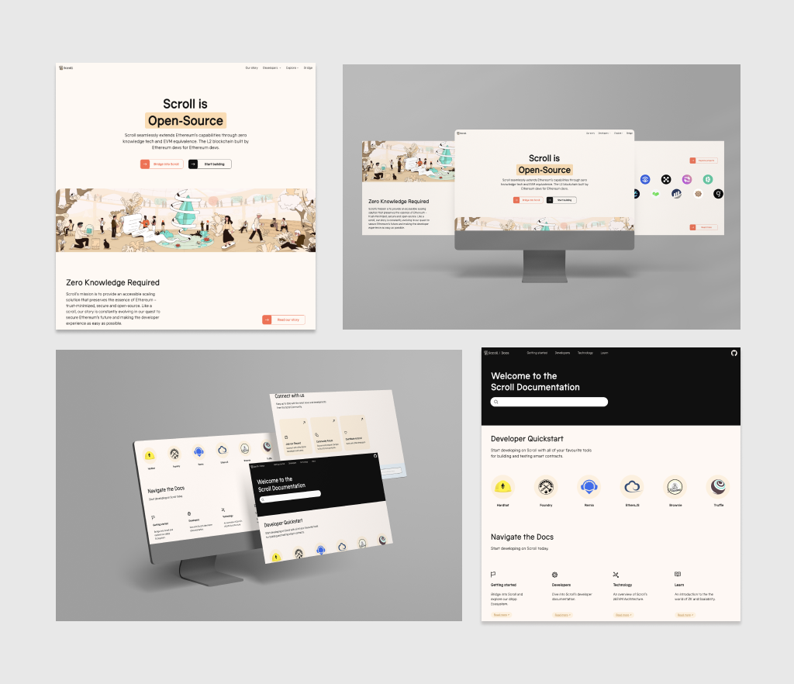

我们为 Scroll 提供了全新的外观、全新的网站、开发者门户等我为我们的团队和其他人所做的工作感到非常自豪。早在去年我加入时，我们所有人都清楚Scroll将进行重大更新。我们一直对于 Scroll 正在构建的内容感到兴奋，但社区经常让我们知道，他们希望看到我们提升用户端体验，并创建一个更现代化的标识。

## 改造过程

我们的新标识不是一夜之间建立起来的。这是一个长达数月的创造和迭代过程。通过与广泛的相关人员以及我们社区的反馈合作，我们希望揭示 Scroll 标识的本质，并表达使我们与众不同的价值观。

通过访谈、研讨会和会议，我们考虑了 Scroll 的每一个可能的角度、颜色、概念和解释。最后出现的是一个独特的标识，既鼓舞人心又易于识别。

在我加入后不久，我们启动了这个项目，让Scroll改头换面，与Human After All（HAA）一起领导整个过程，设计研讨会，会议等等。和HAA一起，我们改进并最终确定了Scroll的风格和总体方案，来完善Scroll的新品牌标识。

我们与设计师/品牌架构师 YTT密切合作，制定了一套强大而全面的指导方针，来统一 Scroll 对外形象。这些旨在确保Scroll 品牌表达保持一致。我们的指南深入探讨了 Scroll 的故事、核心价值观、愿景和品牌定位。

为了了解品牌指南包含的内容，我将向您介绍其一些主要方面：

**风格和定位**。在与HAA合作重新构想Scroll时，我想确保Scroll的风格反映我们的精神。我们不认为炒作是建立信任的最佳方式，而是通过透明、开放的沟通来了解我们社区的需求。我们希望提供信息，但不要听起来太学术，友好但听起来不随意。在这个过程中发现的一件有趣的事情是，我们认为哪些名人最能与Scroll产生共鸣。我们得出的结论是，Scroll是80%的Carl Sagan和20%的David Attenborough：好奇心，真诚和灵感与冒险，勤奋，直率和开放融为一体。

**标识**。对于我们的标识，我们从头开始，尝试了或多或少抽象的可能性，但经过我们的内部设计师YTT和Vivian的多次迭代，很明显，物理的卷轴是我们视觉的核心要素。对我们来说，卷轴象征着创造力、想象力和不断展开的叙事。这也与Scroll长期以来保持开放和以社区为中心的努力相协调，同时尽我们所能保护以太坊的核心原则。

我们对它进行了润色，让它变得抽象，以下就是我们最后的成果。

**配色和版面**。如果你只是快速浏览一下，你就会注意到Scroll的定位在我们的设计师选择的配色和排版中栩栩如生。原生的米色从第一天起就是 Scroll 身份的核心元素，我们认为这种颜色体现了 Scroll 的真实性和叙事，使我们在 web3 中的其他项目中脱颖而出。选择的互补色是青色、黑色和暖红色，代表开放、勤奋和冒险。我们最终的排版反映了Scroll的身份，其特点是简单和俏皮的和谐融合。

**插图**。我们希望确保 Scroll 的视觉元素强化了我们的信念，即创新的核心。找到一位了解我们需求的插画家并非易事！感谢Jonathan和Vivian的合作，他们带来的略带复古未来主义的插图旨在邀请用户在Scroll上探索未来，每个人都可以自由地构建新颖的应用程序。颜色植根于古老的砂岩色调，带有充满活力的新生命和生长。

## 新元素的应用

感谢我们的产品经理Kate，我们的开发者关系负责人Dan和我们的设计师Vivian的辛勤工作，我们的团队能够对Scroll的UX和UI进行相当大的升级。开发者门户从简单的 Wiki 页面转变为具有“开发快速入门”功能的更可靠的交互式体验。您还会注意到 Scroll 的文档排列直观，因此您永远不会陷入因为挖掘所需信息带来的困境。

我们的设计师 Vivian 给网站带来的不仅仅是视觉改造。她摒弃了高度简约的方法，为Scroll建立了一个更全面的家园，使了解社区变得更加容易，包括生态系统项目和有关我们团队的更详细信息。

## 升级的Scroll 周边

在周边上应用我们的新标识很有趣。我们都希望看到我们的社区会感到兴奋，并在回家后仍然会在日常生活中使用我们的周边。在接下来的活动中来找我们，您可能会得到一些有趣的周边。以下我们正在进行的一些创作

## 幕后花絮

Scroll 改造是由一群专业的Scrollers实现的。我想特别感谢我们的设计师YTT和Vivian，产品经理Kate，开发团队和开发人员关系负责人Dan，他们都在这个项目上孜孜不倦地工作。我还要感谢Scroll团队的每一位成员，包括Matt的所有文案工作（包括帮助我写这篇文章），Mei在整个过程中的所有支持，当然还有我们的创始人Ye，Sandy和Haichen。也向所有提供专业知识和支持的人致敬，尤其是在初始阶段。特别感谢Human After All的团队，Peregrine的Jonathan和Wicked Good Media的Alex ，他们的专业性在实现我们的愿景方面发挥了关键作用。

您可以在下方的链接访问完整的指南，我们始终欢迎反馈。您可以通过 hi@scroll.io 与我们联系，或者继续关注加入我们的下一次社区电话会议，与团队进行问答。请关注我们的社区频道以获取更多更新！

[Notion – The all-in-one workspace for your notes, tasks, wikis, and databases.](https://scrollzkp.notion.site/Scroll-Identity-Guidelines-External-5bb83465f56f40989c4f772b39ed3a06)