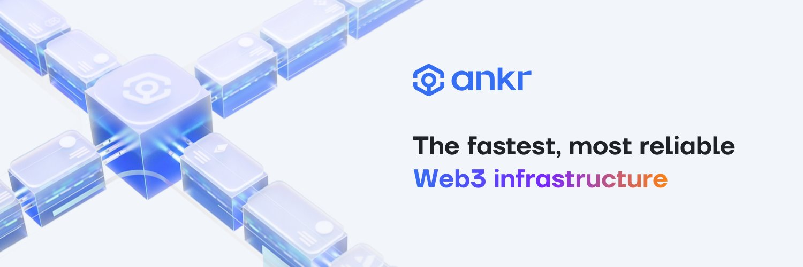

Ankr 提供了全套开发人员工具构建 web3 应用程序，并支持了 Scroll Alpha 测试网


Scroll是以太坊上基于zkEVM的zkRollup

为了使您的 Web3 应用程序与 Scroll 进行交互（通过读取区块链数据或向网络发送交易），它必须连接到 Scroll 节点。开发者可使用 API 提供的方法与区块链进行交互。

API 交互遵循 JSON-RPC，这是一种无状态的轻量级远程过程调用 （RPC） 协议。它定义了几种数据结构及其处理规则。它与传输无关，因为这些概念可以在同一进程中、通过sockets、HTTP 或其他消息传递环境使用。

# 网络
Alpha 测试网 (`HTTPS` and `WSS`)
- HTTPS Endpoint: https://rpc.ankr.com/scroll_testnet
- WSS Endpoint: Premium & Enterprise
Alpha 测试网由以太坊的Goerli测试网和Scroll Alpha测试网络组成。Goerli是一个基于PoS共识的以太坊测试网络，而Scroll Alpha是一个部署在前者之上的零知识汇总测试网。


# API 方法
对于 Scroll 的 Alpha 测试网，我们支持通过所有适用的方法进行区块链交互，除下方的方法外。
**HTTPS**:
`eth_newFilter`, `eth_getFilterChanges`, `eth_coinbase`, `eth_hashrate`, `eth_mining`, `eth_getWork`,`eth_submitWork`, `eth_submitHashrate`, `net_peerCount`, `eth_newBlockFilter`, `eth_newPendingTransactionFilter`, `eth_uninstallFilter`, `eth_getFilterLogs`,`debug_*`, `personal_*`, `admin_*`, `clique_*`, `les_*`, `miner_*`, `engine_*`, `parity_*`

**WSS**:
`txpool_content`, `txpool_inspect`, `txpool_status`, `txpool_contentFrom`

# API 查询
## cURL
### 请求示例
```
```curl -X POST https://rpc.ankr.com/scroll_testnet \
-H 'Content-Type: application/json' \
-d '{
      "jsonrpc": "2.0",
      "method": "eth_blockNumber",
      "params": [],
      "id": 1
    }'
```
### 响应示例
```
{
    "jsonrpc": "2.0",
    "id": 1,
    "result": "0x215d8b"
}
```

## Golang
### 请求示例
```
package main
 
import (
    "context"
    "fmt"
    "github.com/ethereum/go-ethereum/ethclient"
)
 
func main() {
    const url = "https://rpc.ankr.com/scroll_testnet"  // url string
 
    rpcClient,err := ethclient.Dial(url)
 
    if err != nil {
        panic(err)
    }
 
    blockNumber, err := rpcClient.BlockNumber(context.Background())
 
    if err != nil {
        panic(err)
    }
 
    fmt.Println(blockNumber)
}
```
### 响应示例
```
{
    "jsonrpc": "2.0",
    "id": 1,
    "result": "0x215d8b"
}
```

## Web3.JS
### 请求示例
```
const Web3 = require('web3');
 
const url = 'https://rpc.ankr.com/scroll_testnet'  // url string
 
const web3 = new Web3(new Web3.providers.HttpProvider(url));
 
web3.eth.getBlockNumber((error, blockNumber) => {
    if(!error) {
        console.log(blockNumber);
    } else {
        console.log(error);
    }
});
```
### 响应示例
```
{
    "jsonrpc": "2.0",
    "id": 1,
    "result": "0x215d8b"
}
```

## Python
### 请求示例
```
from web3 import Web3
 
def test_block_number(self):
    url = 'https://rpc.ankr.com/scroll_testnet'  # url string
 
    web3 = Web3(HTTPProvider(url))
    print(web3.eth.block_number)
```
### 响应示例
```
{
    "jsonrpc": "2.0",
    "id": 1,
    "result": "0x215d8b"
}
```
