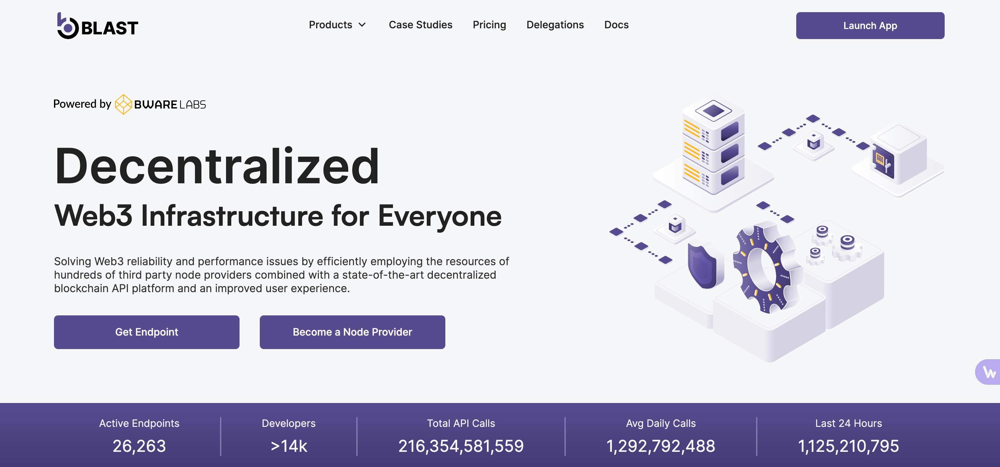
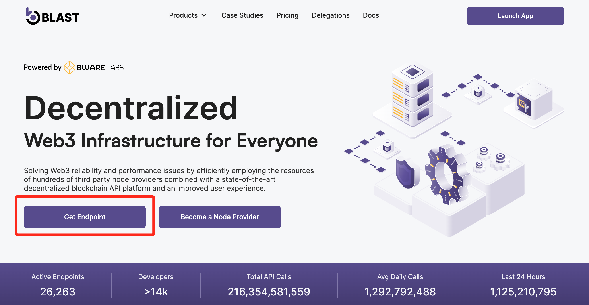
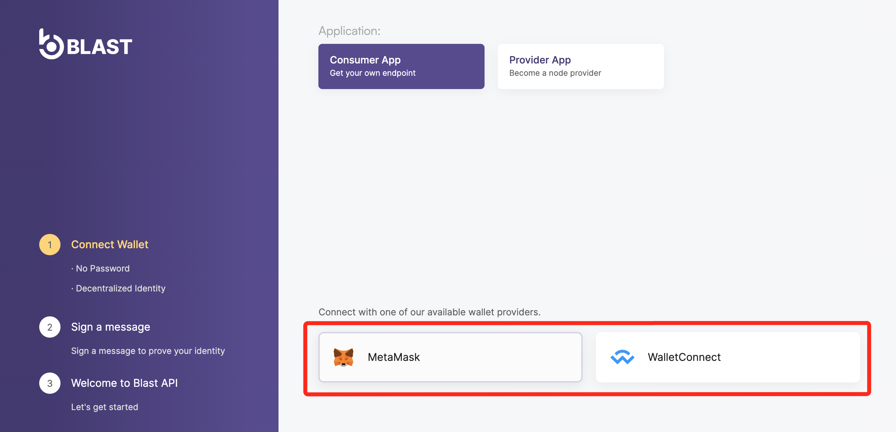
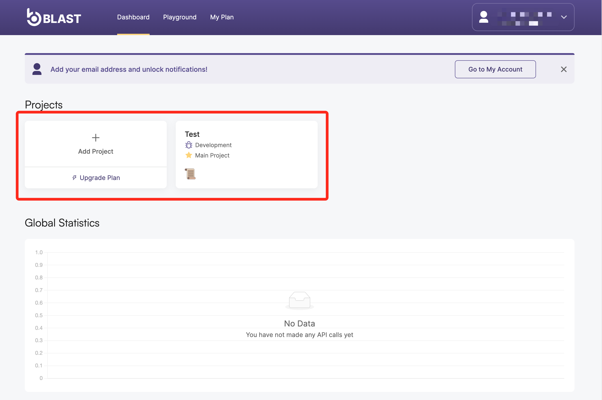
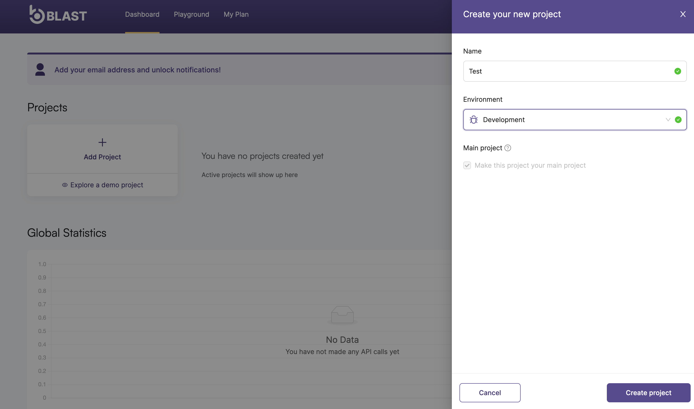
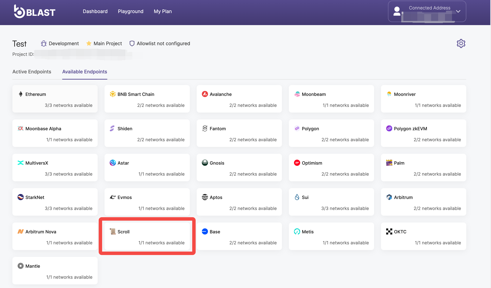
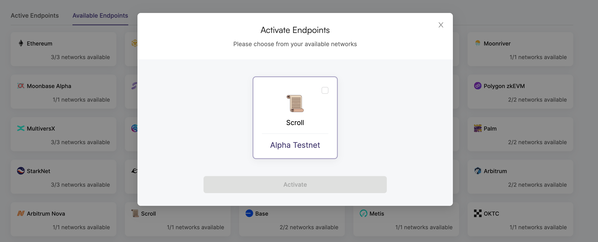
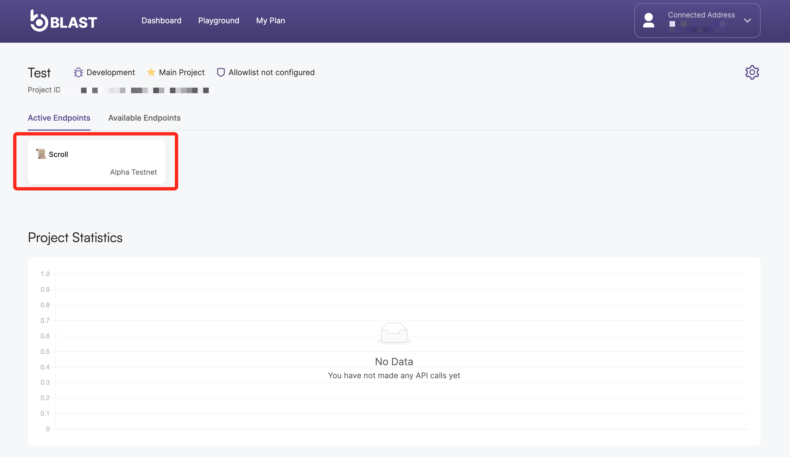

BLAST是一个基于订阅的多链API平台，可以对相关网络实现最快，最可靠的区块链访问。使用Blast，区块链开发者能够绕过运行自己的基础设施所涉及的所有障碍，从而降低中断风险和基础设施成本。

- 公共 API：https://blastapi.io/public-api/scroll

让我们快速浏览一下如何使用Blast API在Scroll上开发您的dApp

1. 前往 blastapi.io

2. 如果您以前从未使用过 Blast，点击“Get Endpoint”或“Connect”

3. 连接您的Metamask钱包或其他钱包连接并按照以下步骤操作

4. 创建一个新项目，以便能够生成您的 API Endpoint，或使用您已经创建的项目之一

5. 在项目空间内，转到 Available Endpoints 并激活Scroll。

