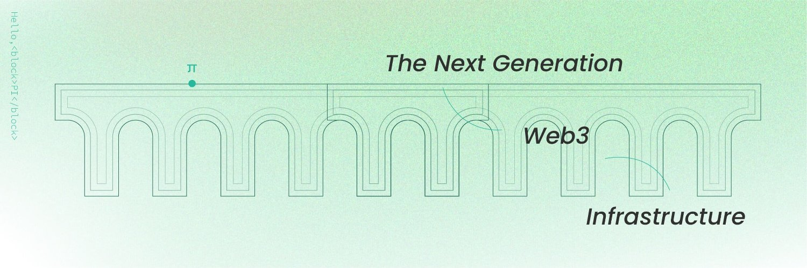
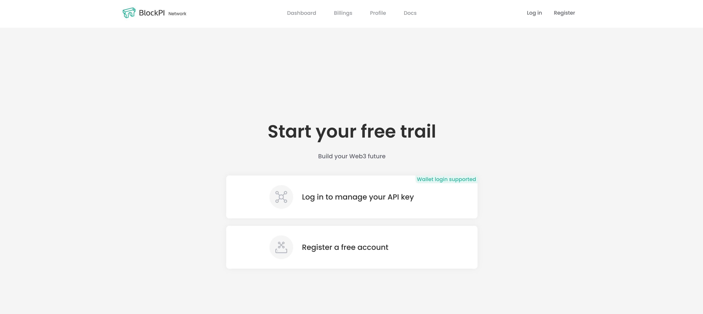
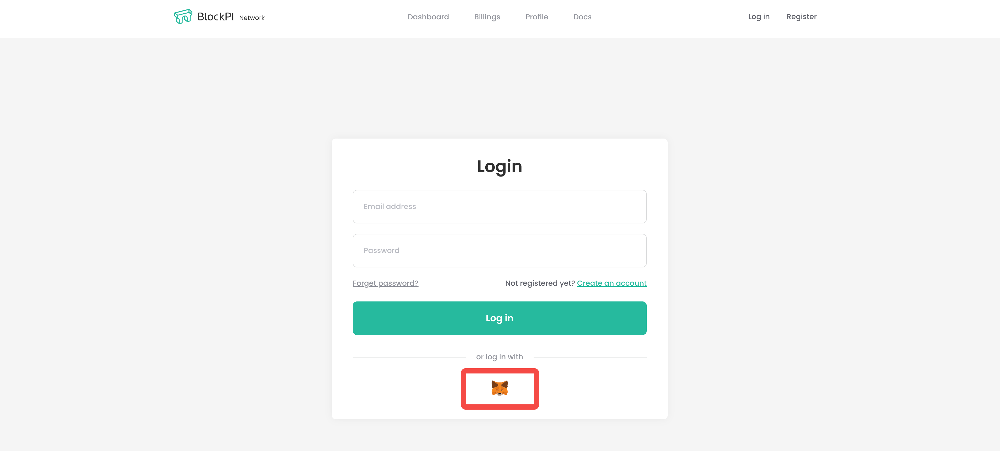
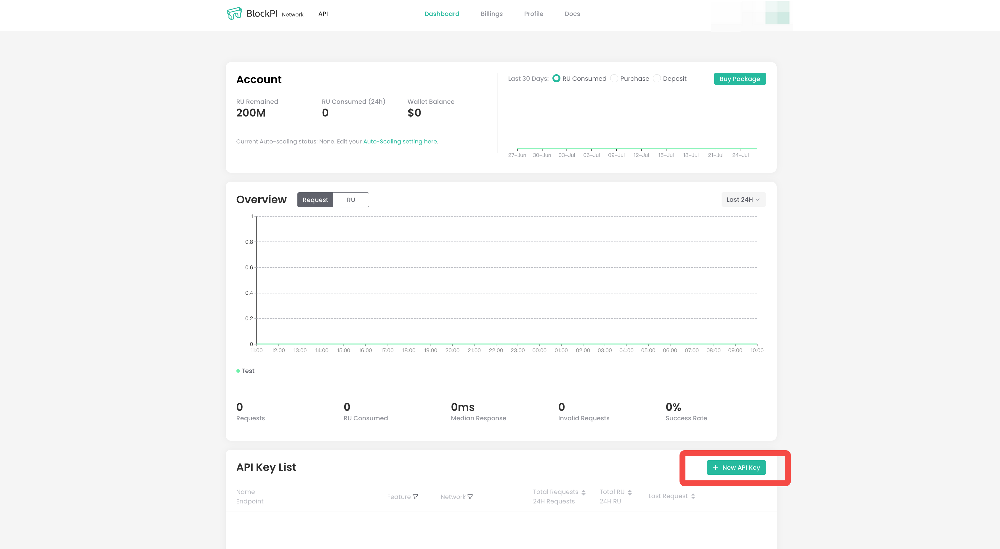
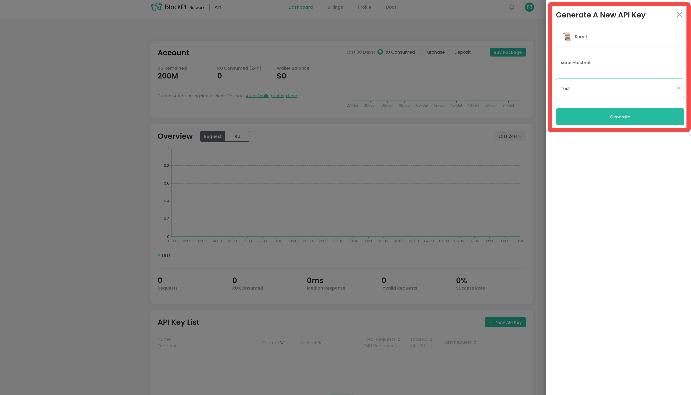
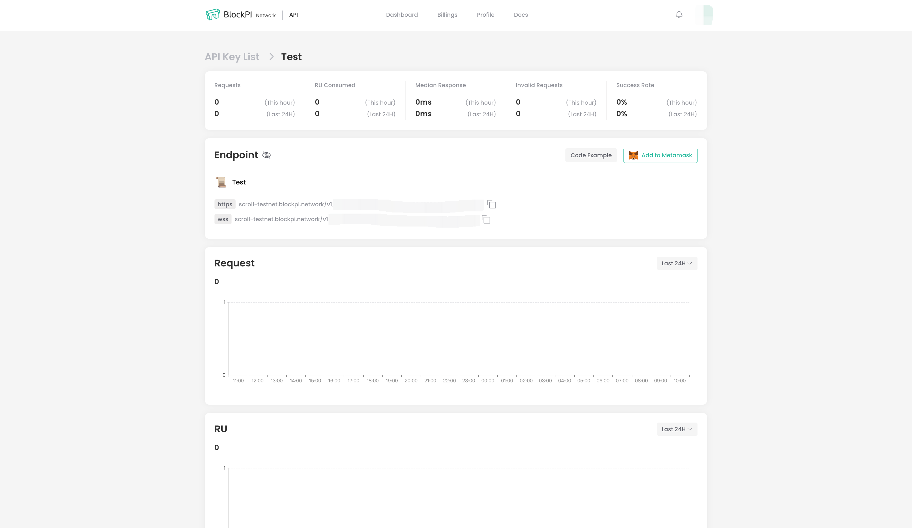

BlockPI Network 旨在提供优质、稳健、高效的 RPC 服务。为了避免单点故障和可扩展性的限制，网络被设计成具有可扩展工作节点的分布式结构。

让我们快速浏览一下如何使用BlockPI 在Scroll上开发您的dApp
1. 前往 https://blockpi.io/

2. 点击“Get Start”，选择登陆方式

3. 在面板页面，点击右下方“New API Key”

4. 选择网络，输入项目名称

5. 回到看板页面，使用Https和wss Endpoint

关于BlockPI完整API接口，请参考文档
[Scroll - BlockPI Network](https://docs.blockpi.io/documentations/api-reference/scroll)

