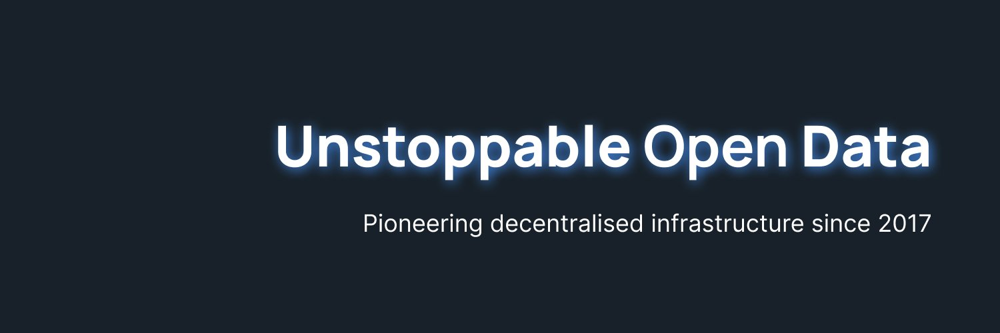

Pocket Network 是 Web3 节点基础设施的 TCP/IP——一种多链中继协议，激励 RPC 节点为 DApp 及其用户提供多样化/的 Web3 访问。
使用 Pocket Network 就像任何其他RPC一样简单。如果您已经在使用集中式 RPC 提供程序，那么 Pocket 门户将是一个熟悉的界面，我们建议每个人开始使用。

通过利用Portal的RPC服务，Scroll将能够更有效地向广泛的应用程序提供其原生zkEVM解决方案，进一步巩固其作为以太坊生态系统关键参与者的地位。

# 创建去中心化Scroll RPC
- 注册一个帐户
- 创建新应用程序
- 使用我们的“Always Free”套餐
- 为Scroll或 Pocket 支持的数十个链中的任何一个添加您自己的私有 Endpoint

# 查看 Pocket 的快速入门指南
现在，你已拥有自己的Endpoint，是时候使用它了。Portal 旨在直接在您常用框架和库中工作。
- 构建应用程序的接口。了解如何将 Pocket Endpoint与常用库配合使用。
- 访问开发环境中。了解如何在不同的智能合约环境中利用你的Endpoint
- 直接访问区块链数据。了解如何使用 Pocket Endpoint 直接在浏览器中与底层区块链 API 进行交互。
[Quickstart - Pocket Network](https://docs.pokt.network/build/quickstart)

# 使用 Pocket API 文档
Pocket API 文档分解了您可以使用端点发出的所有不同请求，并提供正确请求和成功响应的交互式示例。
[Pocket Network](https://docs.pokt.network/api-docs)
此外，Pocket API 文档还带来了更多方便的额外功能：
- 在近 20 种不同的语言之间进行选择，以查看请求示例，从 JavaScript 和 Python 到 Ruby 和 Swift，以及介于两者之间的所有语言。
- 使用你的 Portal ID 直接通过浏览器发送 API 请求
