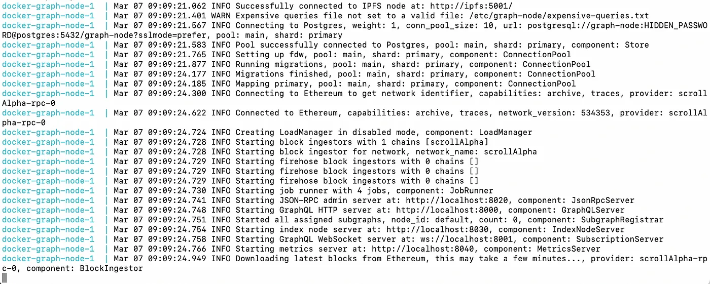
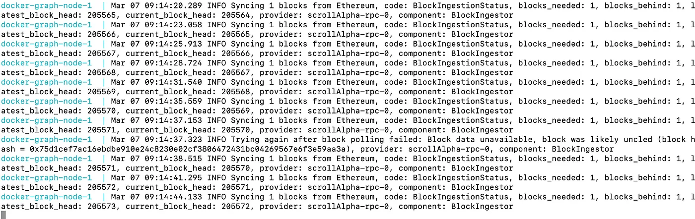
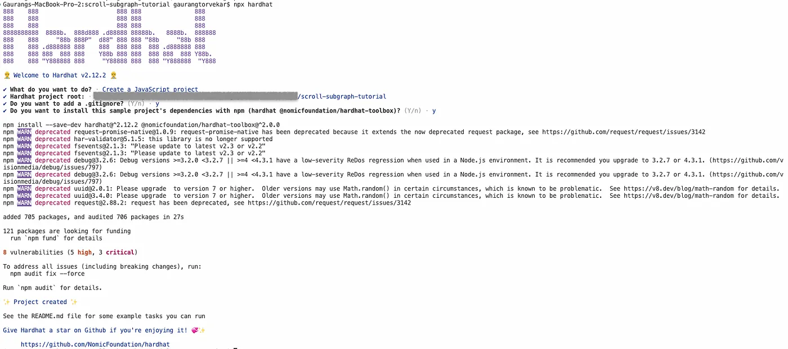
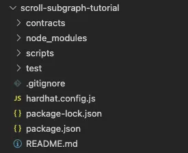
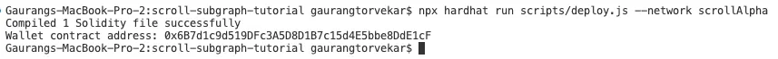
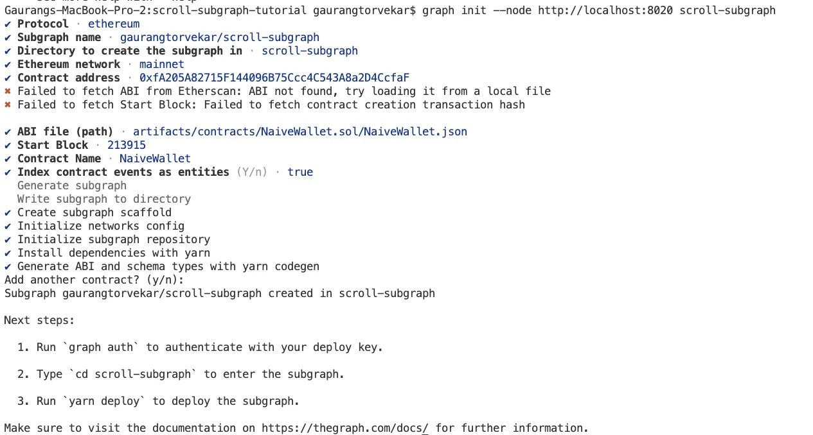
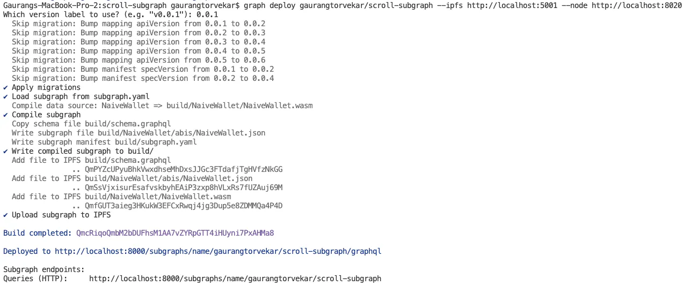

[

[Tutorial for The Graph on Scroll Alpha Testnet | Coinmonks](https://medium.com/coinmonks/tutorial-for-the-graph-on-scroll-alpha-testnet-9982440a4849)
- 作者：Gaurang （GT） Torvekar

The Graph 可以说是支撑几乎所有EVM网络的最重要的基础设施层之一。最近，他们还开始支持其他网络，如Arweave，Near和Cosmos等！话虽如此，Graph本身并不支持很多测试网，特别是在像Scroll zkEVM的Alpha测试网这样的新进入者。

本教程分为三个部分。在第一部分中，您将学习如何部署支持Scroll Alpha 测试网的本地 Graph 节点。在第二部分中，您将创建一个 Hardhat 项目并在测试网上部署一个智能合约，我们将使用我们的 subgraph 对其进行索引。在第三部分中，您将学习如何创建连接到此本地 Graph 节点的 subgraph，从而在Scroll测试网上索引您的智能合约。有了这个 subgraph 后，您可以在DAPP中将其用于多种用途，例如统计信息仪表板。


# 如何创建本地 Graph 节点

有两种方法可以创建本地图形节点。第一种是编译他们的源代码，或者第二种（也是推荐的）方法是使用 Docker！

在开始之前，请确保您的计算机上安装了以下内容
- NodeJS
- Docker 
- Docker Compose

让我们从 Graph 团队提供的 graph-node 仓库开始

```
git clone https://github.com/graphprotocol/graph-node  
  
cd graph-node/docker
```


之后，您必须在 ./setup.sh 上安装安装文件。这将在 docker-compose.yml 文件中加载所有 docker 映像和所需信息。

```
./setup.sh
```

完成此操作后，您需要编辑 docker-compose.yml 文件并更改该文件 `ethereum` 中的值。默认值要求您在端口 8545（如 ganache 或 geth）上运行本地以太坊网络节点，但在 Scroll Alpha 测试网的情况下，您只需连接到他们的 RPC URL — https://alpha-rpc.scroll.io/l2

因此，此处“ethereum”的值应该是'scrollAlpha：https：//alpha-rpc.scroll.io/l2'。

>注意 : 请确保您为您的网络输入了一个容易记忆的名称，例如“scrollAlpha”，因为这是我们在第 2 部分中创建 subgraph 时将使用的名称

docker-compose.yml 文件现在应该看起来像这样

```json
version: '3'  
services:  
	graph-node:  
		image: graphprotocol/graph-node  
		ports:  
			- '8000:8000'  
			- '8001:8001'  
			- '8020:8020'  
			- '8030:8030'  
			- '8040:8040'  
		depends_on:  
			- ipfs  
			- postgres  
		extra_hosts:  
			- host.docker.internal:host-gateway  
		environment:  
			postgres_host: postgres  
			postgres_user: graph-node  
			postgres_pass: let-me-in  
			postgres_db: graph-node  
			ipfs: 'ipfs:5001'  
			ethereum: 'scrollAlpha:https://alpha-rpc.scroll.io/l2'  
			GRAPH_LOG: info  
		ipfs:  
			image: ipfs/go-ipfs:v0.10.0  
			ports:  
			- '5001:5001'  
			volumes:  
			- ./data/ipfs:/data/ipfs  
		postgres:  
			image: postgres  
			ports:  
				- '5432:5432'  
			command:  
				[  
				"postgres",  
				"-cshared_preload_libraries=pg_stat_statements"  
				]  
			environment:  
				POSTGRES_USER: graph-node  
				POSTGRES_PASSWORD: let-me-in  
				POSTGRES_DB: graph-node  
				# FIXME: remove this env. var. which we shouldn't need. Introduced by  
				# <https://github.com/graphprotocol/graph-node/pull/3511>, maybe as a  
				# workaround for https://github.com/docker/for-mac/issues/6270?  
				PGDATA: "/var/lib/postgresql/data"  
				POSTGRES_INITDB_ARGS: "-E UTF8 --locale=C"  
				volumes:  
				- ./data/postgres:/var/lib/postgresql/data
```

完成此操作后，您可以通过运行以下命令启动 Docker 容器

```
docker-compose up
```


这将启动 Docker 容器，并将本地节点从 RPC URL 同步到现有区块链。您的节点可能需要一段时间才能赶上所有已经开采的区块。你应该看到如下的内容



您可以通过查看 https://blockscout.scroll.io/ 上的最新块来检查您的节点是否已同步。


## 重新启动/重新同步节点

有关区块链的所有数据都存储在本地 /data 文件夹中。如果必须重新启动节点，此文件夹将不同步，并可能导致一些问题。因此，通常最好删除整个文件夹并从头开始重新同步整个区块链。

```
rm -rf /data  
  
docker-compose up
```


## 将节点公开

一旦您知道如何创建本地节点，您就可以很好地将整个过程复制到Amazon EC2实例或Google Cloud服务器上。您可以通过像 Nginx 这样的代理公开所需的端口，并使您的 Graph 节点可供社区使用！我不会在本教程中介绍这部分，因为有几个高质量的教程可以帮助您做到这一点！


# 创建连接到 Scroll Graph 节点的subgraph


本部分假设您的机器上已经安装了 Hardhat。如果没有，请首先从他们的网站上完成这些步骤。

> 注意：如果您已经在测试网上部署了一个智能合约（以及 ABI），那么您可以跳过这一部分，直接转到第 3 部分。确保在创建subgraph时在subgraph.yaml中使用该ABI。

假设您熟悉使用Hardhat的智能合约开发，可以在我的 Github 存储库中找到本教程的完整代码。
[GitHub - gaurangtorvekar/scroll-subgraph-tutorial](https://github.com/gaurangtorvekar/scroll-subgraph-tutorial)


在第 1 部分中创建本地 Graph 节点后，我们现在需要在此项目中创建一个新的 Hardhat 项目， `init`  一个新的subgraph

```
cd ../..  
  
mkdir scroll-example-subgraph  
  
npx hardhat
```

暂时接受所有选项。hardhat完成安装后，终端应显示如下


您可以在自己喜欢的代码编辑器中打开此项目，例如Visual Studio Code。文件结构应如下所示


接下来，在文件夹的根目录中创建一个 .env 文件。在该文件中，您需要为这两个变量添加值 

```
SCROLL_RPC_URL=https://alpha-rpc.scroll.io/l2  
ACCOUNT_KEY=XXXX <Private key of an Ethereum account used to deploy the contract>
```

我们还需要安装一些 npm 包。运行此命令 

```
npm i dotenv @nomiclabs/hardhat-ethers ethers
```


安装这些软件包后，我们需要更新 hardhat.config.js 文件以添加 Scroll Alpha 测试网网络。将该文件中的代码替换为

```js
require("@nomicfoundation/hardhat-toolbox");  
require("dotenv").config({ path: ".env" });  
  
/** @type import('hardhat/config').HardhatUserConfig */  
module.exports = {  
	solidity: "0.8.17",  
	networks: {  
		scrollAlpha: {  
			url: process.env.SCROLL_RPC_URL,  
			accounts: [process.env.ACCOUNT_KEY],  
	}  
}  
};
```

让我们编写一个智能合约以部署在 Scroll Alpha 测试网上。我们将从本教程第 3 部分中创建的子图中索引此智能合约。

在本教程中，我编写了一个名为NaiveWallet.sol的简单智能合约。它有三个主要功能 — `deposit` 和 `withdraw` `transfer` 。使用这些功能，任何人都可以添加 ETH 等原生加密货币，将其删除并将其转移到另一个地址。

从 /contract 文件夹中删除 Lock.sol 文件，创建一个名为 NaiveWallet.sol 的新文件，并将此代码添加到该文件中 

``` js
// SPDX-License-Identifier: GPL-3.0  
pragma solidity >0.8.0;  
  
// Dev Notes - This is a potentially insecure, naive wallet implementation just for the purposes of demonstration and for this tutorial.  
// It is NOT AT ALL recommended to be used in Production or to store any real assets.  
contract NaiveWallet {  
	mapping(address => uint) public balances;  
	  
	event Deposit(address indexed from, uint256 indexed amount);  
	event Transfer(address indexed from, address indexed to, uint256 indexed amount);  
	event Withdraw(address indexed from, uint256 indexed amount);  
	  
	function deposit() public payable {  
		require(msg.value > 0, "Deposit must be more than 0");  
		balances[msg.sender] += msg.value;  
		emit Deposit(msg.sender, msg.value);  
	}  
	  
	function withdraw(uint256 _amount) public {  
		require(_amount > 0, "Cannot withdraw an amount less than 0");  
		require(balances[msg.sender] >= _amount, "Cannot withdraw more than you own");  
		balances[msg.sender] -= _amount;  
		(bool sent,) = payable(msg.sender).call{value: _amount}("");  
		require(sent, "Failed to send Ether");  
		emit Withdraw(msg.sender, _amount);  
	}  
	  
	function transfer(address _to, uint256 _amount) public {  
		require(_amount > 0, "Cannot transfer less than 0");  
		require(balances[msg.sender] >= _amount, "Cannot transfer more than you own");  
		balances[msg.sender] -= _amount;  
		balances[_to] += _amount;  
		emit Transfer(msg.sender, _to, _amount);  
	}  
	  
	function getBalance(address _from) view public returns(uint)
	{  
		return balances[_from];  
	}  
}
```


编写智能合约后，我们需要更新部署脚本，以便 Hardhat 可以将我们的合约部署到测试网。从脚本/部署中删除所有代码.js并将其替换为以下代码。在这里，我们使用 Hardhat 在编译合约后生成的 ABI 创建钱包合约的实例，然后使用 .env 文件中提到的私钥部署它。
```js
// We require the Hardhat Runtime Environment explicitly here. This is optional  
// but useful for running the script in a standalone fashion through `node <script>`.  
//  
// You can also run a script with `npx hardhat run <script>`. If you do that, Hardhat  
// will compile your contracts, add the Hardhat Runtime Environment's members to the  
// global scope, and execute the script.  
const { ethers } = require("hardhat");  
  
async function main() {  
	const walletContract = await ethers.getContractFactory("NaiveWallet");  
	const deployedWalletContract = await walletContract.deploy();  
	  
	await deployedWalletContract.deployed();  
	console.log("Wallet contract address:", deployedWalletContract.address);  
}  
  
// We recommend this pattern to be able to use async/await everywhere  
// and properly handle errors.  
main().catch((error) => {  
	console.error(error);  
	process.exitCode = 1;  
});
```


现在我们已经准备好了智能合约和部署脚本，我们可以将合约部署到 Scroll Alpha 测试网。在您的终端中运行此命令

```
npx hardhat run scripts/deploy.js --network scrollAlpha
```


输出应如下所示（合约地址将有所不同）



确保保存此智能合约的地址，因为在接下来的几个步骤中我们将需要它。


# 在Scroll Alpha 测试网上创建 Subgraph

要开始使用，您必须首先在计算机上安装Graph CLI。为此，请在终端中运行以下命令

```
npm install -g @graphprotocol/graph-cli
```

此命令将在您的计算机上全局安装graph CLI。完成后，我们可以 `init` 在项目目录中绘制subgraph。确保您位于项目的根目录中，并运行以下命令

```
graph init --node http://localhost:8020 scroll-subgraph
```


在上面的命令中，http://localhost:8020 是连接到 Docker 中本地graph节点的 URL。此命令将要求您提供一些命令行选项。在本教程中，您可以输入这些值（在“||=>'之前).

```
✔ Protocol · ethereum  
✔ Subgraph name · gaurangtorvekar/scroll-subgraph ||=> (Note - format is <username>/<subgraph-name>)  
✔ Directory to create the subgraph in · scroll-subgraph  
✔ Ethereum network · mainnet ||=> (Note - keep this as mainnet for now, we will change it later)  
✔ Contract address · 0xfA205A82715F144096B75Ccc4C543A8a2D4CcfaF ||=> (Note - this is the contract you deployed in Part 2 above)  
✔ ABI file (path) · artifacts/contracts/NaiveWallet.sol/NaiveWallet.json   
✔ Start Block · 213915 ||=> (Note - this is the block number when your contract was deployed)  
✔ Contract Name · NaiveWallet  
✔ Index contract events as entities (Y/n) · true  
✔ Add another contract? (y/n): n ||=> (Note - You can add another contract if you like)
```


如果你输入这些值，你的终端输出应该看起来会是这样




现在，让我们进入subgraph目录并对 subgraph.yaml 文件进行一些更改。

```
cd scroll-subgraph/
```

在您喜欢的代码编辑器中打开文件 subgraph.yaml，然后将 from `mainnet` 的值 `network` 更改为 `scrollAlpha` 。文件现在应如下所示

```json
specVersion: 0.0.5  
schema:  
	file: ./schema.graphql  
dataSources:  
	- kind: ethereum  
	name: NaiveWallet  
	network: scrollAlpha  
	source:  
		address: "0xfA205A82715F144096B75Ccc4C543A8a2D4CcfaF"  
		abi: NaiveWallet  
		startBlock: 213915  
	mapping:  
		kind: ethereum/events  
		apiVersion: 0.0.7  
		language: wasm/assemblyscript  
		entities:  
			- Deposit  
			- Transfer  
			- Withdraw  
		abis:  
			- name: NaiveWallet  
				file: ./abis/NaiveWallet.json  
		eventHandlers:  
			- event: Deposit(indexed address,indexed uint256) 
				handler: handleDeposit  
			- event: Transfer(indexed address,indexed address,indexed uint256)  
				handler: handleTransfer  
			- event: Withdraw(indexed address,indexed uint256)  
				handler: handleWithdraw  
		file: ./src/naive-wallet.ts
	```

对 yaml 文件进行此更改后，请查看 schema.graphql 文件。在此文件中，graph CLI 根据智能合约中定义的事件将为您自动生成

还有一个相应的映射文件，可以在src/naive-wallet.ts中找到。在此文件中，您可以找到一些代码，这些代码将用于使用区块链中的适当值填充和同步subgraph。这样，您就会公开一个任何 DAPP 都可以直接查询的 API。

一旦您熟悉了新subgraph中的文件并进行了必要的更改，我们需要运行更多命令在本地节点上创建subgraph并部署它。

在您的终端上运行以下命令

```
graph codegen  
  
graph build  
  
graph create <username>/scroll-subgraph --node http://localhost:8020  
  
graph deploy <username>/scroll-subgraph --ipfs http://localhost:5001 --node http://localhost:8020
```

成功部署子图后，您的终端输出应如下所示



现在您已经部署了subgraph，您构建的任何 DAPP 都可以查询 URL http://localhost:8000/subgraphs/name/gaurangtorvekar/scroll-subgraph


## 将subgraph公开

与本地图节点一样，您可以将此subgraph部署在亚马逊或谷歌等云服务器上。使用 Nginx，您可以将端口 8000 公开给互联网，从而使您的subgraph可供社区使用。但是，这超出了本教程的范围。