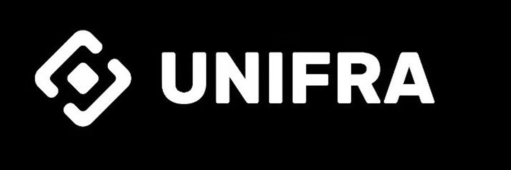
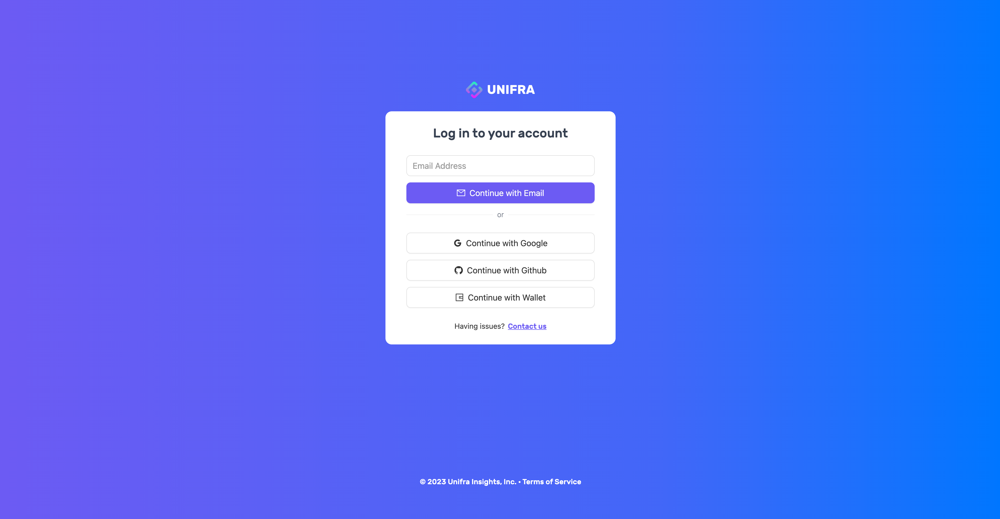
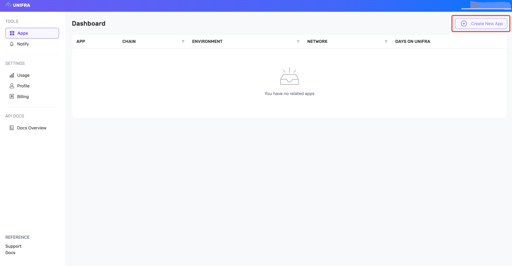
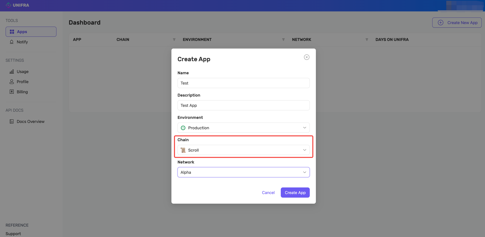
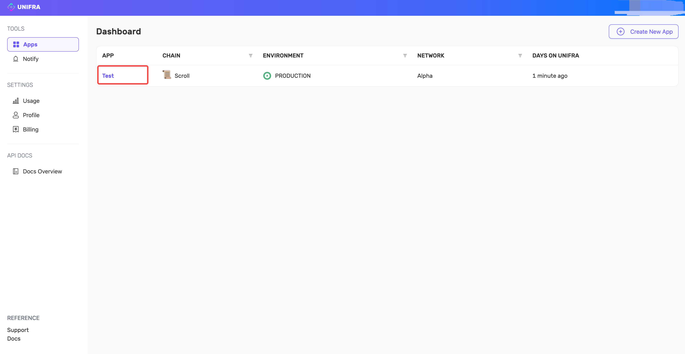
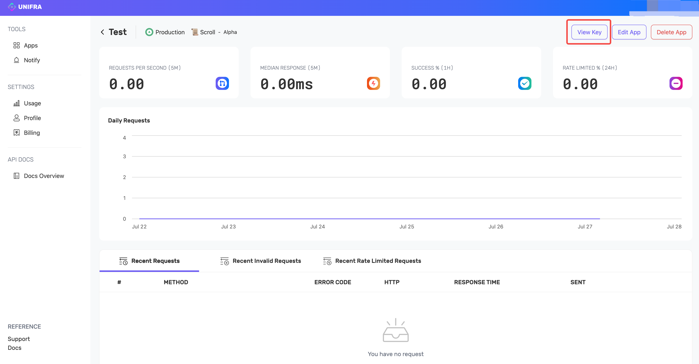

Unifra 是一个 Web3 开发人员平台，专注于简化区块链开发，构建了一套开发人员工具、增强的 API 和现金的节点基础设施，以无缝构建和运行区块链应用程序。

让我们快速浏览一下如何使用 Unifra 在Scroll上开发您的dApp

1. 前往 [UNIFRA](https://www.unifra.io/)，点击“Get Start"

2. 选择登陆方式

3. 创建新的应用

4. 输入App名称，描述，选择网络为“Scroll”

5. 点击创建完成的项目

6. 点击“View Key”进行查看

L2scan区块链浏览器是一个基于Web的工具，允许用户探索和分析L2scan区块链的内容。它提供了一个用户友好的界面，用于查看交易历史记录、检查帐户余额和跟踪网络活动状态。凭借实时更新、搜索功能和可自定义视图等功能

- Scroll Blockchain Explorer：[https://scroll.l2scan.co/](https://scroll.l2scan.co/)
- Github: 
	- [scroll-explorer](https://github.com/unifra20/scroll-explorer)
	- [scroll-explorer-l2-indexer](https://github.com/unifra20/scroll-explorer-l2-indexer)
