Versa是Scroll的Beta测试网上的第一个原生智能钱包！
Versa是一个移动端优先的帐户抽象钱包，经过优化，可将 Web3 技术的采用扩展到主流受众。 Versa 在 Scroll 上原生构建，提供了多种功能，例如定期转账、计划交易和社交恢复。

## 基本功能
1. 前往 https://versawallet.io/ 下载对应移动端钱包，下面以iOS版本为例
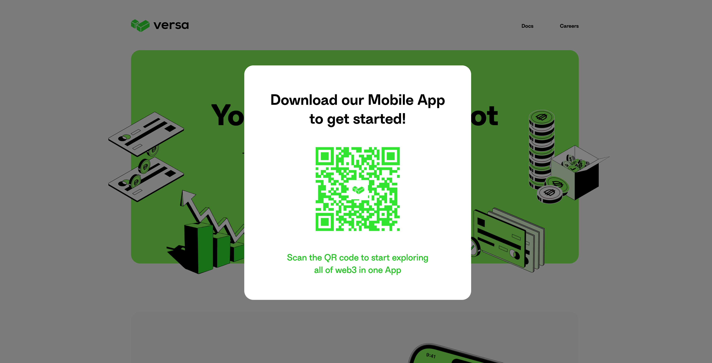
2. 下载Testflight测试版本后，点击创建钱包
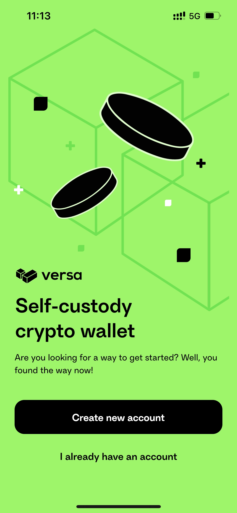
3. 使用邀请码：ONSCROLL，目前Versa为Beta测试网保留了500个名额！

4. 输入钱包名称 
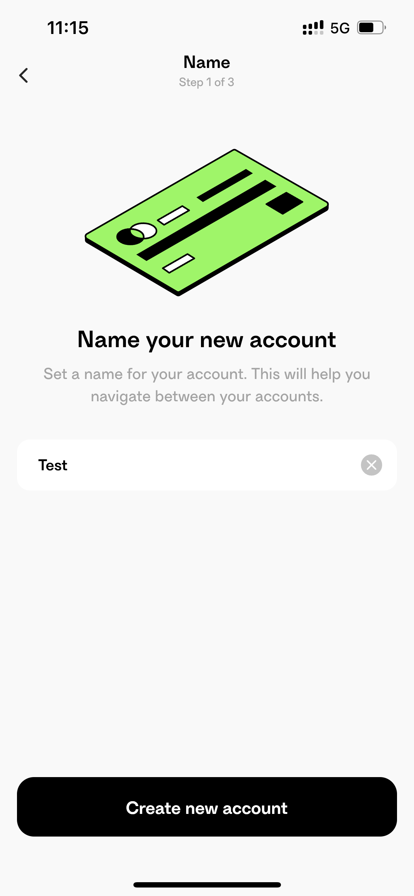
5. 输入九宫格密码
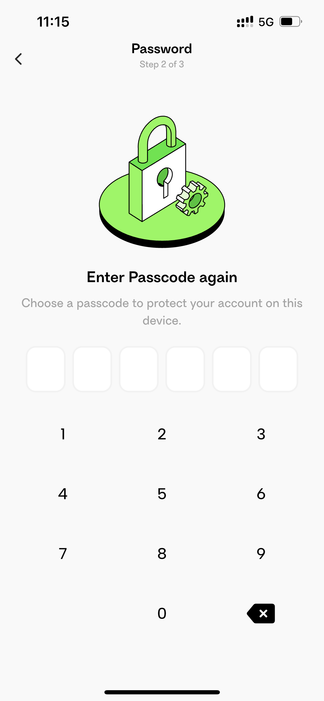
6. 启用Face ID
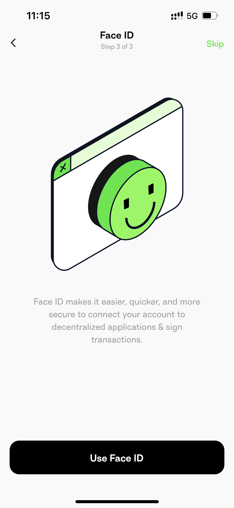
7. 进入钱包页面后，点击Faucet领取测试代币，随后可进行常规转账，收款
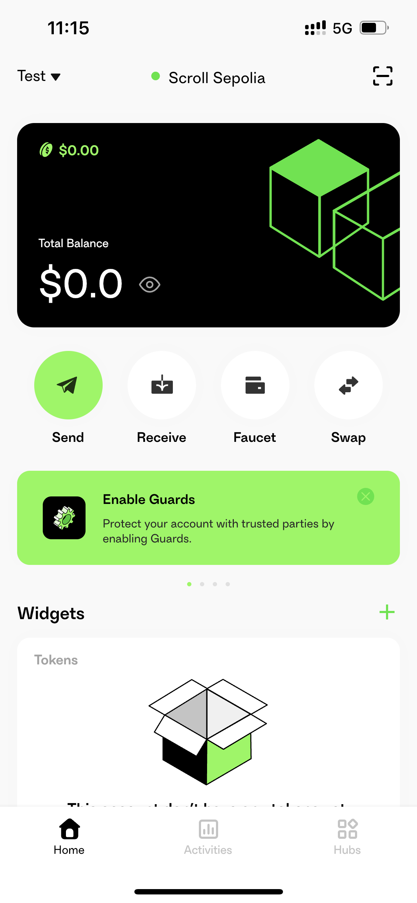
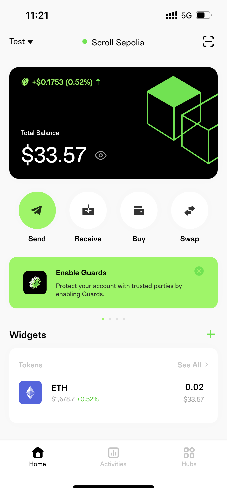
8. 钱包内嵌Swap功能
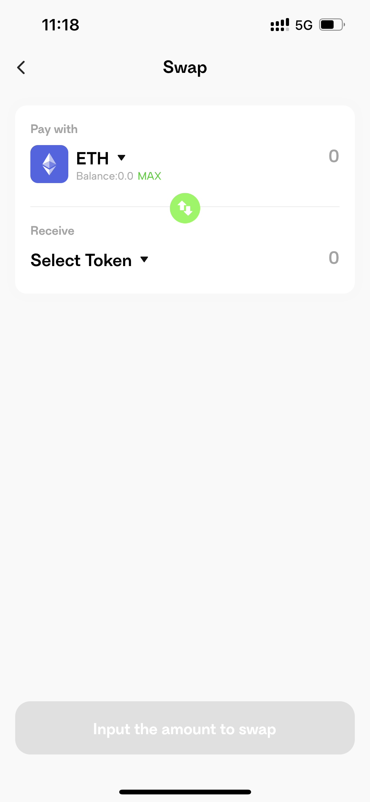

## 社交恢复

可以通过Apple，Google，邮箱进行社交恢复设置
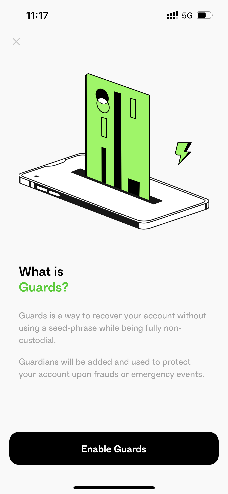
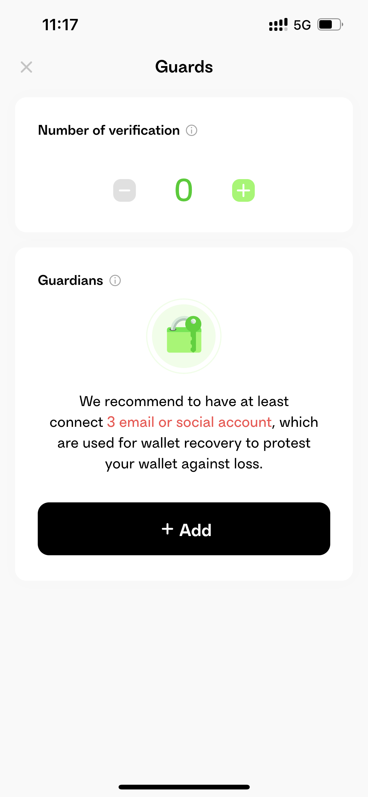

## 定期转账
通过设置总金额，转账频率，转账次数，起始时间来发起定期转账
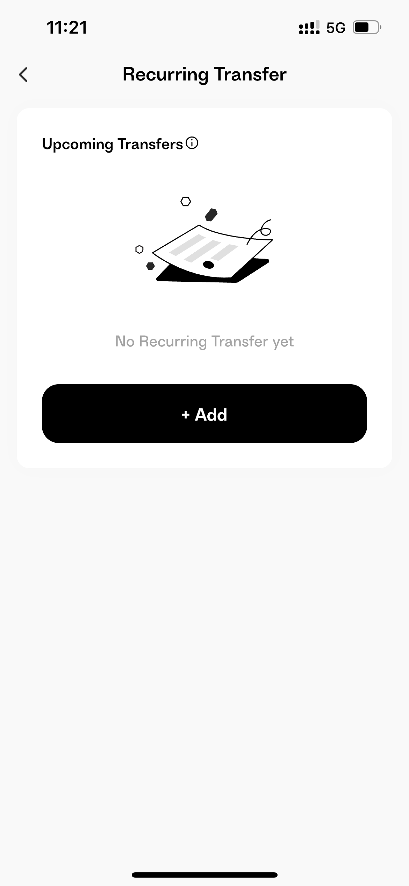
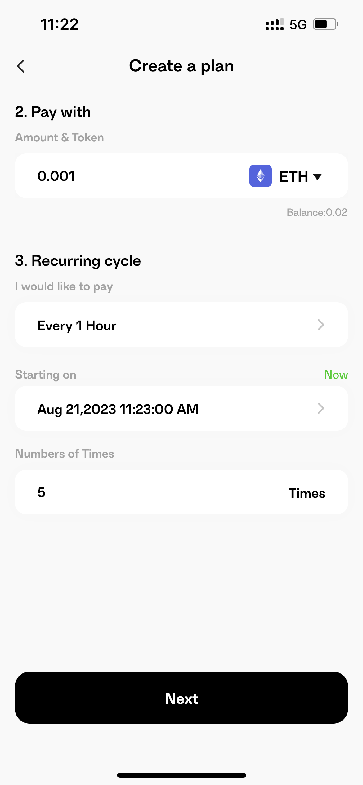
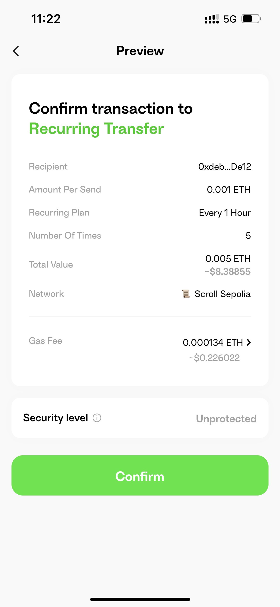

## 定投功能
定投功能类似于定期转账，但可以选择付款代币，定期买入另一种代币
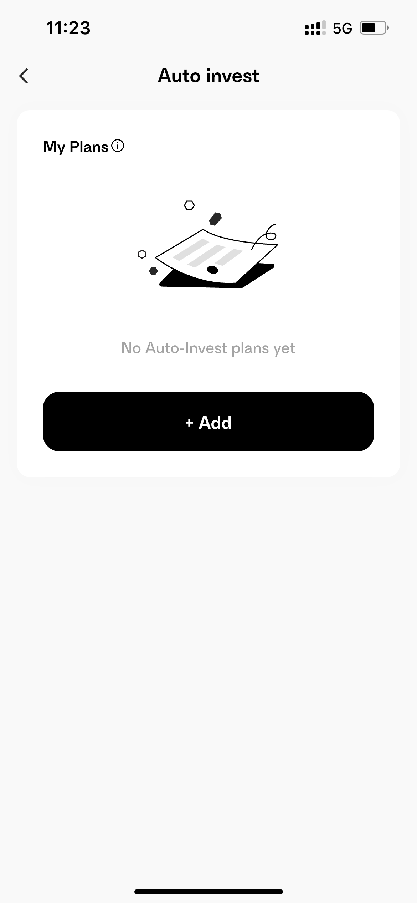
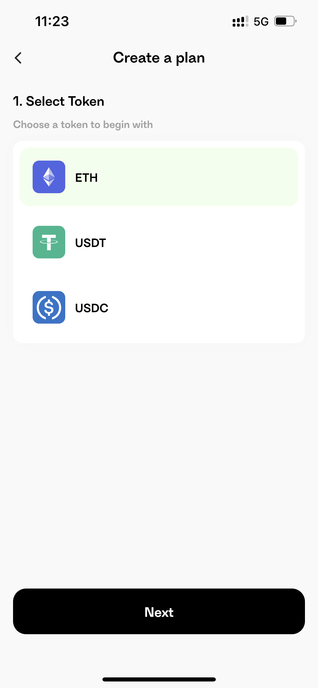
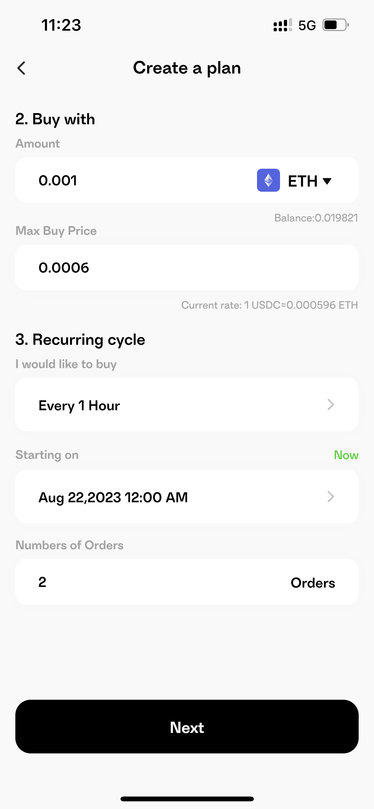
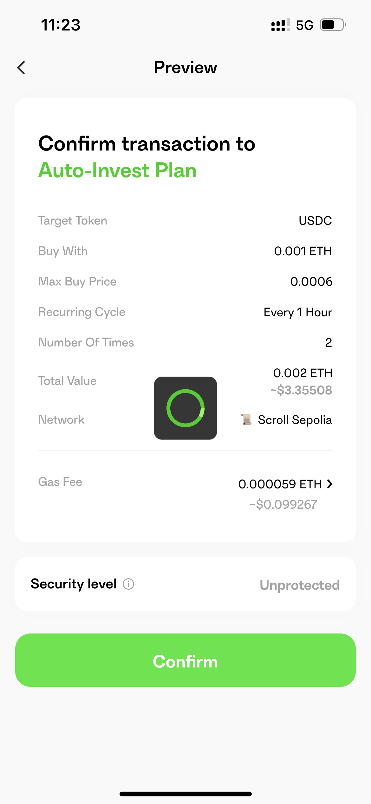