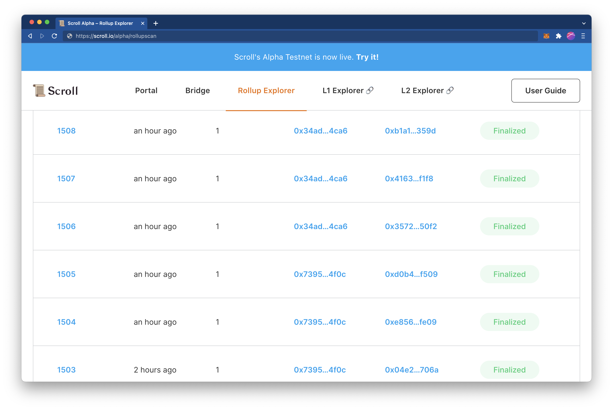

# Rollup 浏览器

Rollup 浏览器 显示有关 Scroll Alpha 块及其Rollup状态的基本信息。

Pre-Alpha 测试网中的 Scroll Alpha 区块有 3 种 rollup 状态：

-   **`Precommitted`** 表示一个区块已经被包含在 Scroll Alpha 区块链中。虽然Precommitted区块因为没有发布在Goerli上，所以还不是Scroll Alpha 链的一部分，但是信任排序器（sequencer）的用户可以认为这个区块是暂时敲定的。
-   **`Committed`** 表示该区块的交易数据已经发布到 Goerli 上的 rollup 合约中。这确保了块数据可用，但不能证明它已以有效方式执行。
-   **`Finalized`** 表示在 Goerli 链上的有效性证明通过验证，已经证明了该区块中交易的正确执行。最终区块被认为是 Scroll Alpha 链的一部分。

### Rollup表

该表提供了有关 Scroll Alpha 区块的 rollup 状态的信息。这些列是：

- `Batch Index`:  Batch编号，点击`Batch Index`会打开详情页
- `Transactions`: 显示 Batch中的交易数量。
- `Transactions`: 显示Batch中的区块数量。
- `Batch Created Timestamp`: 显示自 Batch 生成以来经过的时间
- `Commit Tx Hash`: 显示发布此 Scroll Alpha 区块交易数据的 Goerli 交易哈希缩写。单击哈希将在 Goerli 区块浏览器中打开交易详细信息页面的新标签页。``
- `Commit Timestamp`: 显示自 Batch 提交到 Goerli 测试网以来经过的时间
- `Finalize Tx Hash`: 显示了将此 Scroll Alpha 区块的有效性证明提交给 Goerli 上的 rollup 合约的交易哈希缩写。单击哈希将在 Goerli 区块浏览器中打开交易详情页面的新标签页。