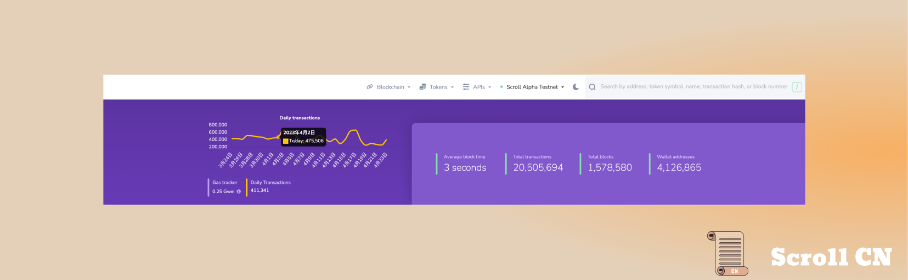

# Alpha测试网
## 测试网现状

截至 2023 年 4 月 24 日  10 : 00，Alpha测试网共有约 4,126,865 3,581,670 个钱包地址，新增了545,195 个钱包地址，处理了约 20,505,692 笔用户交易，生成了 1,578,580 个区块，平均区块时间约为 3 秒。
## 跨链桥
在基础设施方面，我们花了更多时间迭代跨链桥用户界面以及改进生态系统页面的用户体验。
## 电路
在电路方面，我们已经完成了所有 EVM 操作码的开发，正在进行审计。除了持续优化之外，我们还致力于支持 EIP2718 交易。

# 生态

Scroll 生态项目正在持续扩张，欢迎开发者在Scroll Alpha上部署项目，并在[Scroll Alpha – Ecosystem](https://scroll.io/alpha/ecosystem)提交项目信息。
近日，Ethereum Daily 发布了最新的 Scroll 生态全景图。

最新生态项目消息和更新，敬请持续关注 https://scroll.io/alpha/ecosystem 和推特 @BuildWithScroll

# 以太坊社区
## L2 Peace
4 月 19 日，Scroll 参与了 StarkWare 组织的 L2 Peace活动，同其他行业开拓者共同探索以太坊Layer 2解决方案，包括 Optimsim, Arbitrum, zkSync, Polygon, Consensys和Starknet。

### 以太坊基金会 "Next Billion Fellowship” 计划

以太坊基金会发布Next Billion Fellowship计划 Cohort3，通过该计划，你可以获得相关专家的指导、以太坊基金会和以太坊社区的资源、财务支持以及建立人际网络和媒体曝光的机会。
网站：[Ethereum Next Billion Fellowship Program](https://fellowship.ethereum.foundation/)
时间：2023年6月下旬
申请截止：2023 年 4 月 28 日
申请表：[Next Billion Fellowship Program - application form](https://nextbillionfellowship.paperform.co/)

# 活动预告
## ScalingX ZK Hackathon
ScalingX 举办线上黑客松，Scroll 将提供相应社区支持。

## 852zkNight
852 zkNight 首次活动，将邀请三个主要的 ZK Layer2 项目 Aztec、Scroll 和 Starknet，以研讨会的形式分享技术。Scroll 的核心开发者 Vincent 将出席活动并发表"What is Scroll & Scroll’s Architecture"的演讲。
活动时间：4月28日星期五 19:00 - 22:00
活动链接：https://lu.ma/852zkNight

