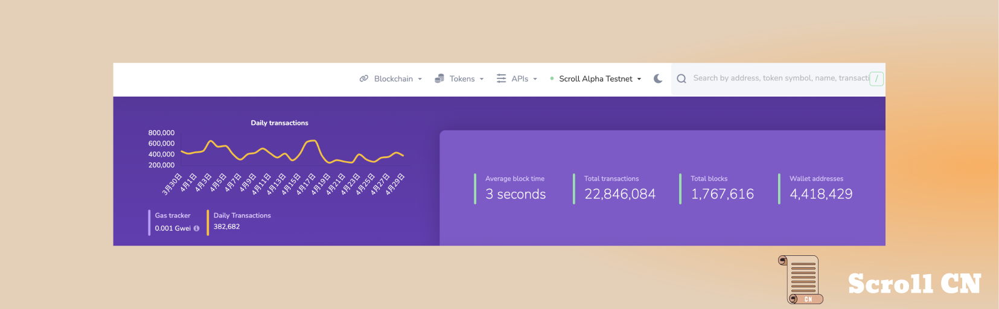
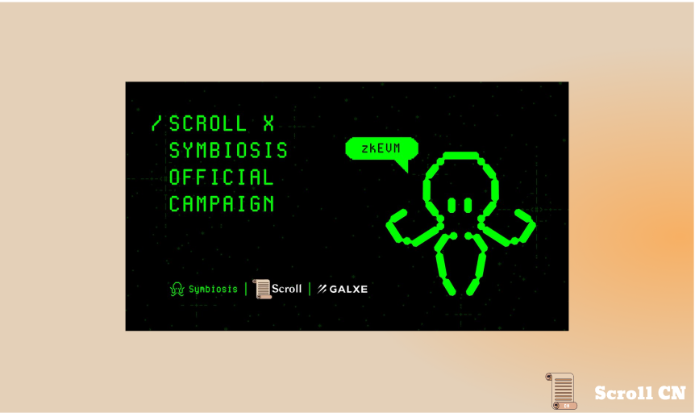
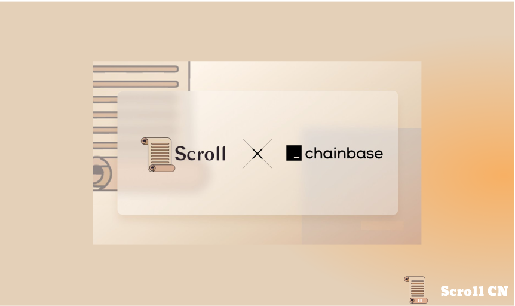
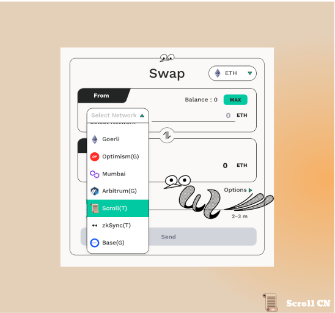

# Alpha测试网
## 测试网现状
截至 2023 年 4 月 30 日  00 : 00，Alpha测试网共有约 4,418,429 个钱包地址，新增了291,564 个钱包地址，处理了约 22,846,084 笔用户交易，生成了 1,767,616个区块，平均区块时间约为 3 秒。

## 基础设施
基础设施方面，我们将升级到 etherjs v6 以更好地处理错误，并对面向用户的方面进行了小幅升级改进。

## ZK
在 ZK 方面，我们在 HyperZexe 上取得了一些进展，我们HyperPlonk 的递归实现很快将披露更多细节。

# 生态

## Symbiosis
跨链流动性协议Symbiosis，整合了 Scroll 最新的 Alpha 测试网。
测试网网址：https://testnet.symbiosis.finance

## Chainbase
基础设施Chainbase宣布与 Scroll 的战略整合。
文档：https://docs.chainbase.com/docs

## Pheasant Network
Optimistic类的跨链桥协议 Pheasant，宣布支持 Scroll 
测试网网址：https://pheasant.network/

# 活动预告
## ETHGlobal Lisbon
我们迫不及待地想在 5 月 12 日至 14 日在里斯本见到你们！在里斯本黑客松期间，
我们为在 Scroll 上构建的黑客提供了 5,000 美元的赏金。在这里找到
📜 **在 Scroll 上部署您的智能合约**- 总计 5,000 美元（奖池奖）
这应该只是意味着改变你的 RPC！通过在 Goerli 上的 Scroll Alpha 测试网上部署项目的智能合约来试用 Scroll 的下一代 zk-rollup。借助 Scroll 的 zkEVM，用户将受益于更低的成本、更短的出块时间和更高的吞吐量——您无需修改​​ Solidity 代码。请务必验证您的合同，以便我们确认您的部署！
