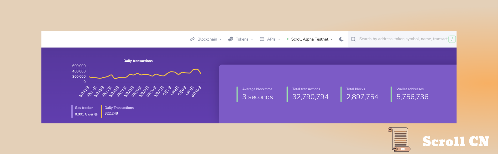
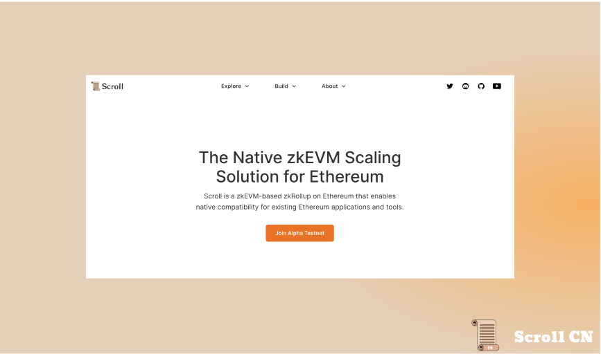
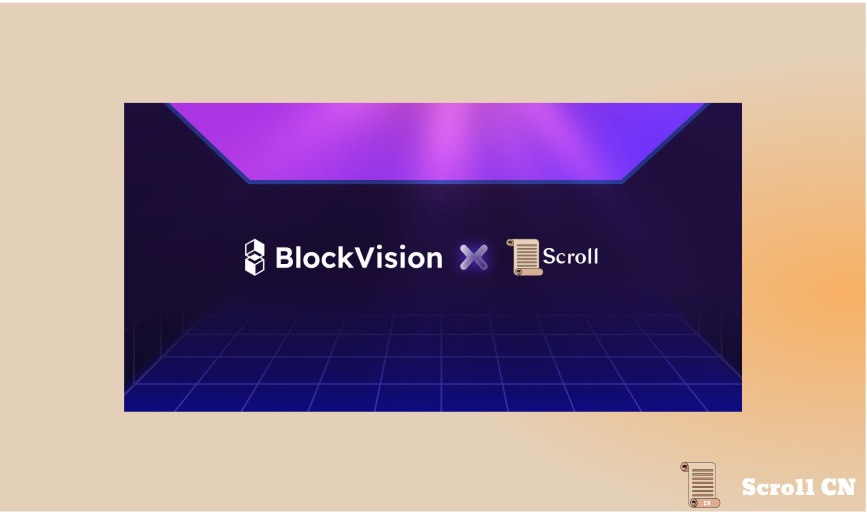
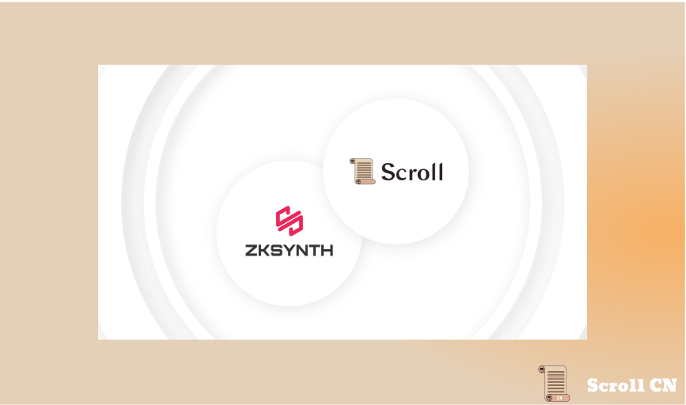
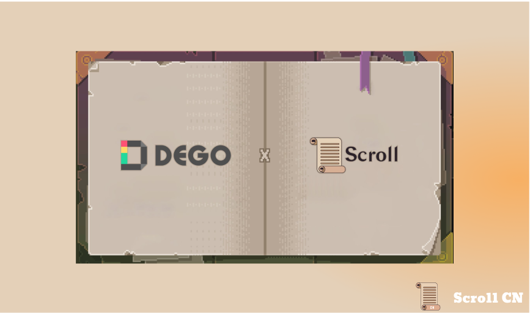
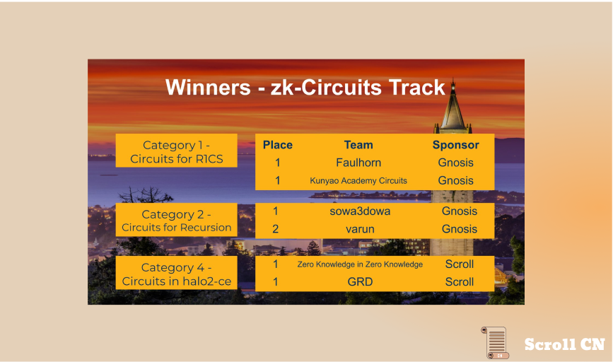
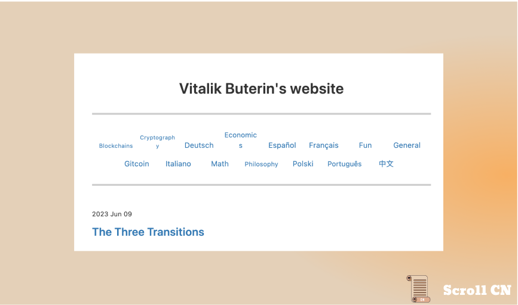
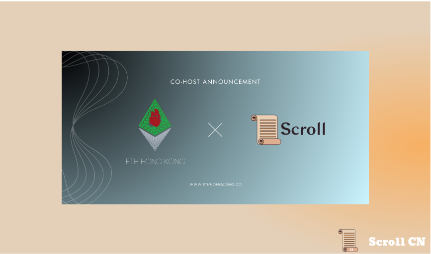

# Alpha测试网

## 测试网现状

截至 2023 年 6 月 11 日  12 : 00，Alpha测试网共有约 5,342,680 5,756,736个钱包地址，新增了 414,056 个钱包地址，处理了约 32,790,794 笔用户交易，生成了 2,897,754 个区块，平均区块时间约为 3 秒

## 基础设施
我们的基础设施团队对 [http://scroll.io](https://t.co/fBxZb6Sapq) 进行了一些改进，以简化我们的网站和 Web 应用性能。
现在，浏览我们的网站将更快、更容易。

## 零知识证明电路
在 ZK 方面，我们完成了 RLP 和交易电路的重构。这意味着 Scroll zkEVM 现在支持以太坊主网所有类型的交易。

# 生态项目
## BlockVision
BlockVision 正在为去中心化的未来构建基础设施，包括多链节点、API 和工具包。 开发者可以查询任何实时链上数据并加速其 Dapp 开发 !

## zkSynth
zkSynth是一种无需信任的合成资产发行和交易协议，使用户能够在链上无滑点地进行交易。 用户可以创建和交易跟踪任何真实世界资产的合成资产价格 !

### DeGo Finance
Dego 通过将现有的 NFT + Defi 模块集成到一个环境中，通过其模块化组合设计构建了理想的 defi 生态系统

# ZKP / Web3黑客松
ZKP/Web3 黑客马拉松将学生、研究员和从业者聚集在一起，构建和展示他们在零知识领域中的创新工作。 作为ZK赛道的赞助商，我们要求黑客通过去中心化的社区协作来优化 Halo2-ce 电路。
最终获奖的两个项目方分别是
**Zero Knowledge in Zero Knowledge**:
[GitHub - span14/zk-mooc-lab](https://github.com/span14/zk-mooc-lab)
**GRD**:
[GitHub - duguorong009/zk-mooc-halo2: ZKP/WEB3 Hackathon Project(zk-Circuits Track-Category 4)](https://github.com/duguorong009/zk-mooc-halo2)

# 以太坊生态
## Vitalik: 以太坊的三个转变
Vitalik 近日发表了关于“以太坊的三个转变”的博客文章，文章内提出以太坊未来为普通用户带来开放、全球化和无需许可的体验，需要经历三个主要技术转变，分别是 L2 扩容的转变，钱包安全的转变和隐私的转变。

## ETHPrague
6 月 9 日至6 月 11 日，我们在 [@EthPrague](https://twitter.com/EthPrague) 的社交展位，为我们的社区提供与我们核心团队成员见面和聊天的机会。了解有关 ZK 技术和在 Scroll 上构建的更多信息。

此外，我们的高级研究员 [@toghrulmaharram](https://twitter.com/toghrulmaharram) 就“zkRollup中排序器-证明者分离”的主题发表演讲。 最后，我们基础设施团队的 [@OrestTa](https://twitter.com/OrestTa) 将探索 zkEVM 如何解锁终极用户体验！

# 活动预告 

## ETHHongKong
ETH HongKong 将在2023年第四季度在香港举行，Scroll 将作为本次活动的联合主办方，

## Scroll Talk #1 
Scroll CN 近日将开启第一期 Scroll Talk ，有幸请到 Scroll 的联合创始人张烨，对话的主题为“Scroll 与 ZK 同行”。
社区 Scroller 可以点击下方阅读原文，提交相关问题。
