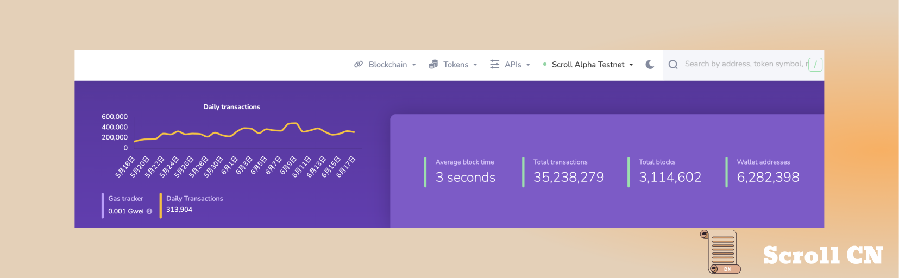
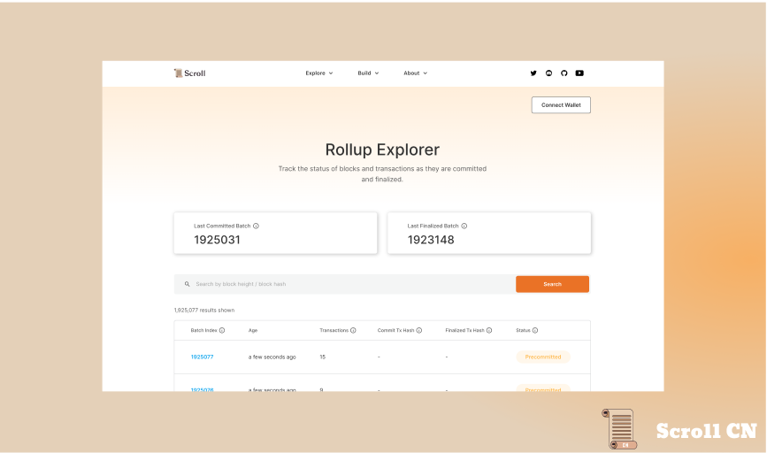
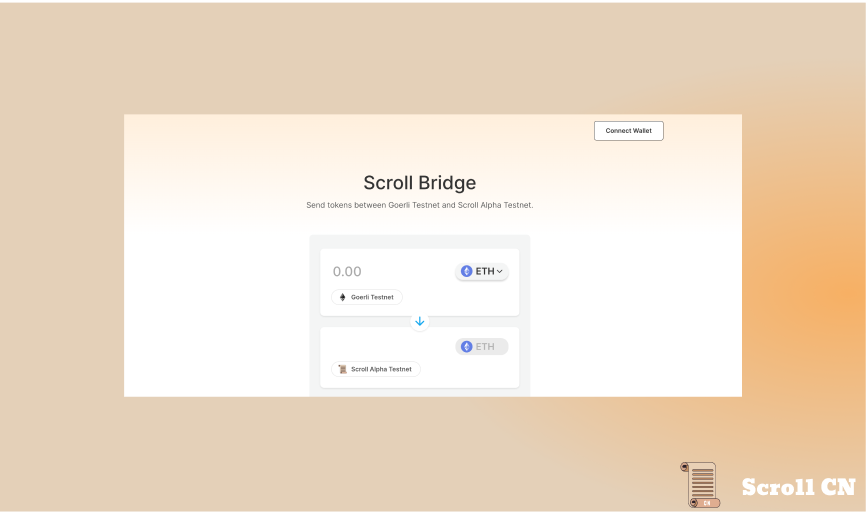
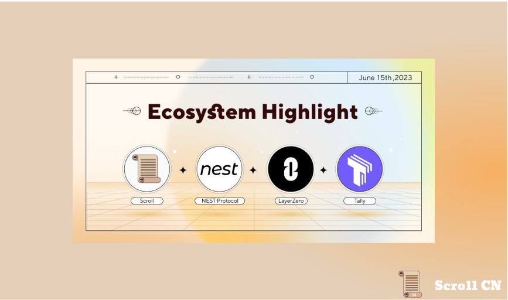
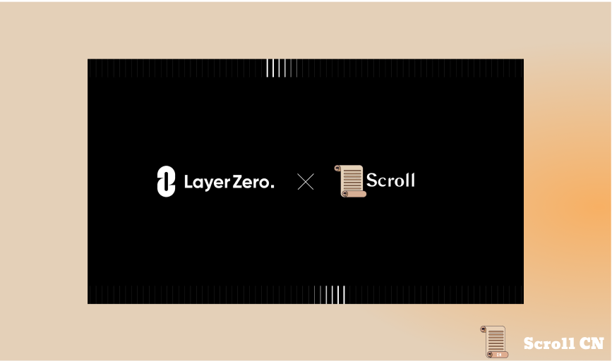
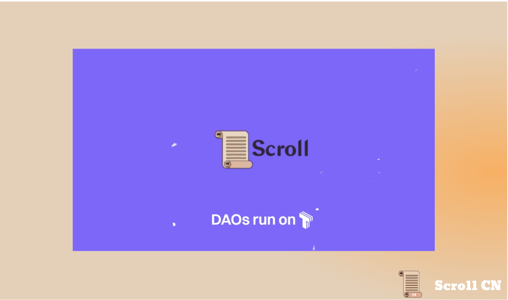
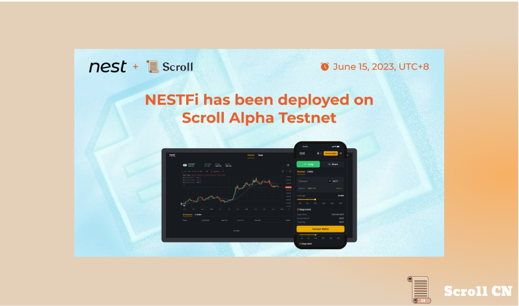
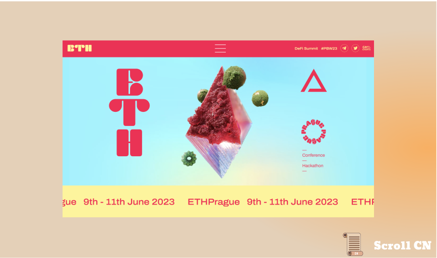

# Alpha测试网

## 测试网现状

截至 2023 年 6 月 18 日  24 : 00，Alpha测试网共有约 6,282,398个钱包地址，新增了 525,662 个钱包地址，处理了约 35,238,279 笔用户交易，生成了 3,114,602 个区块，平均区块时间约为 3 秒

## 基础设施
在基础架构方面，我们在Rollup浏览器中添加了一些程序，以便你现在可以轻松浏览 Scroll 的交易历史记录。

我们还对跨链桥应用程序进行了一些改进，以提高性能并更有效地与 Scroll 进行交互。 Scroll 用户现在将体验到：
- 一致的排序
- 交易速度提升
- 取消交易的选项

## 零知识证明电路
我们的ZK团队一直在努力工作。 Scroll zkEVM 电路现在完全支持了 ecrecover 预编译。 我们还完成了Block-Chunk-Batch的多层聚合证明机制，大大降低了L2 Gas成本。。

# 生态项目

## LayerZero
LayerZero是一种无需信任的全链互操作性协议，可实现跨所有链的直接交易。开发者可以在 Scroll 上无缝构建跨链应用，帮助构建全链生态系统。
LayerZero Endpoint: 
[LayerZero Endpoint - LayerZero Docs](https://layerzero.gitbook.io/docs/faq/layerzero-endpoint)

## Tally
Tally 是链上 `DAO` 的多合一解决方案，可以实现在链上无信任地提案、投票和执行提案，帮助开发者在 Scroll 上建立一个去中心化的社区。

## Nest Protocol
Nest Protocol 是一个链上永续合约平台。 用户可以以高达50倍的杠杆交易各种代币。

# 以太坊生态
## ETHPrague
在布拉格度过了精彩的一周后，我们宣布了 EthPrague黑客松的获胜者！ 共有 27 个项目（由 67 个开发者组成）被选中，以表彰他们在 Scroll 上构建令人兴奋的新用例方面的出色工作。
