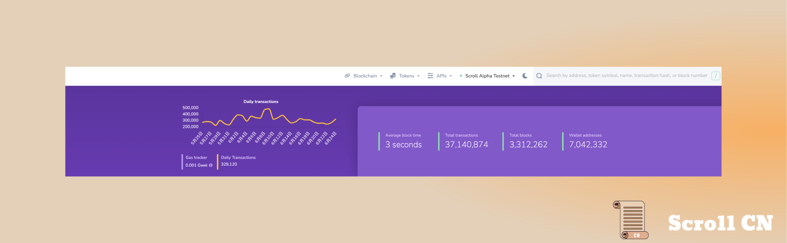

# Alpha测试网

## 测试网现状

截至 2023 年 6 月 25 日  24 : 00，Alpha测试网共有约 7,042,332个钱包地址，新增了 525,662 个钱包地址，处理了约 35,238,279 笔用户交易，生成了 3,114,602 个区块，平均区块时间约为 3 秒

## 零知识证明电路

在技术方面，我们在一些 zkEVM 子电路的电路行中并行化了见证分配。 此次升级将大大提高 Scroll 的证明效率，有效地将整体证明时间减半至约 10 分钟。

虽然上述升级已经实现，但尚未部署。 未来几周内我们将说明此次升级将在何时投入生产。

Dompute 团队已经为 Scroll 的波塞冬电路仓库贡献了一个PR，这一贡献提高了我们电路合成过程的速度。（完整的E2E测试显示将所需的时间从158s减少到1.8s，提高了99%）。 

# 生态项目

安全性和去中心化都是 Scroll 的核心原则。随着主网的临近，这比以往任何时候都更加重要。 在本周的生态系统更新中，了解去中心化 API、智能合约安全性，和无需许可的资产平台。

## Blast API
Blast API是一个基于订阅的多链 API 平台，可以对 Web3 中相关网络进行最快、最可靠的访问。
社区可以使用 Blast API 从 Scroll 无需许可地查询区块链数据。

## Code4rena
Code4rena 是一个智能合约审计社区。借助其端到端安全解决方案，开发人员可以在部署之前发现漏洞，从而使智能合约更加安全。社区中的任何人都可以参与并向世界上顶级的安全研究人员学习

## OpenLeverage
OpenLeverage 是一个无需许可的去中心化保证金交易平台。 用户可以从任何交易对创建借贷池，并无摩擦地做空/做多头寸。

## AlienSwap
AlienSwap 是基于会员制的社区 NFT 市场。 艺术家和创作者可以创建自己的 NFT 并进行交易，AlienSwap 的所有收入在社区成员之间分配。

# 招聘

Scroll 正在寻找一位经验丰富的内容主管来帮助推动我们的内容战略，并在整个行业中有效地传达我们的愿景。 如果您与我们的愿景和价值观保持一致，我们鼓励您申请。

