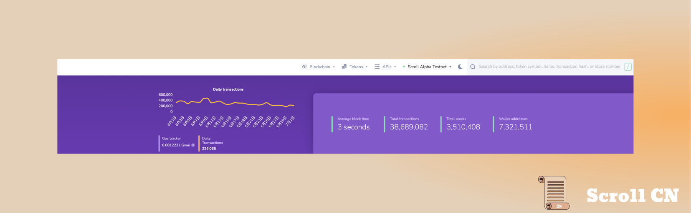
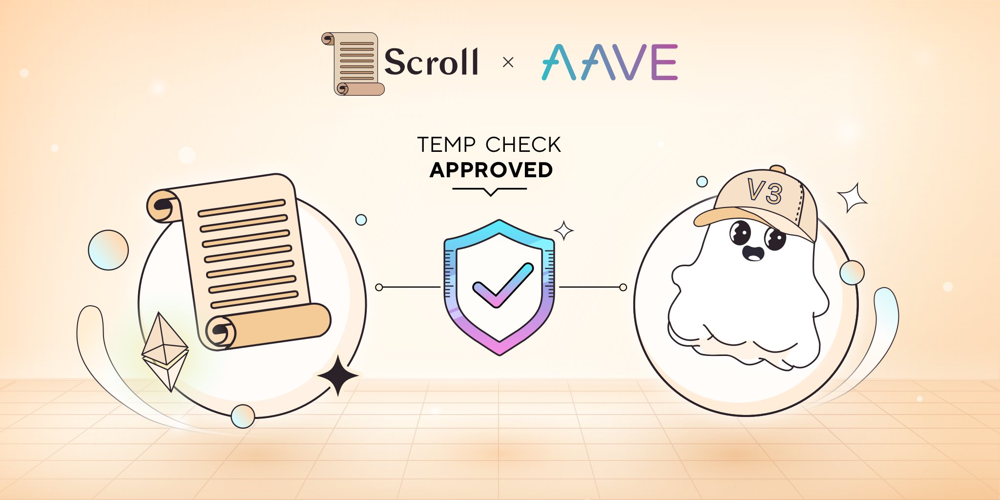
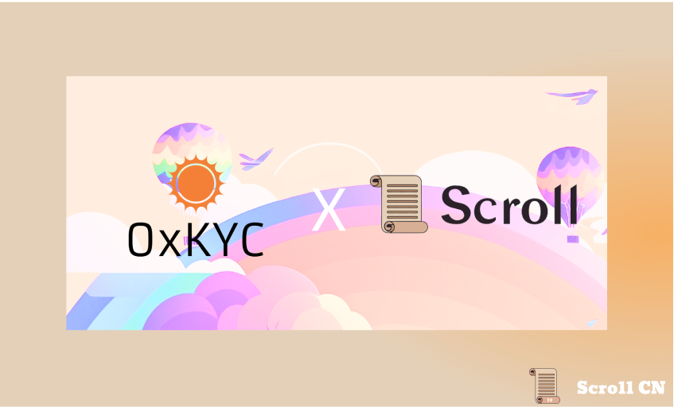
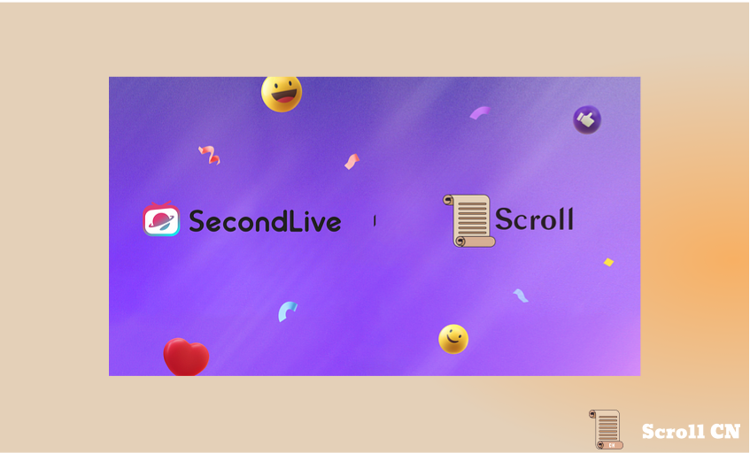
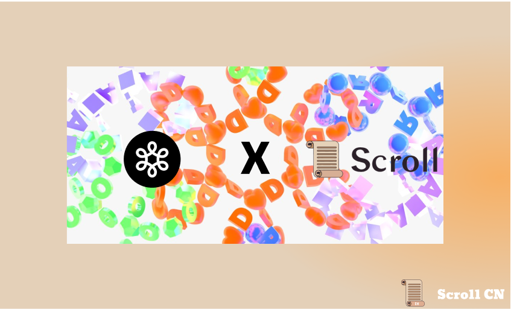
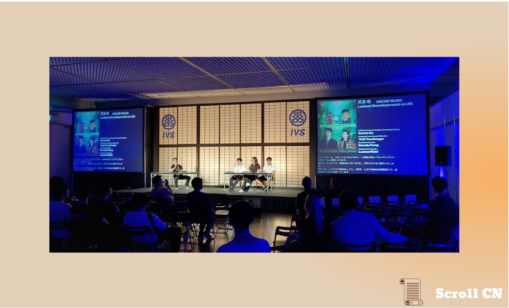

# Alpha测试网

## 测试网现状

截至 2023 年 7 月 2 日  18 : 00，Alpha测试网共有约 7,321,511 个钱包地址，新增了 279,179 个钱包地址，处理了约 38,689,082 笔用户交易，生成了 3,510,408 个区块，平均区块时间约为 3 秒

## 零知识证明电路
在ZK电路方面，我们完全重写了Poseidon存储树电路，采用更加模块化的设计构建了它，目的是使其更易于理解并复用。

此外，我们在椭圆曲线电路上取得了重大进展，以支持 EVM 中的预编译。 我们将在未来几周内在代码库中完成这些，进一步支持开发者的无缝体验。

# 生态项目

本周的生态项目更新，包括借贷龙头AAVE，链上隐私0xKYC、AI驱动的元宇宙SecondLive，区块链浏览器Dora。

## AAVE
我们在 Scroll 主网上部署 AaveAave v3 的建议已经通过了最初的temperature check。 
在接下来的几周内， AaveAave 社区将进行彻底的风险评估，然后进行技术评估。 风险评估的目的是分析和识别可能暴露的任何潜在风险。技术评估旨在通过确保Scroll zkEVM与Aave的协议架构和智能合约基础设施兼容来测试集成的可行性。
Alpha 测试网：[Aave - Open Source Liquidity Protocol](https://app.aave.com/)

## 0xKYC
0xKYC 创建了一个基于生物识别唯一性的保护隐私的验证系统。通过成为Scroll生态系统的一部分，0xKYC将构建一个无机器人，无重复账户的数字环境！
Alpha 测试网：[0xKYC - Private ☀️ Zero Knowledge ID](https://app.0xkyc.id/)

## SecondLive
SecondLive 构建了人工智能增强的工具和基础设施，使人们能够毫不费力地创建一个开放 Metaverse 。 它超越了展示和聚集，提供了丰富的互动和身临其境的体验，以创造一个蓬勃发展的数字文明。
SecondLive 已经开始在 Scroll 上部署功能，期待为 Scroll 生态系统提供独特的元界体验并奖励早期采用者。
Alpha 测试网：[Home | SecondLive](https://secondlive.world/)

## Dora
Dora 是一个区块浏览器，允许用户搜索多个链上的任何链上交易或钱包地址。
Alpha 测试网：[dora](https://www.ondora.xyz/network/scroll-zkp/interactions)

# IVS 活动

Scroll 联合创始人 Sandy Peng 参加了本周的 IVS 圆桌讨论，就ZK技术的一些最令人兴奋的发展进行了内容丰富的讨论。
