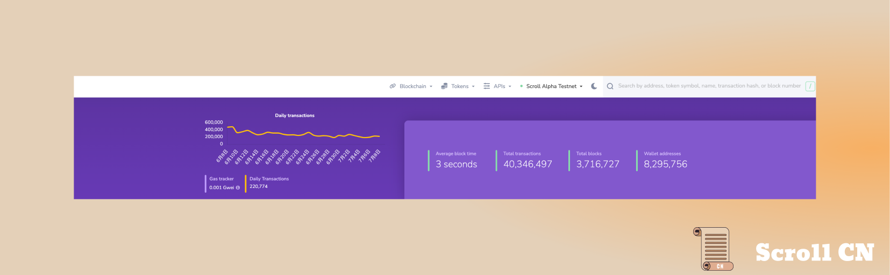
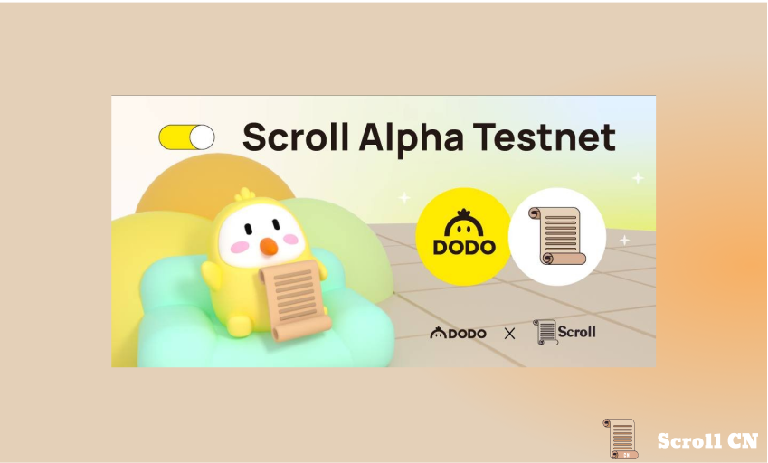
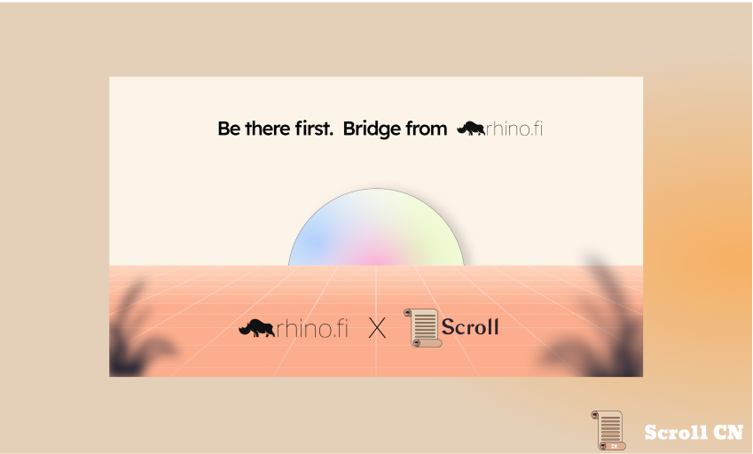
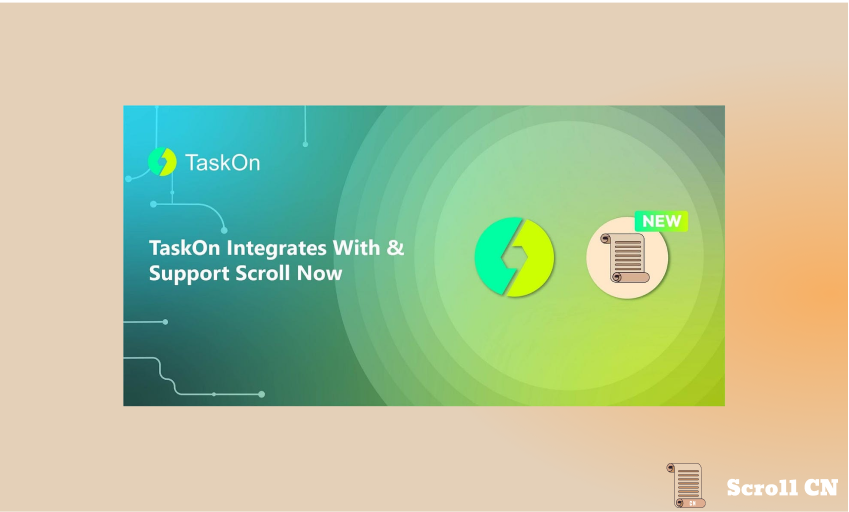
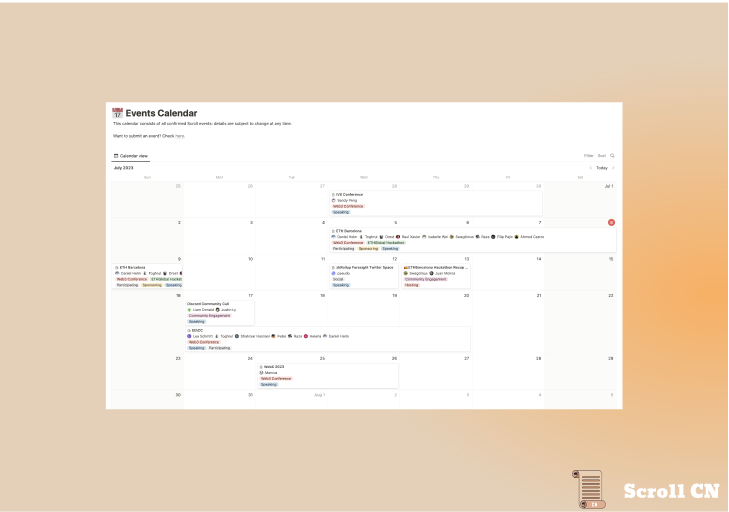
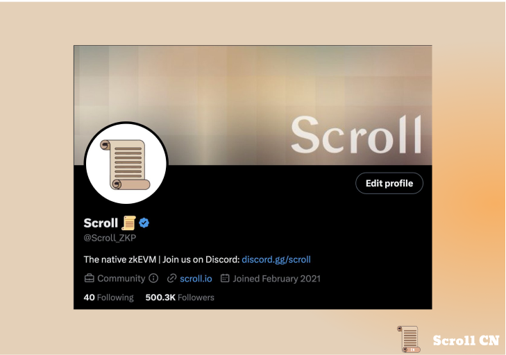

# Alpha测试网
## 测试网现状
截至 2023 年 7 月 9 日  22 : 00，Alpha测试网共有约 8,295,756 个钱包地址，新增了 974,245 个钱包地址，处理了约 40,346,497 笔用户交易，生成了 3,716,727 个区块，平均区块时间约为 3 秒。

## 零知识证明电路
我们正在集成我们的电路，并校验 L2 Geth 中的 API。 这将使我们的排序器能够准确地封装区块，从而提高整个系统的健壮性。

# 生态项目
## DODO
DODO 是多链交易聚合器
DODO 已经成功部署上线 Scroll Alpha 测试网
[Swap - DODO](https://app.dodoex.io/?network=scr-alpha)

## Rhino.fi
rhino 是一站式托管，交易，投资平台。
rhino 将在 Scroll 主网第一天就提供服务，使用户可以在30秒内从 Ethereum，Optimism， zkSync Era,  Arbitrum,  BSC, Polygon 跨链 Scroll

## TaskOn
TaskOn 是 Web3 任务合作平台。
TaskOn 已经集成 Scroll Alpha 测试网，用户可以参与 Scroll 生态系统内任何项目发起的活动。同时，项目可以利用 TaskOn 的强大功能，在 Scroll 网络上启动自己的活动。
[TaskOn](https://taskon.xyz/campaign/detail/5634)

# 社区
Scroll 开放了公共活动日历的链接，现在社区可以随时访问该链接，以查看 Scroll 即将推出的活动。
[Notion – The all-in-one workspace for your notes, tasks, wikis, and databases.](https://scrollzkp.notion.site/cc9ae9da3d894a90937e04818542e97d?v=a08e1f4656104aefa7b8d3ac829f1c90&pvs=4)

Scroll Twitter 刚刚跨越了50万的里程碑。感谢迄今为止旅程中支持我们的每一个人。
