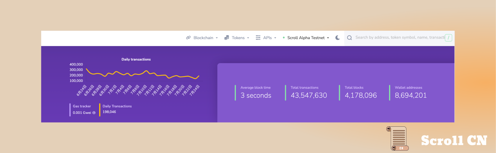
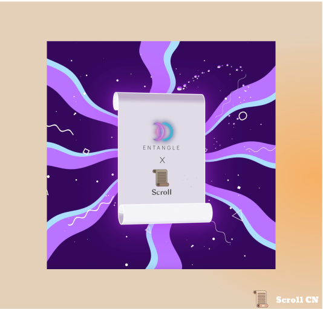
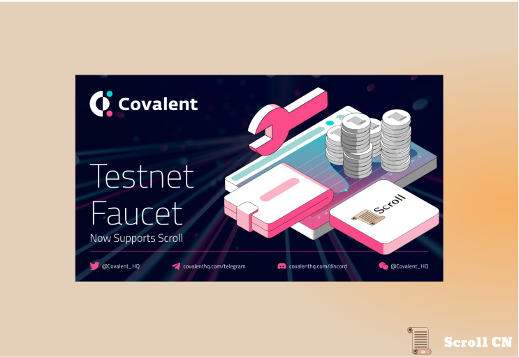
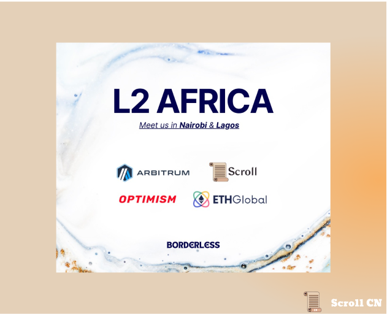

# Alpha测试网
## 测试网现状
截至 2023 年 7 月 25 日  23 : 00，Alpha测试网共有约 8,694,201  个钱包地址，新增了 122,772 个钱包地址，处理了约 43,547,630 笔用户交易，生成了 4,178,096 个区块，平均区块时间约为 3 秒。

## 基础设施
本周我们在电路和基础设施方面取得了很多内部进展，并很高兴在未来几周分享更多内容。

# 生态项目
## Entangle Protocol
Entangle Protocol 以流动性为中心，来促进资本效率和流动性优化。Entangle 允许在安全且可扩展的跨链应用程序上创建可组合工具，从而创建流动且统一的 Defi 。

## Covalent
Covalent的测试网水龙头现在已经支持 Scroll，为想要在 Scroll Alpha 测试网上构建和测试 dApp 的开发者服务。
[Testnet Faucet | Covalent](https://www.covalenthq.com/faucet/#signup)

# 以太坊生态
## ETHCC
ETHCC也许已经结束，但是我们还将参与许多周边活动，有关我们活动的完整列表，请查看我们的 Notion 页面：
https://scrollzkp.notion.site/Scroll-EthCC-2023-e88a5d753a3c4d00bf14ca9f660068a4
我们将很快发布一个ETHCC回顾，尽请期待！

# 活动预告
## WebX
Scroll APAC Growth 负责人 Marcus 将参加主题为“ZK Fixes This: Solving Scaling, Privacy, and More"的圆桌讨论。

## Ethereum Layer 2s in Africa!
在 Vitalik 的非洲之行之后，以太坊 Layer2 项目方将来到非洲！Scroll 联合创始人张烨将和Arbitrum，ETHGlobal，Optimism的成员一起，内罗毕和拉各斯进行巡回演讲，同非洲的开发者交流。

