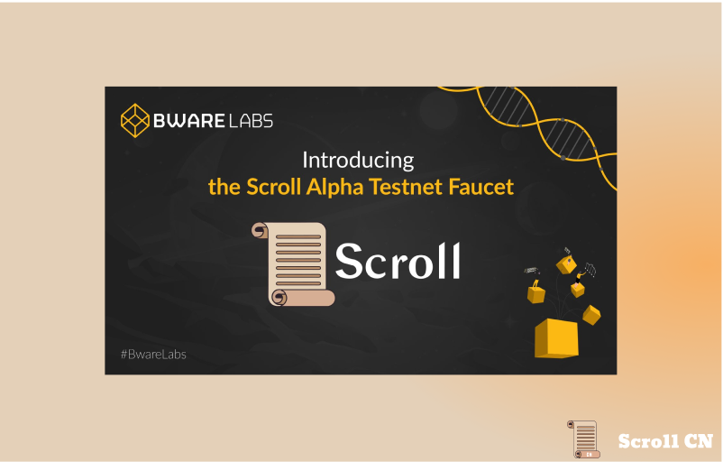
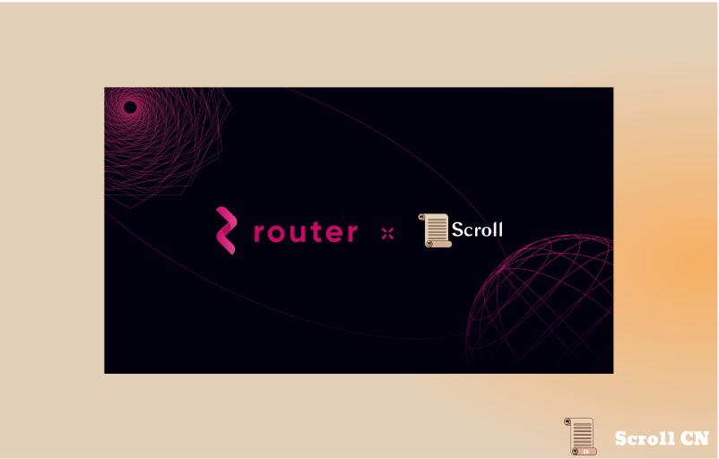
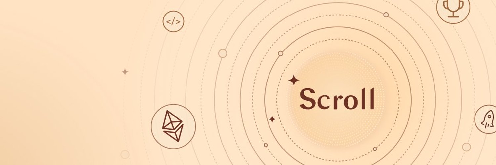

# Alpha测试网
## 测试网现状
截至 2023 年 7 月 31 日  12 : 00，Alpha测试网共有约 8,746,184 个钱包地址，新增了 51,983 个钱包地址，处理了约 44,392,077 笔用户交易，生成了 4,335,611 个区块，平均区块时间约为 3 秒。

## 基础设施
本周我们基础设施团队继续在改善用户端体验：
- 我们的跨链桥应用程序改进了交易费用计算和更友好的金额验证
- 改进了移动设备上的WalletConnect <> MetaMask 钱包的支持

# 生态项目
## Bware Labs
Bware Labs 为Scroll的测试网启用了水龙头。使开发人员能够毫不费力地获得测试所需，使他们能够专注于开发和测试他们的智能合约和应用程序。

## Router Protocol
Router Protocol是使用Cosmos的Tendermint共识构建的Layer1 区块链，以解决区块链互操作性中存在的问题。现在扩展他们的跨链框架以包括Scroll。现在，跨链交易和桥接资产变得更加容易。

# 社区
## Scroll ES
我们的社区在全球范围内不断发展，我们很高兴地宣布，我们现在将在 Twitter 上与西班牙社区分享内容。关注 [@Scroll_ES](https://twitter.com/Scroll_ES) 来随时了解西班牙社区的令人兴奋的进展。

# 月度更新和公告

## 团队
新增团队成员：Jojo, Chris, Ray, Vyzo, Amal, Mohammad, Paul, Sebastien

## 技术开发和更新
- **基础设施**
1. 完全支持 Ecrecover 预编译
2. 完全支持Brave钱包
3. Rollup浏览器改进，可以轻松浏览Scroll的交易历史记录
4. 跨链桥升级
	1. 提高性能使Scroll的交互更加高效，一致的排序，更快的交易速度，取消交易的选项
	2. 准确的交易费用，包括Gas费和中继费
- **零知识证明**
1. 在zkEVM子电路中并行化电路行的见证分配，大大提高Scroll的证明效率，有效将整体证明时间减半至约10分钟。
2. 完成多级证明聚合机制，将链上Gas验证成本降低至～400K左右，在所有zkRollup中排名第一。
3. 模块化的设计改写了波塞冬存储树电路，使其更易于理解和重用。
4. Dompute 团队波塞冬电路仓库贡献了一个PR，这一贡献提高了我们电路合成过程的速度。（完整的E2E测试显示将所需的时间从158s减少到1.8s，提高了99%）
##  Discord
1. 接近 500k 用户上线
2. 增加安全措施
3. 已请求提高用户上线
4. 新增”教育工作者“角色
5. 新增频道：社区内容，生态系统
 

