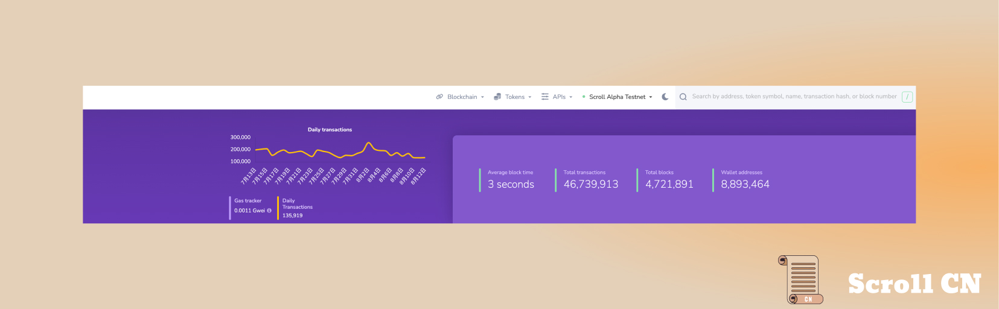
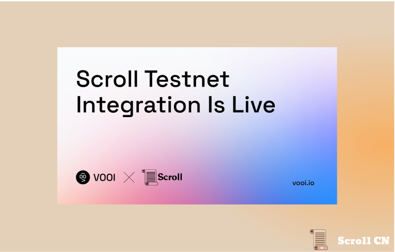
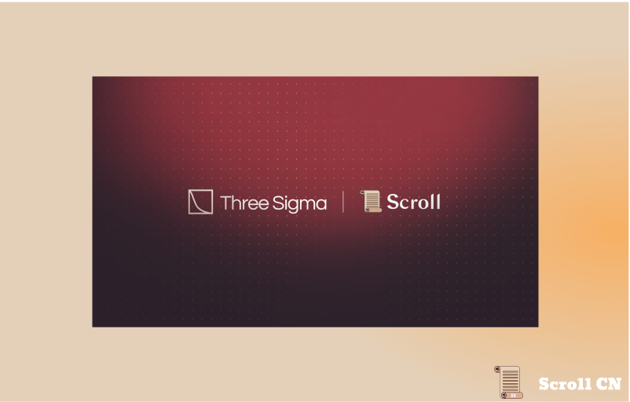
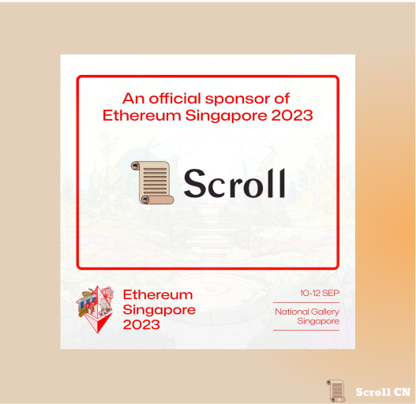
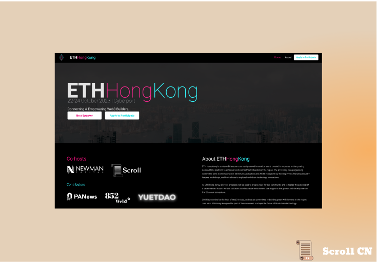

# Alpha测试网
## 测试网现状
截至 2023 年 8 月 13 日  24 : 00，Alpha测试网共有约 8,893,464 个钱包地址，新增了 63,759 个钱包地址，处理了约 46,739,913 笔用户交易，生成了 4,721,891 个区块，平均区块时间约为 3 秒。

## 基础设施
在开发方面，我们完成了对原生跨链桥上完全无需信任交易的支持和测试。 跨链消息传递和传输现在完全在协议中原生支持，无需信任受信任的第三方。

# 生态项目
## Vooi
Vooi 是一种稳定币交易协议，旨在为用户提供深度流动性和低滑点。 为了进一步支持以太坊的Layer2生态系统，Vooi已经与Scroll Alpha测试网集成。

## Three Sigma
Three Sigma现在支持 Scroll 生态系统！ 将提供各种服务，包括代码审计、经济建模等，以加强更多项目在生态系统中的采用。 请继续关注我们将公布的未来发展！

# 以太坊社区

## ETH Singapore

2023年9月10日至12日，Scroll 将作为ETH Singapore的赞助商，出现在活动现场。

## ETH Hong Kong

2023年10月22日至24日，Scroll 将与 EthereumHK 在数码港合作举办香港地区的第一次以太坊聚会。 

作为全球金融业的知名领导者，香港认识到去中心化、开放和无需许可的全球平台的需求不断增长，该平台将更广泛的亚太地区的开发者联系起来。 为了支持这次活动， Newman Capitalvc将作为共同主办方加入我们。

ETH香港将为有才华的开发者营造一个协作环境，为以太坊生态系统的发展做出贡献和支持。 该活动将包括黑客马拉松、开发者研讨会和由一些行业思想领袖主持的圆桌讨论。

想要参加现场活动，请通过 Ethereum HK 网站申请：[Home | ETH Hong Kong](https://www.ethhongkong.co/)

