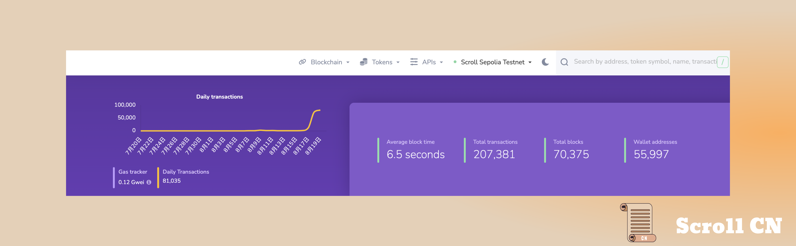

# Beta测试网

首先，我们热烈庆祝Sepolia上测试网的推出，这是我们在以太坊主网上部署Scroll之前的最后测试阶段。 为了深入概述所包含的内容，我们发布了一篇博客文章，概述了我们所有最新的功能改进。

## 测试网现状
截至 2023 年 8 月 20 日  18 : 00，Beta测试网共有约 55,997 个钱包地址，处理了约 207,381 笔用户交易，生成了 70,375 个区块，平均区块时间约为 6.5 秒。

## 首发项目介绍
我们将重点介绍首发部署在Beta测试网上的一些基础设施协议。 这些是我们生态系统的基础支柱，可实现 Scroll 去中心化应用程序之间的无缝集成。

## Ankr
Ankr 为分布式云计算提供基础设施，旨在使开发人员更容易在以太坊上部署和运行应用程序。

为了支持以太坊不断增长的L2生态系统，我们增加了对 Sepolia 上的Scroll Beta测试网的支持。
通过下方公共RPC无缝连接到Sepolia 的Beta测试网
https://rpc.ankr.com/scroll_sepolia_testnet 

## Chainstack
Chainstack 是一套将开发者与 Web3 基础设施连接起来的服务，为 DeFi、NFT、游戏和分析中的应用程序提供支持。 Chainstack 使项目能够降低与创建和扩展去中心化应用程序相关的一些成本和风险。
通过下方公共RPC无缝连接到Sepolia 的Beta测试网
https://scroll-sepolia.chainstacklabs.com 

## BlockPI
BlockPI是一个分布式多链加速层，提供高性能和可靠的RPC服务。 通过可扩展工作节点的分布式结构，BlockPI 解决了单点故障以及与可扩展性相关的其他限制。
通过下方公共RPC无缝连接到Sepolia 的Beta测试网
https://scroll-sepolia.blockpi.network/v1/rpc/public

## Blast API by BwareLabs
BwareLabs旨在通过提供高性能基础设施服务和开发工具来应对 Web3 挑战并促进全球采用。 它们的一些功能包括 RPC、可编程 SDK 和快照服务。
通过下方公共RPC无缝连接到Sepolia 的Beta测试网
[https://scroll-sepolia.public.blastapi.io](https://scroll-sepolia.public.blastapi.io)

## Versa
Versa是Scroll的Beta测试网上的第一个原生智能钱包！
Versa是一个移动端优先的帐户抽象钱包，经过优化，可将 Web3 技术的采用扩展到主流受众。 Versa 在 Scroll 上原生构建，提供了多种功能，例如定期转账、计划交易和社交恢复。

## Redstone
Redstone是一个模块化的预言机，以三种定制的数据消费模式提供灵活的数据推送。 在我们的Sepolia测试网上构建的开发者现在可以利用RedStone高效灵活的数据源来利用更具可扩展性的以太坊。

## Pyth Network
Pyth Network 是一种预言机和API服务，可将金融市场数据发布到多个区块链。 Pyth 跨多个 EVM 链为加密货币、股票、外汇和商品提供实时高频市场数据。

## Dora
Dora 是一个多生态系统搜索引擎，允许任何人搜索已执行的交易，例如转账、发送/接收、交换和铸币。 用户现在可以利用Dora在Scroll上轻松搜索链上活动。

## Orbiter
Orbiter 是一个去中心化的Rollup跨链桥，为以太坊原生资产提供快速可靠的转账。 Scroll Goerli的用户现在可以使用Orbiter直接桥接到我们的Sepolia测试网上。

## Covalent
Covalent 是一个统一的 API，提供对可扩展历史区块链数据的快速可靠访问。 开发人员可以利用Covalent的API服务将分散的应用程序无缝部署到Scroll的Sepolia测试网上。

## Unifra
Unifra 是一个 Web3 开发人员平台，提供一整套开发者工具，例如增强的 API 和高级节点基础设施。 开发人员现在可以通过插入Unifra的免费公共端点来访问我们的Sepolia测试网。
[scroll-testnet-public.unifra.io](http://scroll-testnet-public.unifra.io)
Unifra 也提供了浏览器服务 [http://scroll.l2scan.co](https://t.co/W2yrTOVv7I) ，在页面单击“添加到钱包”按钮可以轻松添加Scroll Sepolia ! 水龙头功能也提供了 Sepolia ETH 供领取

## Celer
Celer 是一个以安全为中心的扩展解决方案，使用扩展设计和零知识证明方面的创新来构建以太坊上的层。 这使得用户和开发者能够使用 Celer cBridge 将数字资产传输到我们的 Sepolia 测试网或从我们的 Sepolia 测试网传输数字资产。

# 以太坊社区

## Flipside
我们的研究团队的 Pseudo 参加了由 Flipside 的Twitter Space，主题是Rollup与侧链，以及如何有效地驾驭以太坊快速发展的 Layer 2生态系统。

# 活动预告

## ZK Community Meetup
9月4日，我们将参加在韩国首尔举行的ZK社区聚会，参加一个晚上的小组讨论和高层主题演讲，讨论ZK技术的最新发展。 点击下方链接如何注册：
[lu.ma/zk_seoul](https://t.co/QE5zWOitvJ)

## ETH Argentina

我们 DevRel 团队的 Ahmed Castro 将参加 Ethereum Argentina 为Solidty 开发者举办关于介绍应用 ZK 的研讨会。 此外，Ahmed还将参加一个小组讨论，涉及许多令人兴奋的Layer2 话题。