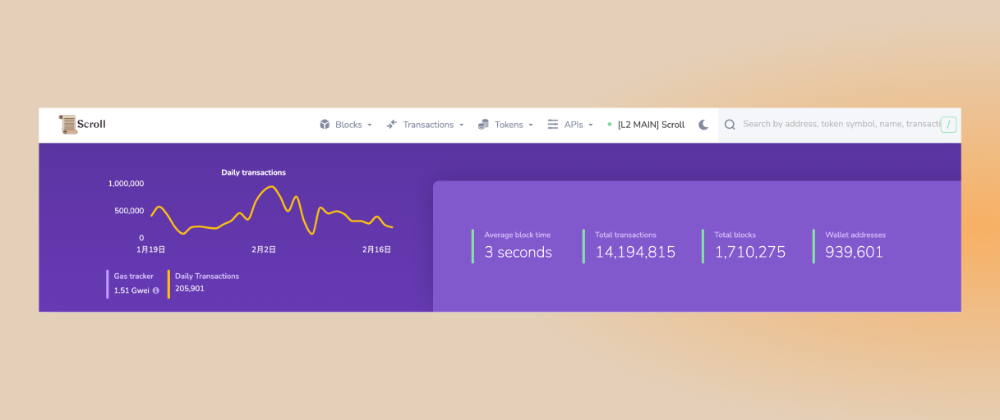
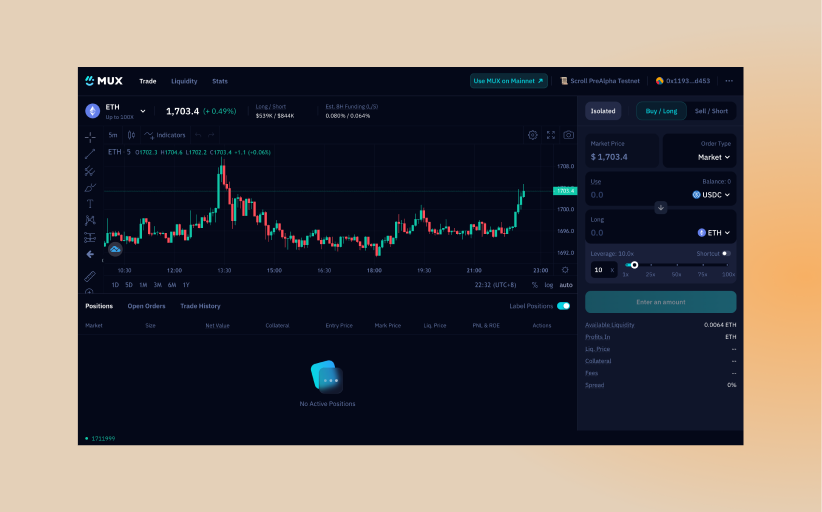
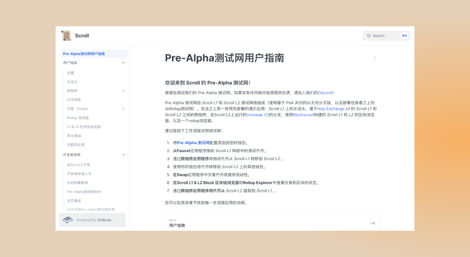

# Pre-Alpha测试网

## 测试网现状

- 截至 2023 年 2 月 19 日 22 : 00，Pre-Alpha测试网共有约939,601个钱包地址，新增72,605个钱包地址，处理了约14,194,815笔用户交易，生成了1,710,275个区块，平均区块时间约为3秒。

- 测试，测试，反复测试。。。
- 我们一直为 Goerli 测试网做最后的润色，包括优化跨链桥设计和提高稳定性。

# 技术架构

- 零知识方面，我们实现了Halo2 API来并行处理见证赋值，进一步减少证明时间。
- 同时，我们优化了在默克尔树中存储 Keccak 和 Poseidon 哈希。 

# 生态项目

## Mux
- 一站式杠杠交易平台 Mux Protocol 支持了 Scroll 的 Pre-Alpha 测试网。

## Scoller
- Scroller中文社区本周上线了 Pre-Alpha 测试网的用户指南和开发者指南：guide.scroller.cn

# 以太坊社区

- 在过去的一周内，Scroll 在幕后为 EthDenver 活动做着最后的准备。将在下周披露更多的内容。

## ETHKL Mini Hack

- Scroll 的开发者关系 Daniel Helm 受邀参加了 ETETHKL 的 Mini Hack 活动，介绍了 Scroll 的 zkEVM 解决方案。

## CoinPost Global
- 2月16日，Scroll的联合创始人 Sandy 参加了 CoinPost Global 的活动，介绍 Scroll 的 EVM 等效方案。

