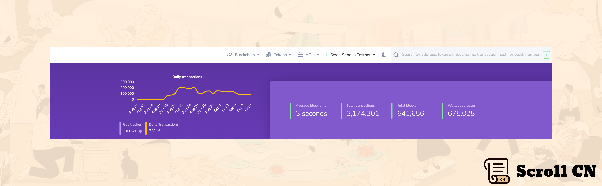

# Beta测试网

## 测试网现状

截至 2023 年 09 月 10 日  23 : 00，Beta测试网共有约 675,028个钱包地址，新增了 111,237 个钱包地址，处理了约 3,174,301 笔用户交易，生成了 641,656 个区块，平均区块时间约为 3 秒。

## 基础设施
继上周跨链桥合约改进之后，我们的L1 Batch 的最终确认成本现在更加稳定和可预测。
除此之外，我们还增加了 Scroll Sepolia 的区块 Gas Limit，使我们能够处理更大的交易，并将更多交易放入单个区块中。

# 生态项目

## zkDX
zkDX是一个去中心化的流动性衍生品交易所，专为以太坊的Layer 2生态系统而构建。 通过与Scroll Sepolia集成，zkDX 正在将其低成本的交易服务扩展到Scroll社区。
[ZKDX](https://app.zkdx.io/trade)

## SubQuery
SubQuery 是一种开放、高性能、可靠且可扩展的数据索引服务，旨在支持去中心化应用程序。 [@SubQueryNetwork](https://twitter.com/SubQueryNetwork) 现在为在 Scroll Sepolia 上的开发者提供了必要的工具，以去中心化他们的整个基础设施堆栈。
[Scroll (Sepolia Testnet) Quick Start | SubQuery Academy (Documentation)](https://academy.subquery.network/quickstart/quickstart_chains/scroll-sepolia.html)

## DEGO
Dego Finance是一个聚合DeFi资产和NFT的创新平台，并允许构建多样化和相互关联的协议。
[Defusion.AI](https://defusion.ai/)

## Pheasant Network 
Pheasant Network 是optimistic 跨链桥协议，用于在以太坊和 Layer2 协议之间转移加密资产。 以太坊用户现在可以使用 Pheasant Network 直接桥接到Scroll Sepolia。
[Pheasant Network](https://pheasant.network/)

## zkPass
zkPass是一个隐私保护协议，可以从各种网络会话中进行安全和隐私的数据验证。 通过利用MPC，ZKP和3P-TLS， [@zkPass](https://twitter.com/zkPass) 允许用户在不上传敏感信息的情况下证明其数据的来源和真实性。
[https://pre.zkpass.org/dashboard](https://pre.zkpass.org/dashboard)

# 活动预告
下周，你会发现 Scrollers 遍布全球三个地点，参加 [@Permissionless](https://twitter.com/Permissionless) [@ethereum_sg](https://twitter.com/ethereum_sg) [@token2049](https://twitter.com/token2049) [@dappcon_berlin](https://twitter.com/dappcon_berlin) [@_FuturEth_](https://twitter.com/_FuturEth_) 。 我们将举办研讨会和演讲，并参加一些小组讨论。

具体行程安排可以参考

