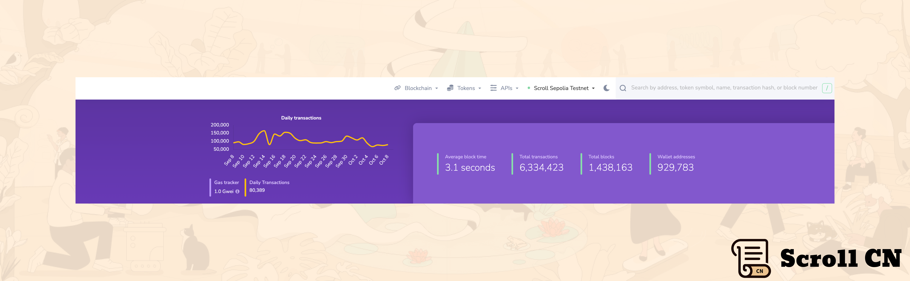

# Beta测试网

## 测试网现状

截至 2023 年 10 月 09 日  14 : 00，Beta测试网共有约 929,783 个钱包地址，新增了 116,705 个钱包地址，处理了约 6,334,423 笔用户交易，生成了 1,438,163 个区块，平均区块时间约为 3.1 秒。

## 基础设施
在技​​术方面，我们的工程团队正在开发 Scroll 排序器的扩展。此次升级将允许跟随节点根据 L1 以太坊上最终的rollup数据可信地验证其本地账本。

# 生态项目
## Atem
Atem 是一种去中心化的内容创建协议，旨在通过帮助创作者标记其内容以保护其在链上的安全来支持创作者。 
Atem 的用户现在可以在 Scroll 上创建并共享他们的内容作为 NFT。
[Atem | Atem Network](https://www.atem.io/)

## STAKEME
为了支持Scroll生态系统，STAKEME 部署了一个新的水龙头，允许用户无缝访问和领取测试网资金，以便与Scroll Sepolia进行交互。 

[FAUCETME](https://scroll.faucetme.pro/)

# ZK 专题研讨会

我们刚刚发布了最新的ZK研讨会。这一次我们邀请到了斯坦福应用密码学小组的 Wilson Nguyen，他带我们深入了解了 Nova 证明系统。

Nova 是一个高效的递归证明系统，早在 2021 年就被发明出来为复杂的折叠（Foding）方案提供安全编译器。 换句话说，Nova是一个系统，其中证明者递归地证明增量计算的正确执行。

# 以太坊社区

## Holesky 测试网

Goerli测试网正式关闭，一个新的测试网正在取而代之：Holesky 

Goerli 最初是在 ETHBerlin 作为一个黑客松项目创建的， 后来逐渐成为今天流行的以太坊测试网。

Goerli 从未打算成为默认的测试网，但由于其无需许可的验证器，由于其与主网环境的相似性，它在客户端团队和 rollup 开发者中变得流行。

Holesky 是 Goerli 的替代品，但有一个关键的区别： Holesky 创世区块拥有 146 万验证者和超过 20 亿个预挖的 Holesky ETH，这应该可以解决 Goerli 的 ETH 稀缺问题。

如果您是开发者，仍然建议您在 Sepolia 测试网上部署测试您的智能合约。它验证器集和状态历史记录较小，以保证较低的测试 gas 费。

总之： 
- Sepolia 测试网供开发者测试智能合约，
- Holesky 测试网供验证者，节点运营商和 rollup 团队测试其基础设施。

