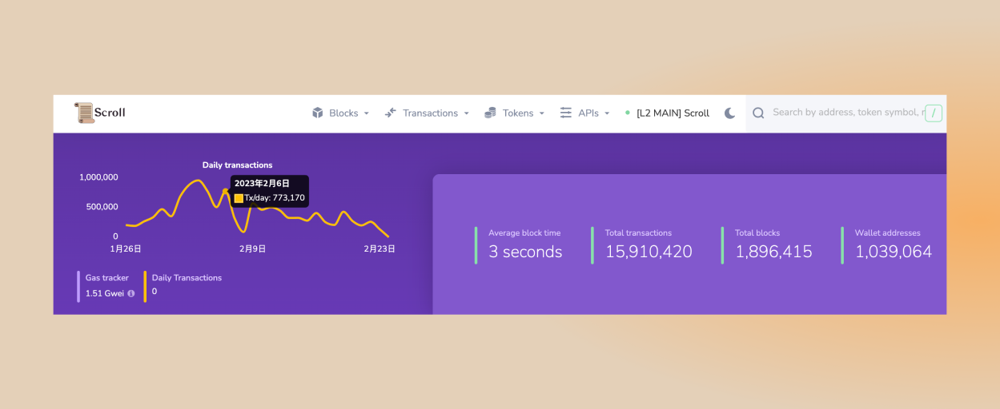

# 关于Scroll

本周，Scroll 的联合创始人张烨拟写了长文，分享了Scroll背后的理念，以及在构建zkEVM的道路上，吸取的经验教训和如何考虑不同的权衡取舍。

# Pre-Alpha测试网

## 测试网现状

- 截至 2023 年 2 月 26 日 10 : 00，Pre-Alpha测试网共有约 1,039,064 个钱包地址，新增 99,463 个钱包地址，处理了约 15,910,420 笔用户交易，生成了1,896,415个区块，平均区块时间约为3秒。

- 我们正在对 Scroll Alpha 做发布前的最后修改，并对我们当前部署的 Pre-Alpha 测试网进行一些额外的维护升级，包括提高整体稳定性的幕后工作。

# 生态项目

## AAVE

- AAVE 的 Temperature Check 阶段投票已经正式通过，后续将部署在 Scroll 的测试网上，披露更多细节。

## FOMO3D
- 一款基于 2018 年 FOMO3D 模型的小游戏
- https://fomo3d-frontend.vercel.app/

## Scroll Guardians
- 一款打怪升级的小游戏
- https://scroll-guardians.vercel.app/

# 合作

- 2 月 22 日，腾讯云宣布将支持 Web3 生态系统的发展，并公布了全套区块链 API 服务的发展路线图及其全新的「腾讯云 Metaverse-in-a-Box」产品，为 Web3 构建者提供强大的技术基础，并宣布与Scroll达成战略合作，以构建更强大的基础设施，帮助全球开发者加速采用 Web3 以实现去中心化的未来。

# 以太坊社区

## ETHDenver 导航

关于 Scroll 在 ETHDenver的活动安排，我们已经搭建了一个导航页面，其中包含了详细信息：[http: //ethdenver.scroll.systems](https://t.co/xFxFsO8HE2) 我们将在这里更新黑客松的详细信息，Scroll 相关讲座的链接，以及我们参与的各种会外活动的相关信息！

## Smart Contract Tuesdays

Scroll 的工程师 Ahmed Castro，参加了 EthereumDenver 的 Smart Contract Tuesdays 采访，讨论了 EIP-712 

## HODLong 播客

本周，Scroll 的联创张烨参加了HODLong播客，同主理人 Mable Jiang (@Mable_Jiang) 交流了Scroll为何选择 zkevm，特定应用 zkrollup 与通用 zkrollup 之间的技术差异，Scroll 架构中的基础设施组件以及这些组件如何协同工作，Scroll 的设计原则和运行 Scroll 社区背后理念。同时也解答了以太坊基金会如何以及为何与 Scroll 共同开发zkEVM，分享了作为技术创始人在过去两年的创业中遇到的挑战。最后也介绍了即将上线的 Goerli 测试网。

