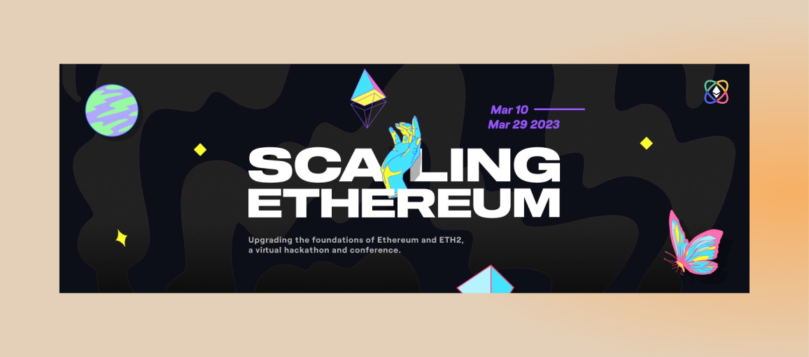
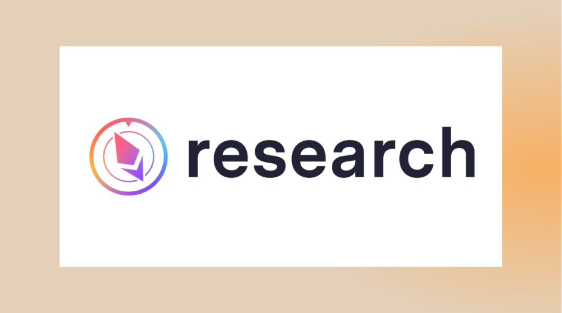

## 融资

为了加快开发我们的 zkEVM、前沿研究并继续与更广泛的社区一起建设，我们已经完成5000万美元的新一轮融资，Polychain Capital、Sequoia China（红杉中国）、Bain Capital Crypto、Moore Capital Management、Variant Fund、Newman Capital、IOSG Ventures、Qiming Venture Partners、OKX Ventures参投。

Scroll 现在是，未来也将永远是，为全球以太坊社区构建的扩容解决方案和生态系统。秉承这一社区至上的原则，我们欢迎来自不同国家、背景的广泛多元化的参与者，我们的共同目标是以正确的方式帮助扩容以太坊。

1) 我们将继续投入资源在完整功能的主网的安全发布。
2) 我们正在设计一项公共产品的 Grant 计划，以帮助支持未来的应用。更多详细信息即将发布。敬请关注！
3) 我们正在投入资源，进一步研究领先的去中心化证明者和排序器网络。我们相信，在完全去中心化之前，rollups 的功能是不完整的。我们的研究工作将继续，来开辟一条通往去中心化 ZK rollups 的道路。
zkEVM 是扩容以太坊的关键，应该一起开放构建。对于想和我们一起建设的伙伴，请在https://jobs.lever.co/ScrollFoundation 上查看我们的空缺职位。感谢您加入我们刚刚起步的旅程。

# Alpha测试网

## 测试网现状

截至 2023 年 3 月 12 日 22 : 00，Alpha测试网共有约 581,428 个钱包地址，新增了433, 535 个钱包地址，处理了约 2,553,282 笔用户交易，生成了 355, 131 个区块，平均区块时间约为 3 秒。

# 以太坊社区

## ETHDenver 简要回顾

- 我们参加了超过 15 个圆桌、研讨会和讲座，涵盖从开发者体验到电路设计和安全的方方面面。当回放上传时，我们会第一时间同步
- 我们在ETHDenver的黑客松活动中！有 55 个项目在 Scroll 上进行了部署，获奖者获得了 16,000 美元的奖金。请持续关注，我们会第一时间同步获奖者信息。
- 我们很高兴在我们的展位、会外活动和 hacker house 中见到你们中的许多人。感谢不断壮大的 Scroll 开发者社区

## ETHGlobal黑客松
Scroll是本次ETHGlobal：Scaling Ethereum 2023的合作伙伴，并提供了三个赛道共 20,000 美元的奖金。

## ETHBeijing 黑客松
Scroll 将协办赞助 ETH 北京黑客松，并对建立在 Scroll 上的项目提供奖金支持，ETH Beijing 黑客松总奖金高达 30,000 美元。

## 研究：多验证者应对跨链桥实现漏洞
Scroll的研究员Oghrul Maharramov近日在Ethereum Research上发表了关于多验证者应对跨链桥漏洞的帖子
