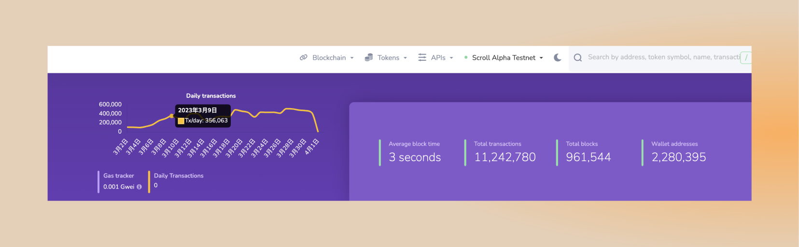
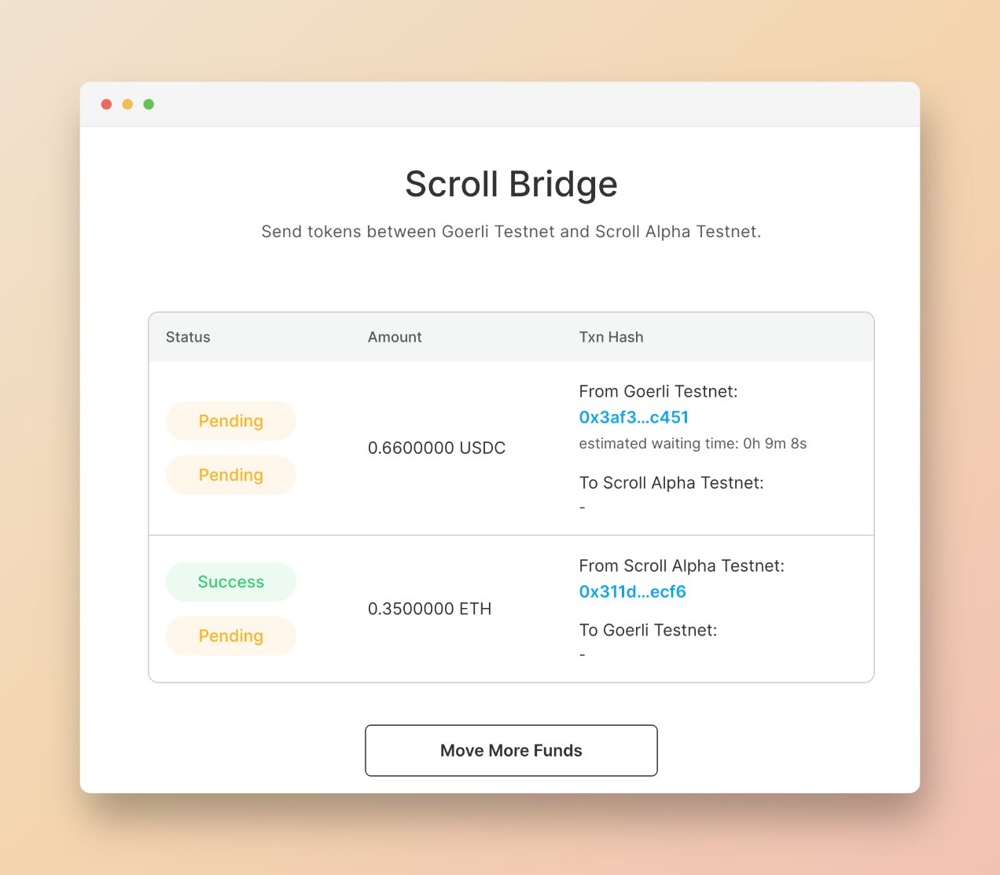
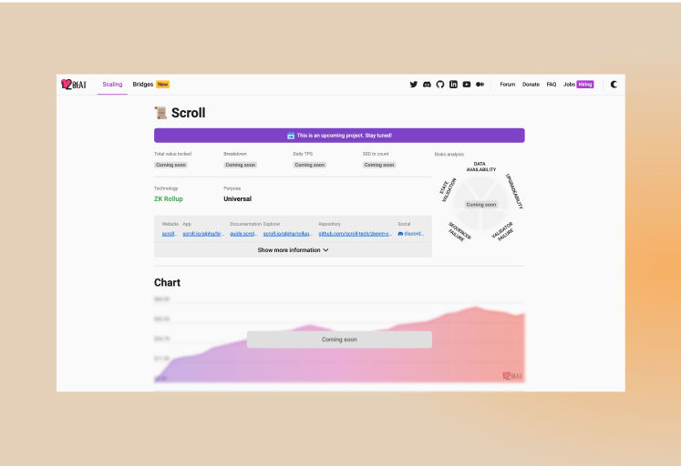
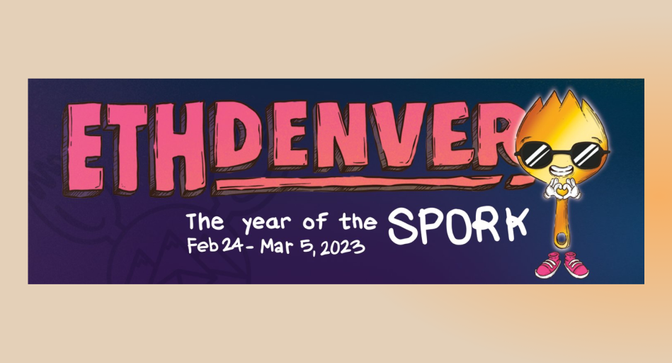
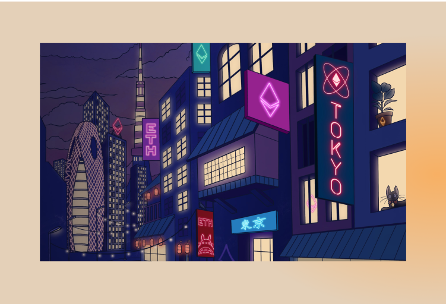

# Alpha测试网

## 测试网现状
截至 2023 年 4 月 2 日  24 : 00，Alpha测试网共有约 2,280,395  个钱包地址，新增了 480,415 个钱包地址，处理了约 11,242,278 笔用户交易，生成了 965,154 个区块，平均区块时间约为 3 秒。

## 跨链桥更新

我们最近改进了跨链桥用户界面并引入了预计到达时间功能。

## 零知识证明电路
在ZK方面，我们仍在持续改进电路效率，并将很快推出。

# 生态项目
## L2Beat
我们已经上线L2Beat

# 社区
## Scroll CN 公告

2023 年 4 月 2 日起，原社区成员发起的 Scroller 中文社区将正式更名为 Scroll CN 中文社区，统一整合现有的各个平台。Scroll CN 中文社区将同时向社区所有成员开放，去中心化运营。所有社区成员都是 Scroller， 欢迎 Scrollers 进行开源贡献。

## 社区电话会议回顾

第二次社区电话会议中，我们邀请了来自今年EthereumDenver黑客松的嘉宾演讲！包括Hunter Z Hunter, L's with Frens and My Mül 团队。关于三个团队的项目内容和Demo，可以参考之前的获奖名单。

# 以太坊社区

## 以太坊上海升级线上峰会
4 月 2 日 以太坊上海升级线上峰会中，Scroll 联合创始人张烨发表了主题为 zkEVM扩容以太坊的演讲。

在随后的圆桌环节中，同 Altlayer, RoochNetwork 等的嘉宾，共同探讨展望了 Rollup 生态。

## Crypto Tech Night
3 月 30 日 晚 19:30 的 Crypto Tech Night 活动中，Scroll R&D 团队的研究员 Luozhu 分享了信标链提款的设计理念，

# 活动预告

在接下来的几周内，您可以在东京、香港、里斯本和北京的eth/zk活动中找到Scroller

## 里斯本：ZK Summit 9
4 月 4 日将会举行ZK 峰会，可以在里斯本找到 @andyrdt、@aurelcode、@z2trillion、@rohitnarurkar 和 @OrestTa 

## 北京：ETH Beijing
4 月 5 日至 4 月 8 日，Scroll 将协办赞助 ETH 北京黑客松，并对建立在 Scroll 上的项目提供奖金支持，ETH Beijing 黑客松总奖金高达 30,000 美元。

## 香港：Hong Kong Web3 Festival 2023

4 月 12 日 - 15 日，由万向区块链实验室、HashKey Group联合主办，W3ME承办的 “2023香港Web3嘉年华（Hong Kong Web3 Festival 2023）” 将在香港进行。

4 月 12 日，Scroll 将与 Newman Capital，OP Capital 和 IOSG 共同举办 Web3 Night Out，Scroll 联合创始人 Sandy，以及工程师团队成员将出席活动。
- **活动链接**：https://lu.ma/7pqsjwxd
- **地点**：Club DAO, 21F, Gold Union Commercial Building, 70-72 Connaught Road West, Sheung Wan, Hong Kong
- **时间**：4 月 12 日 19:00 - Late Night

你也可以在其他活动现场找到Scroller，详见我们香港的活动合集。

## 东京：ETHGlobal Tokyo

4 月 14 日- 4 月 16 日，将在日本东京举办 ETHGlobal Tokyo，Scroll 也将为黑客松选手提供丰厚的奖金，敬请期待后续的活动消息。
