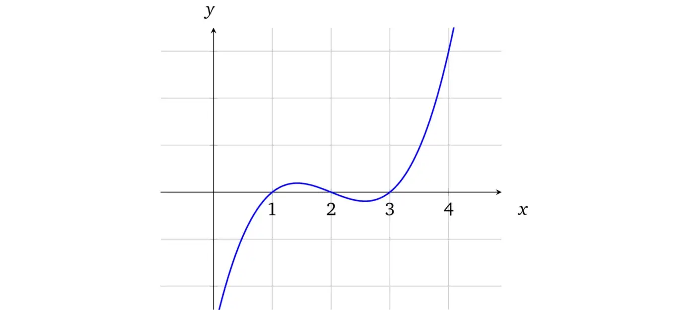
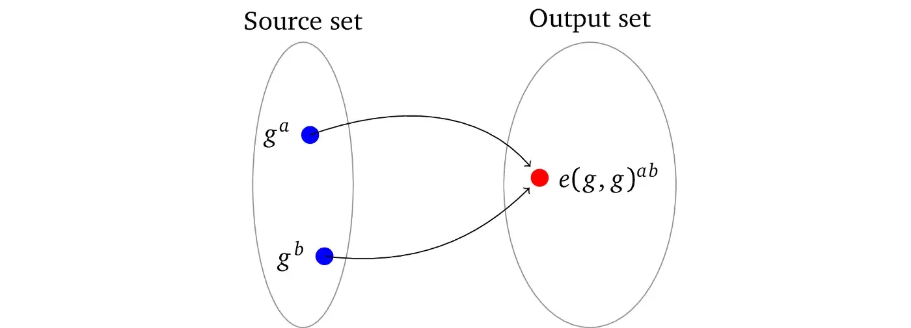
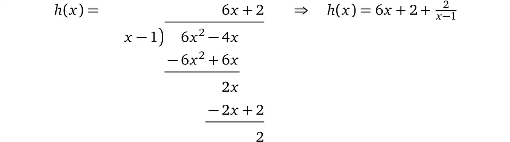
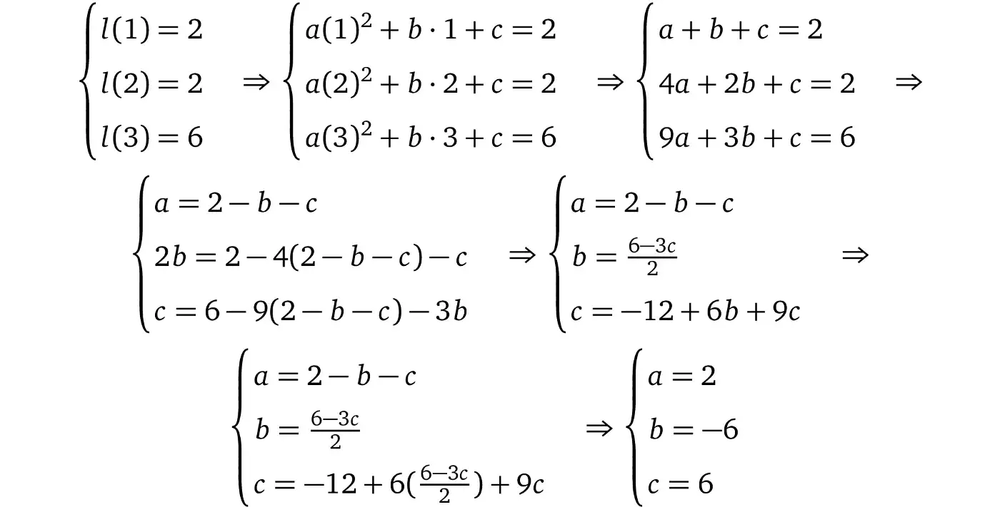
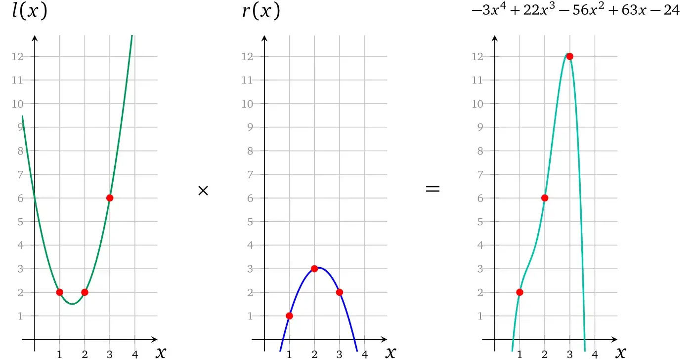
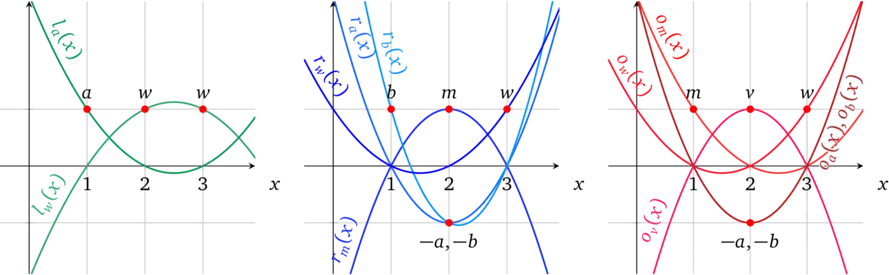

<center><font size=20>zkSNARK证明原理及机制</font></center>

原文：\<Maksym Petkus: Why and How zk-SNARK Works\>

*翻译：Junwei*

> 这篇文章是**[PDF 版本](https://arxiv.org/abs/1906.07221)**的修订版。

尽管已经有多个关于构建*zkSNARK的*重要资源，包括论文原文[ [Bit+11](https://medium.com/@imolfar/why-and-how-zk-snark-works-1-introduction-the-medium-of-a-proof-d946e931160#d914) ; [Par+13](https://medium.com/@imolfar/why-and-how-zk-snark-works-1-introduction-the-medium-of-a-proof-d946e931160#4d29) ] ，以及讲解版本[[Rei16](https://medium.com/@imolfar/why-and-how-zk-snark-works-1-introduction-the-medium-of-a-proof-d946e931160#eabb); [But16](https://medium.com/@imolfar/why-and-how-zk-snark-works-1-introduction-the-medium-of-a-proof-d946e931160#91fa); [But17](https://medium.com/@imolfar/why-and-how-zk-snark-works-1-introduction-the-medium-of-a-proof-d946e931160#3df0); [Gab17](https://medium.com/@imolfar/why-and-how-zk-snark-works-1-introduction-the-medium-of-a-proof-d946e931160#d309)]，由于零知识证明有大量的可拆解组件，其对许多人来说仍然是一个黑匣子。虽然他们给出了一些拼图，但如果没有缺失的部分，就无法看到完整的图片。

笔者第一次发现zkSNARK的各个组件是如何很好地组合在一起的，就被数学之美所震撼，看到的维度越多，就越好奇。因此，本文的重点是分享学习经验，用简单明了的方法，通过示例来阐明*zkSNARK，*并在此过程中回答许多问题，以便更多的人能够理解这项最先进的技术、其创新者以及最终的数学之美。

这项工作的贡献是一个具有足够复杂程度的简单说明，这是理解*zk-SNARK*所必需的，而无需任何主题、密码学或高等数学的先决知识。主要目标不仅是解释它是如何工作的，而且是解释它为什么工作以及它是如何变成这样的。

# 入门和证明媒介

## 前言

虽然最初计划用较短的篇幅，但现在文章已经超过了几十页，不过它需要的前置知识很少，并且可以随意跳过熟悉的部分。

如果你不熟悉一些使用的数学符号，请不要担心，这里只会介绍一些，而且会逐步介绍，一次介绍一个。

## 介绍

*简洁非交互式零知识证明*（*zkSNARK*）巧妙的地方在于，可以在不透露任何其他信息的情况下证明某些事情是真的，但是为什么它首先有用呢？

*零知识证明*在无数应用中都有优势，包括：

1）证明隐私数据的声明：

- A*的*银行账户超过*X*
- 去年，一家银行没有与实体*Y进行过交易*
- 在不暴露完整 DNA 的情况下匹配 DNA
- 信用评分高于*Z*

2）匿名授权：

- 证明请求者*R*有权访问网站的受限部分而无需透露其身份（例如，登录名、密码）
- 证明个人来自允许的国家/州列表，但不透露具体来自哪个国家/州
- 证明个人拥有地铁/地铁的月票，而无需透露卡的 ID

3）匿名支付：

- 完全脱离任何身份信息的支付 [ [Ben+14](https://medium.com/@imolfar/why-and-how-zk-snark-works-1-introduction-the-medium-of-a-proof-d946e931160#4c0c) ]
- 纳税而不透露自己的收入

4）外包计算：

- 外包昂贵的计算并验证结果是否正确而无需重新执行；它开辟了一种无需信任的计算
- 将区块链模型从每个节点计算相同的运算，变更为一方计算而其他人都验证

表面上听起来非常厉害，但底层方法是数学和密码学的“奇迹”，自1985年在主要著作“交互式证明系统的知识复杂性”[GMR85]引入以来，已经进行了四十年的研究。随后引入了非交互式证明[[BFM88](https://medium.com/@imolfar/why-and-how-zk-snark-works-1-introduction-the-medium-of-a-proof-d946e931160#1bde) ]，这在区块链的背景中尤为重要。

在任何*零知识证明*系统中，都有一个*证明*者想要在不透露任何其他信息的情况下说服*验证者，*某些*声明是真的。例如，验证者只知道证明者*在他的银行账户中余额超过*X*但没有别的信息（即未披露实际金额）。一个零知识证明协议应该满足三个属性：

- 完整性 — 如果声明为真，那么*证明者*可以说服*验证者*
- 可靠性 — 作弊的*证明者*无法说服*验证者*相信虚假声明
- 零知识 — 交互仅透露声明是否为真，仅此而已

*zk-SNARK*术语本身是在[[Bit+11](https://medium.com/@imolfar/why-and-how-zk-snark-works-1-introduction-the-medium-of-a-proof-d946e931160#d914)]中引入的，它建立在[[Gro10](https://medium.com/@imolfar/why-and-how-zk-snark-works-1-introduction-the-medium-of-a-proof-d946e931160#e2e7) ]的基础上，随后的匹诺曹(Pinocchio)协议[[Gen+12](https://medium.com/@imolfar/why-and-how-zk-snark-works-1-introduction-the-medium-of-a-proof-d946e931160#7f22); [Par+13](https://medium.com/@imolfar/why-and-how-zk-snark-works-1-introduction-the-medium-of-a-proof-d946e931160#4d29)]使其适用于通用计算。

## 证明的媒介

让我们从简单形式开始，尝试证明一些东西，而不用担心零知识、非交互性、它的形式和适用性。

想象一下，我们有一个长度为10的位数组，我们想向验证者（例如程序）证明所有这些位都设置为了1。


验证者一次只能检查（即读取）一个元素。为了验证该陈述，可以通过以任意顺序读取元素并检查它是否真的等于 1 来继续进行，如果等于1，则在第一次检查后该声明的可信度为⅒= 10%，验证者必须继续下一轮，直到他达到足够的置信度，如果一旦等于0则整体验证失败。在某些情况下，人们可能信任证明者并且只需要50%的可信度，这意味着必须执行 5 次检查，而在其他需要95%的可信度的情况下，必须检查所有单元格。很明显，这种证明协议的缺点是必须进行与元素数量成比例的检查，如果我们处理数百万个元素的数组，这是不切实际的。

让我们考虑多项式，它可以可视化为图形上的曲线，由数学方程式构建：



上面的曲线对应于多项式：*f*(*x*) = *x*³ – 6*x*² + 11*x* – 6。多项式的次数由*x*的最大指数决定，在本例中为3。

*多项式有一个有用的性质，即，如果我们有两个次数为d*的不相等多项式，它们最多只能在*d个*点上相交。例如，让我们稍微修改原始多项式*x* ³ – 6*x* ² + **10***x* – **5**并将其可视化为绿色：


如此微小的变化会产生截然不同的结果。事实上，不可能找到两个不相等的多项式，它们会共享曲线的连续部分（不包括交点）。

此属性源自查找交点的方法。如果我们想找到两个多项式的交集，我们需要使它们相等。例如，要找到多项式与*x*轴的交点（即*f*(*x*) = 0），我们将*x*³ – 6*x* ² + 11*x* – 6 = 0，这样一个方程的解将是那些交点：*x* = 1、*x* = 2 和*x* = 3，你也可以清楚地看到在上一张图中也是如此，其中蓝色曲线与*x*轴线相交。

同样，我们可以将多项式的原始版本和修改后的版本构建等式，以找到它们的交点。

$$
x^3-6x^2+11x-6=x^3-6x^2+10x-5
$$
所得多项式的次数为1，显而易见解*x*=1。因此只有一个交点：


对于任意次数*d的多项式，任何此类方程的结果始终是次数最高为d*的另一个多项式，因为没有乘法会产生更高的次数。例如：5*x* ³ + 7*x* ² – *x* + 2 = 3*x*³ – *x*² + 2*x* – 5，可简化为 2 *x* ³ + 8 *x* ² – 3 *x* + 7 = 0。代数基本定理告诉我们一个*d*次多项式最多可以有*d*个解（在接下来的部分中会详细介绍），因此最多有*d*个交点。

因此我们可以得出结论，在在任意点对任何多项式的求值（更多关于多项式求值：[ [Pik13](https://medium.com/@imolfar/why-and-how-zk-snark-works-1-introduction-the-medium-of-a-proof-d946e931160#489a) ]）类似于其唯一身份的标识。让我们在*x*=10处计算示例中的多项式。

$$
x^3-6x^2+11x-6=504
x^3-6x^2+10x-5=495
$$
事实上，在要求值的*x*的所有选择中，最多只有3个选择在这些多项式中具有相同的求值，而所有其他选择的x上求值都会不同。

这就是为什么如果证明者声称知道验证者也知道的某个多项式（无论其次数有多大），他们可以遵循一个简单的协议：

- *验证者为x*选择一个随机值并在本地进行多项式求值
- 验证者将*x*提供给证明者并要求计算所讨论的多项式
- 证明者计算他在*x*处的多项式并将结果提供给验证者
- 验证着检查本地结果是否等于证明者的结果，如果是，则声明被证明具有高可信度

例如，如果我们考虑*x*从 1 到 10⁷⁷ 的整数范围，则多项式求值不同的点数为10⁷⁷ – *d*。因此*， x*意外“命中” *d*个交点中的任何一个的概率等于（被认为可以忽略不计）：

$$
\frac{d}{10^{77}}
$$

> *注意：与低效的位检查协议相比，新协议只需要一轮，并且可以给出极高的可信度（假设d充分小于x取值范围的上限 ，几乎是100% ）。*

这就是为什么多项式是*zk-SNARK*的核心，尽管其他证明媒介也可能存在。

# 多项式证明

我们从证明多项式知识的问题开始，然后逐步走向通用方法。在此过程中，我们将发现多项式的许多其他性质。

到目前为止的讨论都集中在证明的弱概念上，各方必须相互信任，因为还没有方法来执行协议的规则。例如，证明者不需要知道多项式，他可以使用任何其他方法来得出正确的结果。此外，如果验证者计算多项式的范围不大，比如$10$，证明者可以猜出一个数字，并且有不可忽视的概率被接受。我们必须解决协议的这种弱点，但首先知道多项式意味着什么？多项式可以表示为以下形式（其中$n$是多项式的次数）：

$$
c_nx^n+...+c_1x^1+c_0x^0
$$
如果有人说他知道一次多项式（即$c_1x^1 + c_0=0$），这意味着他真正知道的是系数$c₀$和 $c₁$。此外，系数可以为任何值，包括$0$。

假设证明者声称知道一个三次多项式，$x = 1 $和$x = 2$ 是所有可能解中的两个。满足条件的其中一个多项式是$x^3–3x^2+2x=0$。对于$x = 1：1 – 3 + 2 = 0$。对于$x = 2：8 – 12 + 4 = 0$。

让我们首先更进一步地剖析下多项式的解。

## 因式分解

代数基本定理指出，只要可解，任何多项式都可以因式分解为线性多项式（即表示直线的一次多项式）。因此，我们可以将任何有效的多项式表示为其因子的乘积：

$$
(x-a_-)(x-a_1)...(x-a_n)=0
$$
此外，如果这些因式中的任何一个为零，则整个方程为零，此后所有$a$都是唯一的解。事实上，我们的示例可以分解为如下的多项式：

$$
x^3-3x^2+2x=(x-0)(x-1)(x-2)
$$
解是（$x$的值）：0、1、2 ，你可以在多项式的任意形式上轻松检查这一点，但因式分解的形式上可以直观的看出所有解（也称为根）。

回到证明者声称他知道根为1和2的三次多项式，这意味着该多项式具有以下形式：

$$
(x-1)(x-2)·...
$$
换句话说，$(x – 1)$和$(x – 2)$是相关多项式的因式。因此，如果证明者想要证明他的多项式确实有这些根而不公开多项式本身，他需要证明他的多项式$p(x)$是这些因式$t(x) = (x-1)(x-2)$，称为目标多项式，和一些任意多项式$h(x)$（在我们的示例中等于$x – 0$）的乘积，即：

$$
p(x)=t(x)·h(x)
$$
换句话说，存在多项式$h(x)$与$t(x)$相乘等于$p(x)$，因此p(x)包含t(x)，因此$p(x)$具有$t(x)$的所有根，需要证明的事情。

找到$h(x)$的直接方法是通过除法

$$
h(x)=\frac{p(x)}{t(x)}
$$
如果证明者找不到这样的$h(x)$，则意味着$p(x)$没有因式$t(x)$，在这种情况下，多项式除法将有余数。在我们的示例中，如果我们将$p(x)=x^3 – 3x^2 + 2x$除以$t(x) = (x – 1)( x – 2)=x^2–3x+2：$


> 注意：分母在左边，结果在右上方，余数在下方（多项式除法的解释和例子可以在[[Pik14](https://medium.com/@imolfar/why-and-how-zk-snark-works-2-proving-knowledge-of-a-polynomial-f817760e2805#e105)]中找到）。

我们得到了没有余数的结果$h(x)=x$。

> 注意：简单起见，以后我们将使用多项式的字母变量来表示其计算结果，例如，$p=p(r)$

使用我们的多项式身份检查协议，我们可以比较多项式$p(x)$和$t(x)⋅h(x)$

- 验证者采样一个随机值$r$，计算$t=t(r)$并将r给证明者
- 验证者计算$h(x) = p(x) / t(x) $并计算$p(r)$和$h(r)$；并将结果值$p, h$提供给验证者
- 验证者随后检查$p=t⋅h$是否相等，如果是，则这些多项式相等，这意味着$p(x)$具有$t(x)$的因式。

实际运用中，我们对示例中的多项式执行此协议：

- 验证者抽取一个随机值$23$，计算出$t=t(23)=(23–1)(23–2)= 62$并将$23$交给证明者
- 证明者计算$h(x)= p(x)/t(x)= x$，求出$p=p(23)=10626$和$h=h(23)=23$，并将$p,h$提供给验证者
- 验证者随后检查$p=t⋅h: 10626=462⋅23$，是正确的，因此证明了该声明

相反，如果证明者使用不同的$p^{′}(x)$，它不包含必要的因式，例如$p^{′}(x)=2x^3–3x^2+2x$，那么：


> 注意：虽然笔者的主要目标是通俗易懂，包括使用的数学符号集，但在后续章节中省略无处不在的符号：'是有问题的。它的基本作用是表示原始变量或函数的某种变换或推导，例如，如果我们想将v乘以2并将其分配给一个单独的变量，我们可以使用符号：$v^{′}= 2 ⋅ v$ 。

我们将得到$2x+3$，余数为$7x –6$，即：$p(x) = t(x) × (2x+3) + 7x – 6$。这意味着证明者必须通过将余数除以$t(x)$来计算：

$$
h(x)=2x+3+\frac{7x-6}{t(x)}
$$
因此，由于验证者对$x$的随机选择，余数$7x–6$的计算结果被$t(x)$计算结果整除的概率很低（但仍然不可忽视），随后如果验证者将另外检查$p$和$h$必须是整数，这样的证明将被拒绝。然而，检查要求多项式系数也为整数，这对协议造成了重大限制。

这就是引入加密原语的原因，它使这种划分成为不可能，即使原始评估恰好是可分的。

**Remark 3.1** *现在我们可以在不知道多项式本身的情况下检查多项式的特定属性 ，因此这已经为我们提供了某种形式的零知识和简洁性。尽管如此，这样构建存在多个问题：*

- *证明者可能根本不知道所要求的多项式 $p(x)$ 。他可以计算 $t = t ( r ) $，选择一个随机数h并设置$p=t⋅h$，这将被验证者接受为有效，因为等式成立。*
- *因为证明者知道随机点$x = r$，他可以构造任何在r处有一个交点且具有$t(r)⋅h(r)$的多项式。*
- *在原始声明中，证明者声称知道特定次数的多项式，在当前协议中没有次数的强制限制。 因此，证明者可以通过使用也满足因式检查的更高阶多项式来作弊。*

我们将在如下部分解决所有这些问题。

## 模糊多项式求值(Obscure Evaluation)

Remark 3.1 的前两个问题是可能的，因为值以原始形式呈现，证明者是知道$r$和$t(r)$的。理想情况下如果这些值作为黑盒给出，这样人们就无法对协议进行调整，但仍然能够对这些模糊值进行计算操作。类似于哈希函数在计算时很难返回原始输入。

### 同态加密

这正是同态加密的设计目的。也就是说，它允许加密一个值并能够对这种加密应用算术运算。实现同态加密的方式有多种，我们简单介绍一种。

一般的想法是我们选择一个基数（基数需要具有某些属性）自然数 $g$（比如 $5$）并加密一个值，我们将该值作为基数的指数求幂。例如，如果我们要加密数字 $3$：

$$
5^3=125
$$
其中125是3的加密值。如果我们想将这个加密数字乘以 $2$，我们将加密值的指数变为$2$：

$$
125^2=15625={(5^3)}^2=5^{2\times3}=5^6
$$
我们能够将未知值乘以2并将其加密。我们还可以通过乘法将两个加密值相加，例如3+2：

$$
5^3·5^2=5^{3+2}=5^5=3125
$$
同样，我们可以通过除法来减去加密数字，例如，5 – 3：

$$
\frac{5^5}{5^2}=5^{5-2}=5^3=3125
$$
但是，由于基数5是公开的，所以很容易逆运算得到秘密值，将加密值除以5直到结果为1，计算步数就是秘密值。

### 模运算

这就是模运算算法发挥作用的地方。模运算的思想如下：我们声明我们只选择前$n$个自然数，即$0、1 、…、n – 1$ 来处理，而不是有一个无限的数字集，如果任何给定的整数没有落在这个范围内，我们将其“包”起来。例如，让我们选择前六个数字。为了方便解释，考虑一个有六个单位相等的刻度的圆圈；这是我们的范围（通常称为有限域）。


现在让我们看看数字8会落在哪里。打个比方，我们可以把它想象成一根绳子，它的长度是8个单位：


如果我们把绳子系在圆圈的开头


并开始将绳子缠绕在它周围，旋转一圈后我们还剩下一部分绳子：


因此，如果我们继续该过程，绳索将在第 2 个刻度处结束。


这就是模运算的结果。无论绳子有多长，它总是会停在圆圈的一个刻度处。因此，模运算会将其保持在特定范围内（在本例中为 0 到 5）。15 个单位的绳子将在 3 处停止，即 $6 + 6 + 3$（两个完整的圆圈，剩余 3 个单位）。负数的工作方式相同，唯一的区别是我们将其换向相反的方向，对于–8，结果将为 4。

而且，我们可以进行算术运算，结果总是在n个数的范围内。我们现在将使用符号“mod n ”来表示数字的范围。例如：

$$
3\times2=3\ mod\ 6\\
5+2=1\ mod\ 6
$$
此外，最重要的特性是操作的顺序无关紧要，例如，我们可以先执行所有操作然后进行模运算或在每个操作之后进行模运算。例如$ (2 × 4 – 1) × 3 = 3 (mod 6)$ 等同于：

$$
2\times4=2\ (mod\ 6)\\
2-1=1\ (mod\ 6)\\
1\times3=3\ (mod\ 6)
$$
那么到底为什么会有帮助呢？事实证明，如果我们使用模运算，得到一个运算结果，不可能返回到原始数字，因为许多不同的组合将有相同的运算结果：

$$
5\times4=2\ (mod\ 6)\\
4\times2=2\ (mod\ 6)\\
2\times1=2\ (mod\ 6)\\
...
$$
如果没有模运算，结果的大小会透露其解的线索。现在这条信息被隐藏起来，同时保留了通用算术的属性。

### 强同态加密

如果我们回到同态加密并使用模运算，例如模 7，我们将得到：

$$
5^1=5\ (mod\ 7)\\
5^2=4\ (mod\ 7)\\
5^3=6\ (mod\ 7)
$$
不同的指数将有相同的结果：

$$
5^5=3\ (mod\ 7)\\
5^11=3\ (mod\ 7)\\
5^{17}=3\ (mod\ 7)
$$
这是很难找到指数的原因。事实上，如果模足够大，找到指数是几乎不可能的，现代密码学的很大一部分都是基于该问题的“难度”。

该方案的所有同态性质在模块化下都得以保留：

$$
encryption:\ 5^3=6\ (mod\ 7)\\
multiplication:\ 6^2={(5^3)}^2=5^6=1\ (mod\ 7)\\
addition:\ 5^3·5^2=5^5=3\ (mod\ 7)
$$

> 注意：模块化划分有点复杂，超出本文范围

让我们明确说明加密功能：

$$
E(v)=g^v\ (mod\ n)
$$
其中$v$是我们要加密的值。

**备注 3.2** *这种同态加密方案存在局限性，虽然我们可以将加密值乘以未加密值，但不能将两个加密值相乘（和相除），也不能对加密值求幂。虽然第一印象看很糟糕 ，但这些属性将成为zkSNARK的基石。这些限制在“加密值的乘法”部分进行了说明。*

### 加密多项式

有了这样的工具，我们现在可以用加密随机值x来计算多项式，并相应地修改零知识协议。

让我们看看如何计算多项式$p(x)=x^3 – 3x^2 + 2x$。正如我们之前构建的那样，知道多项式就是知道它的系数，在这里就是是：$1、–3、2$。我们必须得到加密值$x$从1到3次方的幂值：$E(x) , E(x^2) , E(x^3)$，因为不能直接对$E(x)$做平方/立方得到$E(x^2) , E(x^3)$，这样我们就可以计算加密多项式如下：

$$
{E(x^3)}^1·{E(x^2)}^{-3}·{E(x)}^2=\\
{(g^{x^3})}^1·{(g^{x^2})}^{-3}·{(g^{x^1})}^2=\\
g^{1x^3}·g^{-3x^2}·g^{2x}=\\
g^{x^3-3x^2+2x}
$$
这样运算的结果是，我们在一些未知的$x$处对多项式进行了加密计算。这是一个非常强大的机制，并且由于同态属性，相同多项式的加密求值在加密空间中总是相同的。

我们现在可以更新之前版本的协议，对于$d$次多项式：

- 验证者
	- 取随机数 $s $
	- 计算随机数$s $各阶数加密后的值 $E(s^i)=g^{s^i}, i\in{\{0,1,2,...,d\}} $，并提供给证明者
	- 计算未加密的目标多项式: $t(s) $
- 证明者
	- 计算多项式 $h(x)=\frac{p(x)}{t(x)}$
	- 根据加密值 $g^{s^0},g^{s^1},...,g^{s^d} $和系数$c_0,c_1,...,c_n $，进行多项式求值 $E(p(s))=g^{p(x)}=g^{c_dx^d+…+c_0x^0}=(g^{x^d})^{c_d}·...·(g^{x^0})^{c_0} $， 同理计算$E(h(s))=g^{h(s)} $ 
	- 提供计算结果$g^p $和$g^h $给验证者
- 验证者
	- 对于验证者而言，最后一步是检查$p=t(s)·h: g^p={(g^h)}^{t(s)}  $ => $g^p=g^{t(s)·h} $

> 注意：因为证明者对 $s$ 一无所知，所以很难伪造仍然匹配的多项式求值。

虽然在这样的协议中，证明者的是有限的，但他仍然可以使用任何其他方式来伪造证明，而无需实际使用提供的$s$的各阶加密值，例如，如果证明者声称仅使用3次幂$s^3$和1次幂$s^1$，在当前协议中无法检验。

## 约束多项式

多项式的知识是其系数$c₀、c₁ 、…、cᵢ$的知识，我们在协议中“分配”这些系数的方式与随机数s的各阶幂加密值相乘。我们已经在选择s的各阶幂的加密值时对证明者进行了约束，但是没有强制这类约束，例如，证明者可以使用任何可能的方法找到任意值$z_p$和$z_h$满足等式

$$
z_p=(z_h)^{t(s)}
$$
并将它们提供给验证者而不是$g^p$和$g^h$。这就是为什么验证者需要验证证明者只使用了$s$的各阶幂加密值而没有其他任何东西。

让我们考虑一个有一个变量和一个系数的一次多项式的基本例子$f ( x ) =c⋅x$和对应的$s$的加密值$E ( s ) = g^s$。我们正在寻找的是确保只有$s$ 的加密值即$g^s$，与某个任意的系数$c$同态“相乘”而不是其他任何东西。因此，结果肯定是如下的形式（对于任意系数$c$）：

$$
(g^s)^c
$$
一种方法是要求对另一个位移后的加密值与原始值一起执行相同的操作，作为算术模拟的“校验和(checksum)”，确保结果是原始值的幂。

更准确地说，这是通过[Dam91]中引入的Knowledge-of-Exponent Assumption(或KEA)实现的（注意$a$和$\alpha$(alpha)之间的区别）：

1. Alice 有一个值$a$，她希望 Bob 对任何幂取幂（其中a是使用的有限域群的生成元），唯一的要求是$a$只可以进行指数运算，不能进行别的操作。为了确保这一点，Alice
	1. 选择了随机数α
	2. 计算$a'=a^{\alpha} (mod\ n) $
	3. 将元组(a, a')提供了Bob，要求对每个值都进行任意指数运算并返回元组(b,b')，并保持"α位移"，即$b'=b^{\alpha}(mod\ n) $
2. 因为Bob无法从元组$(a, a ')$ 中提取出$α$ ，除非通过不可行的暴力破解，因此可以预见的是，Bob要想生成有效响应的唯一方法是通过以下过程：
	1. 选择某个常数c
	2. 计算$b=a^{c}\ (mod\ n) $和$b'=(a')^{c}\ (mod\ n) $
	3. 响应元组(b,b')
3. 有了响应和$α$，Alice检查等式：
	1. $b'=b^{\alpha} $ 
	2. ${(a^c)}^{\alpha} = {(a')}^c $
	3. $a^{c·\alpha} = {(a^{\alpha})}^c $

结论：

- Bob对元组的两个值应用了相同的指数（即$c$ ）
- Bob 只能用原来 Alice 的元组来维持$α$位移的关系
- Bob知道应用的指数$c$，因为产生有效 $( b,b^′) $的唯一方法是使用相同的指数
- Alice无法知道$c$的原因与Bob无法知道$α$的原因相同。

*尽管$c$已加密，但其值的范围可能不足以保证零知识的特性，这将在“零知识”部分中解决。*

最终，协议向Alice提供了一个证明，即Bob确实用他已知的某个值对$a$求幂，并且他不可能进行任何其他操作，例如乘法、加法，因为这会消除$α$位移的关系。

在同态加密的背景下中，求幂是加密值的乘法。我们可以在简单的单系数多项式$f(x) = c⋅x$的情况下应用相同的构造：

- 验证者选择随机数$s,α$并为$x = s$的一阶幂及其“位移”进行求值：

$$
(g^s,g^{}\alpha·s)
$$

- 证明者应用系数$c$：

$$
((g^s)^c,(g^{\alpha·s})^c)=(g^{c·s},g^{\alpha·c·s})
$$

- 验证者检验：

$$
{(g^{c·s})}^{\alpha}=g^{\alpha·c·s}
$$

这种构建限制了证明者只能使用提供的加密值s，因此证明者只能将系数c分配给验证者提供的多项式。我们现在可以将这种单项多项式（单项式）方法扩展为多项式，因为每个项的系数分配是单独计算的，然后同态“相加”在一起（这种方法由Jens Groth在[[Gro10](https://medium.com/@imolfar/why-and-how-zk-snark-works-2-proving-knowledge-of-a-polynomial-f817760e2805#3068)]中引入）。因此，如果证明者得到s的加密幂值及其位移值，他就可以对原始多项式和位移多项式进行求值，并进行相同的检验。特别地，对于d次多项式而言：

- 验证者计算随机数$s $各阶幂加密后的值 $E(s^i)=g^{s^i}, i\in{\{0,1,2,...,d\}} $和相应的位移项 $E(s^{\alpha i})=g^{\alpha s^i}, i\in{\{0,1,2,...,d\}} $
- 证明者
	- 根据各阶幂的加密值计算加密多项式$g^{p(x)}=g^{c_dx^d+…+c_0x^0}=(g^{x^d})^{c_d}·...·(g^{x^0})^{c_0} $
	- 根据位移项计算加密的“位移”多项式 $g^{\alpha p(x)}=g^{c_d\alpha x^d+…+c_0\alpha x^0}=(g^{\alpha x^d})^{c_d}·...·(g^{\alpha x^0})^{c_0} $
	- 将结果 $g^p,g^{p'} $提交给验证者
- 验证者验证: ${(g^p)}^{\alpha}=g^{p'} $

对于我们之前的示例多项式$p(x) = x^3 –3x^2+ 2x$这将是：

- 验证者提供 $E(s^3),E(s^2),E(s) $和相应的位移项$E(\alpha s^3),E(\alpha s^2),E(\alpha s^1) $
- 证明者计算

$$
g^p=g^{p(s)}=(g^{s^3})^1·(g^{s^2})^{-3}·(g^{s})^2=g^{s^3}·g^{-3s^2}·g^{2s}=g^{s^3-3s^2+2s}\\
g^{p^{'}}=g^{\alpha p(s)}=(g^{\alpha s^3})^1·(g^{\alpha s^2})^{-3}·(g^{\alpha s})^2=g^{\alpha s^3}·g^{-3\alpha s^2}·g^{2\alpha s}=g^{\alpha (s^3-3s^2+2s)}
$$

- 验证者检验$(g^p)^{\alpha}=g^{p^{'}}$

$$
(g^{s^3-3s^2+2s})^{\alpha}=g^{\alpha(s^3-3s^2+2s)}\\
g^{\alpha(s^3-3s^2+2s)}=g^{\alpha(s^3-3s^2+2s)}
$$

现在我们可以确定证明者除了验证者提供的多项式之外没有使用任何其他东西，因为没有其他方法可以保留$α$位移关系。此外，如果验证者想要确保排除证明者多项式中$s$的某些幂，例如$j$，他可以不提供加密值及其移位：

$$
g^{s^j},g^{\alpha s^j}
$$
与最开始时相比，我们现在有了一个健壮的协议。然而目前零知识特性仍然存在一个明显的缺点：虽然理论上多项式系数$cᵢ$值的范围可以很大，实际上它可能非常有限（在前面的例子中是 6），这意味着验证者可以暴力破解有限范围内的系数组合，直到结果满足证明者的答案。例如，如果我们考虑每个系数值的范围是100，则二次多项式将总共有100万个不同的组合，考虑到暴力破解只需要不到一百万次。更重要的是，安全的协议即使在只有一个系数且其值为1的情况下，也应该是安全的。

## 零知识

因为验证者只能从证明者发送的数据中提取关于未知多项式$p(x)$的知识，所以让我们看一下那些提供的值（证明）：

$$
g^p,g^{p^{''}},g^h
$$
他们参与如下检验：

$$
g^p=(g^h)^{t(s)}\\
(g^p)^{\alpha}=g^{p^{'}}
$$
问题是我们如何修改证明，使检验仍然有效，但无法提取任何知识？可以从上一节中得出答案：我们可以将这些值“位移”一些随机值$δ$ (delta)，例如，$(g^p)^{\delta}$。现在，为了提取知识，首先需要找到$δ$ ，这是不可行的。此外，这种随机化在统计上无法区分。

为了保持等式关系，让我们来看验证者的检验。证明者所提供的值在等式的两边。因此，如果我们用将它们每一个都采取相同的$δ$“位移”，则方程肯定保持平衡。

具体来说，证明者对选取随机数$δ$并用它对其证明值求幂

$$
(g^{p(s)})^{\delta},(g^{h(s)})^{\delta},(g^{\alpha p(s)})^{\delta}
$$
并提供给验证者进行验证：

$$
(g^p)^{\delta}={((g^h)^{\delta})}^{t(s)}\\
((g^p)^{\delta})^{\alpha}=(g^{p^{'}})^{\delta}
$$
合并后我们可以观察到检验仍然有效：

$$
g^{\delta·p}=g^{\delta·t(s)·h}\\
g^{\delta·\alpha p}=g^{\delta·p^{'}}\\
$$

> *注意：构建过程中加入零知识很容易，这通常被称为“免费”的零知识。*

# 非交互性和分布式可信设置

## 非交互性

至此，我们有了一个交互式的零知识方案。为什么会这样？因为证明仅对原始验证者有效，所以没有其他人（其他验证者）可以信任相同的证明，因为：

- 验证者可以与证明者串通并公开那些可以用来伪造证明的秘密参数$s,α$， 如<u>Remark 3.1</u>所提到的一样

- 同样的，验证者可以自己生成虚假的证明

- 验证者必须存储$α$和$t(s)$，直到所有相关证明都得到验证，这可能会泄露秘密参数，这给额外的攻击面提供了机会

因此，需要与每个验证者进行单独交互，才能证明一个声明（在这里是多项式证明）。

虽然交互式证明系统有它的用例，例如，当证明者只想说服一个专门的验证者（称为指定的验证者，更多信息详见[[JSI96](https://medium.com/@imolfar/why-and-how-zk-snark-works-3-non-interactivity-distributed-setup-c0310c0e5d1c#4b56)]）时，证明不会被重复用于向其他人证明相同的声明，但是当需要同时（例如在区块链等分布式系统中）或永久令多方可信时，效率非常低。证明者将被要求始终保持在线并为每个验证者执行相同的计算。

因此，我们需要秘密参数是可重用的、公开的、可信的和不会被滥用的。

让我们首先考虑在生成秘密$(t(s), α)$ 之后如何将它们保密。我们可以像验证者在发送给证明者之前，对s的幂值加密一样对它们进行加密。然而，如<u>Remark 3.2</u>中所述，我们使用的同态加密不支持两个加密值的乘法，但这在检验$t(s)$和$h$加密值相乘以及$p$和$α$相乘都是必需。这正是密码学配对适用的地方。

### 加密值的乘法

密码学配对（双线性映射）是一种数学结构，可以表示为函数$e(g, g)$，给定来自数组的两个加密输入（例如$g^a、g^b$），允许将它们确定性地映射到一组不同数组输出中的乘法表示，即$e(g^a, g^b ) = e(g, g)^{ab}$：



因为*源数组*和*输出数组*（通常称为群）不同，所以配对的结果不能用作另一个配对操作的输入。我们可以将输出群（也称为“目标群”）视为来自“不同的空间”。因此，我们不能将配对结果乘以另一个加密值，我们一次只能将两个加密值相乘。

在某种意义上，它类似于哈希函数，将所有可能的输入值映射到可能输出集合中的一个元素，并且它不是简单可逆的。

> *注意：乍一看，这种限制只会影响其他相关的功能，但有意思的是，在 zkSNARK中，它是方案安全性所依赖的最重要的属性，请参见<u>Remark 3.3</u>。*

配对函数$e(g, g)$的基本数学类比（技术上不正确的）是说，有一种方法可以“交换”每个输入的底数和指数，这样底数g在转换过程中被修改成指数，例如，$g^a → a^g$ 。然后将两个“交换”后的输入相乘，这样原始的$a$和$b$在相同的指数下可以相乘，例如：

$$
e(g^a,g^b)=a^a·b^g=(ab)^g
$$
因此，因为在“交换”过程中基数被改变，输出结果$(ab)^g$在另一组配对中（例如，$e (( ab ) ^g , g^d )$），不会产生所需的加密乘法$abd$。配对的核心属性可以用以下等式来表示：

$$
e(g^a,g^b)=e(g^b,g^a)=e(g^{ab},g^1)=e(g^1,g^{ab})=e(g^1,g^a)^b=e(g^1,g^1)^{ab}
$$
从技术上讲，配对的结果是目标集的不同生成元$g$下原始值的加密乘积，即$e(g^a, g^b ) = g^{ab}$。因此它具有同态加密的性质，例如，我们可以将多个配对的加密乘积加在一起：

$$
e(g^a,g^b)·e(g^c,g^d)=g^{ab}·g^{cd}=g^{ab+cd}=e(g,g)^{ab+cd}
$$

> *注意：密码学配对利用椭圆曲线来实现这些属性，因此从现在开始，符号 $g^n$将代表曲线上的生成元点累加n次，而不是我们在前面部分中使用的乘法群生成元。*

研究[[DBS04](https://medium.com/@imolfar/why-and-how-zk-snark-works-3-non-interactivity-distributed-setup-c0310c0e5d1c#0ea5)]为探索密码学配对提供了一个起点。

### 可信设置

有了密码学配对，我们现在可以准备设置安全的可重用公共参数。让我们假设我们信任一个诚实方来生成秘密值$s$和$α$。一旦$α$和$s$的所有幂值$（i = 0, 1, …, d）$以及相应的$α$位移被加密，就必须删除原始值

$$
g^{\alpha},g^{s^1},g^{\alphas^i}
$$
这些参数通常称为公共参考字符串或 CRS。CRS生成后，任何证明者和任何验证者都可以使用它来执行非交互式零知识证明协议。虽然不是至关重要的，但CRS 的优化版本将包括加密的目标多项式求值$g^{t(s)}$。

此外，CRS 分为两组$（i = 0, 1, …, d）$，包括：

- 证明密钥（也叫做求值密钥）：$$(g^{s^i}, g^{\alpha s^i}) $$

- 验证密钥：$$(g^{t(s)}, g^{\alpha}) $$

由于能够将加密值相乘，验证者可以在协议的最后一步检查多项式$t(s)$和$h$加密值相乘，以及$p$和$α$加密值相乘：

- 验证者可以利用验证密钥，处理从证明者处收到的加密后的多项式求值
	- 在加密空间内检验 $$p=t·h$$：
		-   $$e(g^p,g^1)=e(g^t,g^h)$$等价于$$e(g,g)^p=e(g,g)^{t·h} $$
	- 检验多项式约束：
		-   $$e(g^p,g^{\alpha})=e(g^{p^{'}}, g) $$

### 信任多方中的任何一方

可信设置应当是有效的，但因为上述的可信设置中，使用CRS时将不得不相信一方删除了α和s，而目前没有办法证明这一点（无知证明是一个活跃的研究领域[[DK18](https://medium.com/@imolfar/why-and-how-zk-snark-works-3-non-interactivity-distributed-setup-c0310c0e5d1c#2823)]），因此并不是有效的。我们有必要尽量减少或消除这种信任的需要。否则，不诚实的一方将能够在不被发现的情况下生成虚假的证明。

实现这一目标的其中一种方法，是由多方使用前面所介绍的数学工具，来生成复合CRS，这样任何一方都不知道秘密。下面，让我们考虑三个编号分别为A、B和C的参与方Alice、Bob和Carol，对于$i = 1 , 2 , …, d$：

- Alice随机取样随机数，并发布她的CRS

	$$(g^{s_A^i},g^{\alpha_A},g^{\alpha_A S^i_A}) $$

- Bob随机取样随机数，并通过同态相乘聚合Alice的CRS

	$$({(g^{s_A^i})}^{s_B^i},{(g^{\alpha_A})}^{\alpha_B},{(g^{\alpha_A S^i_A})}^{\alpha_B S^i_B})=(g^{{(s_As_B)}^i},g^{\alpha_A\alpha_B},g^{\alpha_A\alpha_B {(s_As_B)}^i}) $$

	发布Alice-Bob两方的CRS

	$$(g^{s_{AB}^i},g^{\alpha_{AB}},g^{\alpha_{AB} S^i_{AB}}) $$

- Carol对她的随机数做相同的处理

	$$({(g^{s_{AB}^i})}^{s_C^i},{(g^{\alpha_{AB}})}^{\alpha_C},{(g^{\alpha_{AB} S^i_{AB}})}^{\alpha_C S^i_C})=(g^{{(s_As_Bs_C)}^i},g^{\alpha_A\alpha_B\alpha_C},g^{\alpha_A\alpha_B\alpha_C {(s_As_Bs_C)}^i}) $$

	发布Alice-Bob-Carol的CRS

	$$(g^{s_{ABC}^i},g^{\alpha_{ABC}},g^{\alpha_{ABC} S^i_{ABC}}) $$

协议的结果是，我们得到合成的$s^i$和$α$，其中

$$
s^i=s_A^is_B^is_C^i,\alpha=\alpha_A\alpha_B\alpha_C
$$
并且没有参与者知道其他参与者的秘密参数，除非他们串通。事实上，为了知道$s$和$α$，一个人必须与所有其他参与者串通一气。因此，只要其中一个参与方是诚实的，就不可能生成虚假证明。

> *注意：可以根据需要让尽可能多的参与者重复此过程。*

我们可能会遇到的问题是如何验证参与者是否使CRS的每个值保持一致，因为恶意方可以对随机取样多个不同的$s₁、s₂、… $和$α₁, α₂, …$（或直接提供随机数作为聚合的公共参考字符串），使CRS无效且不可用。

幸运的是，因为我们可以使用配对使加密值相乘，所以我们能够执行一致性检验，从第一个参数开始并确保后面的每一个参数都是从它派生而来。参与者发布的每个 CRS 都可以按如下方式进行检验：

- 我们将s的一次幂作为标准值，并检验所有其他次幂是否与其一致：

	$$e(g^{s^i},g)=e(g^{s^1},g^{i-1}) $$

	例如

	- 二阶：$$e(g^{s^2},g)=e(g^{s^1},g^{s^1})\Rightarrow e(g,g)^{s^2}=e(g,g)^{s^{1+1}} $$
	- 三阶：$$e(g^{s^3},g)=e(g^{s^1},g^{s^2})\Rightarrow e(g,g)^{s^3}=e(g,g)^{s^{1+2}} $$

- 我们现在检验上一步中α位移是否正确：

	$$e(g^{s^i},g^{\alpha})=e(g^{\alpha s^i},g)|_{i\in[d]} $$

	例如

	- 三阶：$$e(g^{s^3},g^{\alpha})=e(g^{\alpha s^3},g)\Rightarrow e(g,g)^{s^3·\alpha}=e(g,g)^{\alpha s^3} $$

其中$i ∈ {2 , …, d }$ 是“ i is in 2 , 3 , …, d ”的缩写形式，$[d]$是范围 1 , 2 , …, d的缩写形式，在下一节中这样表示符号更方便。

请注意，虽然我们检验了每个参与者使用的秘密参数一致性，但并没有对之后的每一个参与者（在我们的示例中为Bob和Carol）强制使用之前发布的CRS。因此，如果恶意方是整条链的最后一个，他可以忽略先前的CRS 并从头开始构造有效参数，就好像他是链上的第一个参与者，因此是唯一知道秘密值$s$和$α$的人。

我们可以通过额外要求除第一个参与者之外的每个人加密并发布他的秘密参数来解决这个问题，例如，Bob 还需要发布：

$$
(g^{s_B^i},g^{\alpha_B},g^{\alpha_Bs_B^i})|_{i \in[d]}
$$
这样就可以检验Bob的CRS是Alice的CRS的若干倍数，对于$i \in 1 , 2 ,…, d$：

- $e(g^{s^i_{AB}},g)=e(g^{s^i_{A}},g^{s^i_{B}})$
- $e(g^{\alpha_{AB}},g)=e(g^{\alpha_A},g^{\alpha_B})$
- $e(g^{\alpha_{AB}s^i_{AB}},g)=e(g^{\alpha_As_A^i},g^{\alpha_Bs_B^i})$

同样，Carol必须证明她的CRS 是Alice-Bob的CRS的若干倍数。

这是一个稳健的CRS设置方案，不完全依赖任何一方。事实上，即使所有其他人都串通起来，只要有一方诚实并删除并且永远不共享其秘密参数就可以了。因此，CRS设置（有时称为仪式[[Wil16](https://medium.com/@imolfar/why-and-how-zk-snark-works-3-non-interactivity-distributed-setup-c0310c0e5d1c#191c)]）中不相关的参与者越多，伪造证明的可能性就越小，如果对立的多方参与，则概率就变得可以忽略不计。该方案允许对CRS设置不熟悉的其他不受信任方加入，因为验证步骤可确保他们不会破坏（其中包括使用不可靠的$α$和$s$）最终的公共参考字符串。

## 多项式的简洁非交互零知识证明

我们现在准备巩固升级的zk-SNARKOP协议。为简洁起见，正式版本中我们将使用大括号来表示由其旁边下标所填充的一组元素，例如

$$
\{s^i\}_{i\in[d]}
$$
表示集合$s^1, s^2, …, s^d$ 。在对目标多项式$t(x)$和证明者多项式的次数$d$达成一致：

- 设置
	- 取样随机值$$s,\alpha $$
	- 计算加密值 $$g^{\alpha} $$和$${g^{s^i}}_{i \in[d]},{g^{\alpha s^i}}_{i\in{0,...,d}} $$
	- 证明密钥：$$({g^{s^i}}_{i\in[d]},{g^{\alpha s^i}}_{i\in{\{0,...,d\}}}) $$
	- 验证密钥：$$(g^{\alpha},g^{t(s)}) $$

- 证明
	- 分配系数$$\{c_i\}_{i\in\{0,...,d\}} $$（即知识）给多项式，$$p(x)=c_dx^d+...+c_1x^1+c_0x^0 $$
	- 计算多项式 $$h(x)=\frac{p(x)}{t(x)} $$
	- 利用$${g^{s^i}}_{i \in[d]} $$计算加密后的多项式$$g^{p(s)} $$和$$g^{h(s)} $$
	- 利用$${g^{\alpha s^i}}_{i \in[d]} $$计算加密后的位移多项式$$g^{\alpha p(s)} $$
	- 取样随机值$$\delta $$
	- 设定随机证明 $$\pi=(g^{\delta p(s)},g^{\delta h(s)},g^{\delta \alpha p(s)}) $$

- 验证
	- 解析证明$$\pi $$为$$(g^{p},g^{h},g^{p^{'}}) $$
	- 检验多项式约束 $$e(g^{p^{'}},g)=e(g^p,g^{\alpha}) $$
	- 检验多项式因子 $$e(g^p,g)=e(g^{t(s)},g^h) $$

**Remark 3.3** 如果可以将配对的结果重用于另一个配对乘法，那么这样的协议将是完全不安全的，因为证明者可以设置
$$
g^{P^{'}}=e(g^p,g^{\alpha})
$$
然后将通过“多项式约束”的检验：

$$
e(e(g^p,g^{\alpha}),g)=e(g^p,g^{\alpha})
$$

## 小结

我们得到了多项式问题的零知识简洁非交互式协议，这是一个特殊的用例。虽然有人会说，证明者可以通过将$t(x)$乘以另一个多项式来轻松构建多项式p(x)使其通过检验，但这种构建方式仍然有用。

验证者知道证明者有一个有效的多项式，但不知道具体是哪个多项式。我们可以添加多项式其他特性的额外证明，例如：可以被多个多项式相除，多项式的平方。未来可能存在接受、存储和奖励所有已证明多项式的服务，或者是对特定形式的未知多项式进行加密求值的需求。不管如何，通用方案将可能诞生无数的应用程序。

# 通用计算

## 计算

让我们考虑一个简单的伪代码程序：

```undefined
算法1：
function calc(w, a, b)        
    if w then        
        return a × b        
    else        
        return a + b        
    end  if        
end function
```

从高阶视角看，它与我们的多项式协议无关。因此我们需要找到一种方法将程序转换为多项式形式。第一步是将程序翻译成数学语言，这相对容易，同样的语句可以表示如下（假设$w$为 0 或 1）：

$$
f(w,a,b)=w(a\times b)+(1-w)(a+b)
$$
执行$calc(1, 4, 2)$和计算$f(1, 4, 2)$ 将得出相同的结果：8。相反，$calc(0, 4, 2)$和$f(0, 4, 2)$都会算出结果为6。我们可以用这种方式表示任意的有限程序。

那么（在这个例子中）我们需要证明的是，对于表达式$f(w,a,b)$，当输入为(1, 4, 2)时输出是 8，换句话说，我们检验等式：

$$
w(a\times b)+(1-w)(a+b)=8
$$

## 单步运算

我们现在有了用数学语言表示的通用计算，但我们仍然需要将其转化为多项式形式。让我们仔细看看什么是计算。任何计算的核心部分都由以下形式的基本运算组成：

<center>左运算数 <b>运算符</b> 右运算数 = 输出

运算符（例如 +、 –、 × 、 ÷）正在对两个运算数（即值）进行计算。例如，对于运算数2和3以及运算符“乘法”，它们将得出2 × 3 = 6。因为任何复杂的计算（或程序）都只是一系列运算，首先我们需要找出这样的运算如何用多项式来表示。

### 多项式的算术特性

让我们看看多项式与算术运算有何关系。例如，如果您取两个多项式$f(x)$和$g(x)$并尝试将它们相乘：$h(x) =f(x)×g(x)$，计算结果$h(x)$在任意点$x = r$的值将是$f(r)$和$g(r)$的求值结果的乘积。让我们考虑如下两个多项式：$f(x)=2x² – 9x + 10 $和$g(x) = – 4x ² + 15x – 9$。可视化的图表如下：


在$x = 1$时，它们求值分别为：$f(1) = 2 – 9 + 10 = 3， g(1) = – 4 + 15 – 9 = 2$。将两个多项式相乘：$h(x)=f(x) × g(x) = – 8x⁴ + 66x³ – 193x² + 231x – 90$。乘法的图表形式如下：


如果我们检验结果多项式$f(x) × g(x)$ 在$x = 1$处的求值，我们将得到：$h(1) = – 8 + 66 – 193 + 231 – 90 = 6$，等于$ f(x)$和$g(x)$在$x=1$时的乘积，并且在其他的点x时也是一样。

同样，如果我们将$f ( x ) $和$g ( x ) $相加，我们将得到$–2 x ² + 6 x + 1$，在$x = 1$时求值为 5。


> *注意：其他点x处的求值也被加在一起，例如，检验$x = 2，x = 3$。*

如果我们可以将运算数表示为多项式（我们确实可以这样），那么通过算术属性，我们将能够获得运算符计算后的结果。

### 执行运算

如果证明者声称拥有两个数字相乘的结果，验证者如何检查？为了证明单步运算的正确性，我们必须执行提供的运算数来检验输出（结果）的正确性。如果我们再看一下运算形式：

<center>左运算数 <b>运算符</b> 右运算数 = 输出

同样可以表示为一个多项式运算：

$$
l(x)\ 运算符\ r(x) = o(x)
$$
对于给定的$a$：

- $l(x)$ — 在a点表示（求值为）左运算数的值

- $r(x)$ — a点代表右运算数的值

- $o(x) $— a点表示运算的结果（输出）

因此，如果这些多项式运算正确地表示了运算数和输出，则$ l(a)\ 运算符\ r(a) = o(a)$的计算应当成立。将输出多项式$o(x)$移到等式左侧则$l(a)\ 运算符\ r(a) – o(a) = 0$，如果输出多项式$o(x)$表示的值，是运算符对运算数多项式$l(x)$和$r(x)$表示的值正确计算的结果，表明运算多项式$ l(x)\ 运算符\ r(x) – o (x)$求值肯定 0 。也就是说，如果多项式运算是有效的，它肯定有根$a$，因此，它肯定包含我们之前构建的因式$(x – a)$（详见 [因式分解部分](https://medium.com/@imolfar/why-and-how-zk-snark-works-2-proving-knowledge-of-a-polynomial-f817760e2805#2fe7)），也就是我们所证明的目标多项式，即$t(x) = x – a$。

例如，让我们考虑运算：

$$
3\times2=6
$$
它可以用简单的多项式表示$l(x) = 3x$ ,$ r(x) = 2x $,$ o(x) = 6x$，对应$a = 1$相应求值，即 $l(1) = 3; r(1) = 2; o(1) = 6。$


> *注意：“$a$”的值可以是任意的。*

运算多项式则为：

$$
l(x)\times r(x)=o(x)\\
3x\times 2x=6x\\
6x^2-6x=0
$$
可视化为：


值得注意的是，运算多项式有$(x – 1)$的因式：

$$
6x^2-6x=6x(x-1)
$$
因此，如果证明者提供这样的多项式$l(x)、r(x) 、o(x)$而不是之前的$p(x)$，那么验证者将接受它是有效的，因为它可以被$t(x)$整除。相反，如果证明者试图作弊将输出值替换为4，例如$o(x) = 4x$，则运算多项式将变成$6x^2 – 4x = 0：$


而它没有解$x = 1$，因此$l(x) × r(x) – o(x)$ 不能被$t(x)$在没有余数的情况下整除：



因此，这种不一致的运算将不会被验证者接受（如[因式分解部分](https://medium.com/@imolfar/why-and-how-zk-snark-works-2-proving-knowledge-of-a-polynomial-f817760e2805#2fe7)所述）。

## 运算证明

让我们修改我们最新的协议以支持单步乘法运算证明。回想一下，[之前](https://medium.com/@imolfar/why-and-how-zk-snark-works-3-non-interactivity-distributed-setup-c0310c0e5d1c#d1b1)我们有多项式知识p(x)的证明，但现在我们需要处理三个多项式$l(x)、r(x)、o(x)$。虽然我们可以定义$p(x) = l(x) × r(x) – o(x) $，但有两个相悖的地方。首先，在我们的协议中，加密值的乘法（即$l(s) × r(s)$) 在证明阶段是不可行的，因为配对只能使用一次并且需要进行“多项式约束”检查。其次，这将为证明者留下一个机会，可以随意修改多项式的结构，但仍然保持有效的因式$t(x)$，例如$p(x) = l(x)$ 或$p(x) = l(x) – r(x) $甚至$p(x) = l(x) × r(x) + o(x)$，只要保证$p(x)$有根$a$。这种修改实际上意味着证明有可能背后是不同的声明，这当然不是我们所希望的。

这就是证明者必须单独提供多项式$l(s)、r(s)、o(s)$求值的原因。这意味着必须调整多项式知识。本质上验证者需要在加密空间中检验的是$l(s) × r(s) – o(s) = t(s)h(s)$。虽然验证者可以使用密码学配对执行乘法，但减法$(–o(x)$)是一个成本极高的运算（需要找到$g^{o(s)}$的倒数），这就是为什么我们将$o(x)$移到等式的右边的原因：$l(x)r(x) = t(x)h(x) + o(x)$。在加密空间中验证者的检验转换成了：

$$
e(g^{l(s)},g^{r(s)})=e(g^{t(s)},g^{h(s)})·e(g^{o(s)},g)\\
e(g,g)^{l(s)r(s)}=e(g,g)^{t(s)h(s)}·e(g,g)^{o(s)}\\
e(g,g)^{l(s)r(s)}=e(g,g)^{t(s)h(s)+o(s)}
$$

> *注意：回想一下，密码学配对的结果支持通过乘法进行加密加法，参考[配对部分](https://medium.com/@imolfar/why-and-how-zk-snark-works-3-non-interactivity-distributed-setup-c0310c0e5d1c#f62b)。*

设置阶段保持不变，而协议更新后如下：

- 证明

	- 赋值$$l(x),r(x),o(x) $$的对应系数
	- 计算多项式$$h(x)=\frac{l(x)\times r(x)-o(x)}{t(x)} $$
	- 利用$${g^{s^i}}_{i \in [d]} $$进行加密多项式求值$$g^{l(s)},g^{r(s)},g^{h(s)} $$
	- 利用$${g^{\alpha s^i}}_{i \in [d]} $$进行加密后的位移多项式求值$$g^{\alpha l(s)},g^{\alpha r(s)},g^{\alpha h(s)} $$
	- 设定证明$$\pi=(g^{l(s)},g^{r(s)},g^{o(s)},g^{h(s)},g^{\alpha l(s)},g^{\alpha r(s)},g^{\alpha o(s)}) $$

- 验证

	- 解析证明$$\pi $$为$$(g^l,g^r,g^o,g^h,g^{l^{'}},g^{r^{'}},g^{o^{'}}) $$
	- 检验多项式约束
	- $$e(g^{l^{'}},g)=e(g^l,g^{\alpha}) $$

	- $$e(g^{r^{'}},g)=e(g^r,g^{\alpha}) $$

	- $$e(g^{o^{'}},g)=e(g^o,g^{\alpha}) $$

	- 检验运算有效性: $$e(g^l,g^r)=e(g^{t(s)},g^h)·e(g^o,g) $$

	上述的协议可以证明正确计算了两个值相乘。

	人们可能会注意到，在更新后的协议中，我们不得不放弃零知识部分。这样做的原因是为了使过渡更加简单。我们将在后面的部分中添加它。


## 多步运算

我们可以证明单步运算，但我们如何扩展来证明多步运算呢（这是我们的最终目标）？让我们尝试添加另一步运算。考虑计算连乘的情况：$a × b × c$。在基本运算模型中，这意味着两步运算：

$$
{\color{green}a}\times{\color{blue}b}={\color{red}r_1}\\
{\color{green}r_1}\times{\color{blue}c}={\color{red}r_2}\\
$$
如前所述，我们可以通过使运算数多项式在任意$x$点，例如$x=1$时求值来表示这样的运算。有了多项式的这个性质并不限制我们在不同的$x$点表示其他值，例如$x=2$时:


这种独立性允许我们同时执行两步运算，而不会将它们“混合”在一起（即不会互相影响）。满足上面两个点的多项式运算如下所示：


可以看出运算多项式的根为$x = 1$ 和$x = 2$。因此两步运算都是正确的。

让我们看一个三个连续的乘法的例子: $2×1×3×2$，它可以按如下方式计算：

$$
{\color{green}2}\times{\color{blue}1}={\color{red}2}\\
{\color{green}2}\times{\color{blue}3}={\color{red}6}\\
{\color{green}6}\times{\color{blue}2}={\color{red}12}\\
$$


我们需要将它们表示为运算数多项式，对于由$x∈ {1 , 2 , 3}$表示运算，$l(x)$分别为2、2和6，即通过点$(1, 2),(2, 2),(3, 6)$，同样地 $r(x) ∋ (1, 1) , (2, 3) , (3, 2)$，而$o ( x ) ∋ (1 , 2) , (2, 6) , (3 , 12)$。

但是，我们如何找到通过这些点的多项式呢？对于任何通过多点的情况，我们必须使用一种特定的数学方法。

### 多项式插值

为了构建运算数和输出多项式，我们需要一种方法，可以在给定通过一组点的情况下，生成多项式曲线，这种方法称为插值法。有如下多种可用的方法：

- 方程组与未知数

- 牛顿多项式

- 内维尔算法

- 拉格朗日多项式

- 快速傅里叶变换

让我们以第一个为例。这种方法的思想是存在一个唯一未知系数的$n$次多项式$p(x)$，它通过给定的$n + 1 $个点，使得对于每个点${(xᵢ, yᵢ )}, i ∈ [n +1]$，在$xᵢ$处多项式求值应等于$yᵢ$，即对于所有$i$，$p(x_i) = y_i$。在我们通过三个点的例子中，它将是如下形式的二次多项式：

$$
ax^2+bc+c=y
$$
让我们对左运算数多项式（绿色）中每个点的多项式求值得到等式，并通过用其他系数表示每个系数来求解方程组：



因此左运算数多项式为：

$$
{\color{green}l(x)}=2x^2-6x+6
$$


对应下图：


我们可以用同样的方法求得 r(x)和o(x)：

$$
{\color{blue}r(x)}=\frac{-3x^2+13x-8}{2};{\color{red}o(x)}=x^2+x
$$


### 多项式表示多步运算

现在我们有了表示三步运算的运算数多项式，让我们一步步看看如何验证每步运算的正确性。回想一下，验证者正在寻找等式 $l(x) × r(x) – o(x) = t(x)·h(x)$。在这种情况下，因为运算由点$x ∈ {1 , 2 , 3}$表示，目标多项式在这些$x$点求值肯定为0，换句话说，$t(x)$的根肯定是 1、2 和 3，其基本形式为：


首先，$l(x)$ 和$ r(x)$ 相乘，结果是：



其次，从$l(x) × r(x)$的结果中减去$o(x)$：


已经可以看出每步运算数乘法都对应一个正确的根。最后一步，证明者需要提供一个有效的因式：

$$
h(x)=\frac{l(x)\times r(x)-o(x)}{t(x)}=\frac{-3x^4+22x^3-57x^2+62x-24}{(x-1)(x-2)(x-3)}
$$
使用长除法我们得到：


当$h(x) = –3x + 4$时，验证者可以计算$t(x)·h(x)$：


现在很显然$l(x) × r(x) – o(x) = t(x)·h(x)$，这也是我们用多项式表示运算所要证明的。

# 变量多项式

## 变量多项式

使用[第4 部分](zkSNARK证明原理及机制 #4：通用计算.md)中介绍的证明多步运算的多项式方法，我们可以一次证明许多步运算（例如百万级别甚至更多），但它有一个严重的缺陷。

如果生成证明的“程序”在不同运算中使用相同的*变量*作为运算数或输出，例如：

$$
{\color{green}a}\times{\color{blue}b}={\color{red}r_1}\\
{\color{green}a}\times{\color{blue}c}={\color{red}r_2}\\
$$
对于这两步运算， $a$在*左运算数多项式*中必须表示为：


尽管如此，因为我们的协议允许证明者为多项式设置任意系数，所以他为不同运算设置不同的$a$值时并不会受到约束，例如：


这种自由度打破了一致性，允许证明者生成验证者所不关心的其他程序的证明。因此，我们必须确保任何变量在其使用的每步运算中只能具有一个值。

> *注意：这里的变量不同于常规的计算机科学的定义，因为它是不可变的并且每次执行仅赋值一次。*

### 单变量运算数多项式

让我们考虑一个简单的例子（与当前示例一样），我们只有一个变量（即$a$）用于所有的左运算数，由左运算数多项式 $l(x)$ 表示。我们必须找出一种方案，可以确保此多项式在每步运算中都表示相同的$a$值。证明者可以设置不同值的原因是，他可以控制$x$的各阶幂的系数。因此，如果这些系数是常数，那就可以解决可变性问题。

让我们仔细看看包含相等值的多项式。例如，检验两个多项式表示两步运算对应的值相等（即在$x=1$ 和 $x=2$ 处），其中第一个多项式表示值1，第二个表示值 2：


请注意，对应的系数在每个多项式中成比例，因此第二个系数是第一个系数的两倍，即：

$$
2x^2-6x+6=2\times(x^2-3x+3)
$$
因此，当我们想同时改变一个多项式中的所有值时，我们需要改变它的比例，这是由于多项式的算术性质导致的。如果我们将一个多项式乘以一个数，每个x点处的求值将会倍乘（即缩放)。要求证的话，可以尝试将第一个多项式乘以3或其他任何数字。

因此，如果验证者需要强制证明者在所有操作中设置相同的值，那么应该只能修改比例而不是单个系数。

那么如何保留系数比例呢？我们可以从左运算数多项式的证明开始。它是 $l(x)$ 在某个秘密值$s$处求值的加密形式：$g^{l(s)}$，即它是一个加密值。我们已经从“多项式约束”部分知道，如何通过$α$位移来约束验证者仅使用提供的$s$，同态乘法是唯一可用的运算。

与约束单个指数类似，验证者可以一次约束整个多项式。而不是提供单独的加密值及其$α$位移

$$
g^{s^1},g^{s^2},...,g^{s^d},g^{\alpha s^1},g^{\alpha s^2},...,g^{\alpha s^d}
$$
该协议如下：

- 设置
	- 利用对应的系数构建运算数多项式 $$l(x) $$
	- 随机取样随机数 $$\alpha $$和 $$s $$
	- 设置证明密钥：$$(g^{l(s)},g^{\alpha l(s)}) $$
	- 设置验证密钥：$$(g^{\alpha}) $$

- 证明
	- 利用运算值$$v $$
		- 乘以运算数多项式：$${(g^{l(s)})}^v $$
		- 乘以位移后的运算数多项式：$${(g^{\alpha l(s)})}^v $$
	- 提供运算数多项式相乘的证明：$$(g^{vl(s)}, g^{v\alpha l(s)}) $$

- 验证
	- 解析证明为$$(g^l, g^{l^{'}}) $$
	- 验证比例：$$e(g^{l^{'}},g)=e(g^l, g^{\alpha}) $$

证明者需要用相同的α位移来响应，因为他无法从证明密钥中恢复出α，所以保证这种位移的唯一方法是对两个加密值同时乘以相同的值。

$$
g^{l(s)}, g^{\alpha l(s)}
$$
因此证明者不能修改$ l(x)$ 的单个系数，例如如果 $l(x) = ax^2 + bx + c$，他只能一次性将整个多项式乘以某个值$v: v ⋅ ( ax^2 + bx + c ) = v⋅ax^2 + v⋅bx + v⋅c$。而乘以另一个多项式是不可行的，因为没有提供$s$的单个指数的配对和$α$位移。证明者不能相加或相减，因为：

$$
g^{\alpha(l(s)+a^{'}x^2+c^{'})}\neq g^{\alpha l(x)}·g^{a^{'}x^2}·g^{c^{'}}
$$

<center><p style="color:gray">这再次需要知道未加密的α</p>

我们现在有了协议，但是应该如何构建运算数多项式$ l(x)$ 呢？由于任何整数都可以通过乘以1得到，因此对于相应的每步运算，多项式求值的结果应为 1，例如：


这允许证明者赋值$a$：


**Remark 4.1** *由于验证密钥包含加密的 $α$，因此可以向多项式添加（或减去）任意值 $v^′$ ，即：*
$$
g^{vl(s)}·g^{v^{'}}=g^{vl(s)+v^{''}}\\
g^{\alpha vl(s)}·(g^{\alpha})^{v^{'}}=g^{\alpha(vl(s))+v^{'}}\\
e(g^{\alpha(vl(s))+v^{'}},g)=e(g^{vl(s))+v^{'}},g^{\alpha})
$$
*因此，有可能修改并打破验证者所指向的多项式，证明不同的声明。我们将在下一节中解决这个缺陷。*

### 多变量运算数多项式

现在，只有当所有左运算数都使用相同的变量时，我们才能单独赋值。如果我们再添加一个变量d会怎样：


如果我们使用相同的方法，我们将无法为每个变量单独赋值，并且每个不同的变量将一起相乘。因此这种多项式约束只能支持一个变量。如果我们检查多项式的性质，我们会看到将多项式加在一起会得出这些多项式的不同求值。因此我们可以将运算数多项式l ( x ) 分离为运算数变量多项式
$$
l_a(x),l_d(x)
$$

<center><p style="color:gray">（注意下标）</p>

使得*变量* $a$和$d$可以与上一章节一样分别赋值和约束，然后加在一起表示所有左运算数的变量。因为我们将运算数中的变量多项式加在一起，所以我们需要确保运算数多项式在每步运算中只表示所有变量的其中一个。

使用算术特性，我们可以构建每个运算数变量的多项式，如果变量在相应运算作中用作运算数，则它的求值结果为 1，否则为 0。连续 0 乘以任何值将保持为零，当加在一起时它将被省略。对于我们的示例而言，变量多项式求值式必须满足：

$$
l_a(1)=1,l_a(2)=1,l_a(3)=0\\
l_d(1)=0,l_d(2)=0,l_d(3)=1\\
$$
以图表形式：


因此，我们可以分别设置每个变量的值，然后将它们加在一起得到运算数多项式，例如，如果$a = 3$ 和$d = 2$：


*注意：我们在值旁边使用下标来表明它代表哪个变量，例如， 3 ₐ 是 一个赋值为3的实例化后的变量。*

让我们从现在开始用大写字母表示这样的复合运算数多项式，例如，

$$
L(x)=al_a(x)+dl_d(x)
$$
其求值结果为$L$，即$L = L( s )$。只有当每个运算数变量多项式被验证者约束时，这样的构建才会有效，左运算数的交互也应当相应地改变：

- 设置
	- 构建$$l_a(x),l_d(x) $$，使其在第$$x$$步运算出现时，求值为1；在所有其他步运算时，求值均为0
	- 随机采样随机数$$s,\alpha $$
	- 对未赋值的变量多项式求值并加密
		-   $$g^{l_a(s)}, g^{l_d(s)} $$
	- 计算这些多项式的位移形式
		-   $$g^{\alpha l_a(s)}, g^{\alpha l_d(s)} $$
	- 设置证明密钥
		-   $$(g^{l_a(s)}, g^{l_d(s)}, g^{\alpha l_a(s)}, g^{\alpha l_d(s)}) $$
	- 设置验证密钥
		-   $$(g^{\alpha}) $$

- 证明
	- 对变量多项式赋值$$a $$和$$d $$: 
		-   $${(g^{l_a(s)})}^a, {(g^{l_d(s)})}^d $$
	- 对位移后的多项式赋值$$a $$和$$d $$:
		-   $${(g^{\alpha l_a(s)})}^a, {(g^{\alpha l_d(s)})}^d $$
	- 将所有赋值后的变量多项式相加组成运算数多项式: 
		-   $$g^{L(s)}=g^{al_a(s)}·g^{dl_d(s)}=g^{al_a(s)+dl_d(s)} $$
	- 将所有赋值的位移后的变量多项式相加组成位移后的运算数多项式:
		-   $$g^{\alpha L(s)}=g^{a\alpha l_a(s)}·g^{d\alpha l_d(s)}=g^{\alpha(al_a(s)+dl_d(s))} $$
	- 提供左运算数的有效赋值证明
		-   $$(g^{L(s)}, g^{\alpha L(s)}) $$

- 验证
	- 解析证明为$$(g^L, g^{L^{'}}) $$
	- 检验所提供的多项式是原始未赋值的变量多项式的和：
		-   $$e(g^{L^{'}},g)=e(g^L,g^{\alpha}) $$，其中检验了

		-   $$\alpha al_a(s)+\alpha dl_d(s)=\alpha(al_a(s)+dl_d(s)) $$

> *注意：$L(s)$和 $αL(s)$一次性表示所有变量多项式，并且由于$α$仅用于变量多项式的求值，因此证明者别无选择，只能使用提供的随机点求值并将相同的系数分配给原始和位移后的变量多项式。*

因此，证明者：

- 除了“赋”值，证明者不能通过改变系数来修改所提供的变量多项式，因为仅提供了这些多项式的加密求值，并且无法单独使用所需的加密的s幂值和α位移

- 无法在所提供的多项式之上加上另一个多项式，因为α比率将被破坏

- 无法通过乘以一些其他的多项式$u(x)$来修改运算数多项式，这可能会不成比例地修改值，因为在预配对空间中无法进行加密乘法

*注意：如果我们将一个多项式（例如 $l_a(x) $）加上（或减去）另一个多项式，例如，*
$$
l_d^{'}(x)=c_d·l_d(x)+c_a^{'}·l_a(x)
$$
*这实际上并不是对多项式 $l_d(x)$的修改，而是对 $l_a(x)$的结果系数的更改，因为它们最终会被相加起来：*
$$
L(x)=c_a·l_a(x)+l^{'}_d(x)=(c_a+c_a^{'})·l_a(x)+c_d·l_d(x)
$$
虽然证明者限制了多项式的使用，但仍然有一些不需要约束的空间：

- 如果证明者决定不加上某些赋值的变量多项式$l_i(x)$来计算运算数多项式$L(x)$是可以接受的，因为它等价于赋值0：

$$
g^{al_a(x)}=g^{al_a(x)+0l_d(x)}
$$

- 如果证明者累加多次相同的变量多项式是可以接受的，因为它与一次性赋值若干倍数是等价的，例如：

$$
g^{al_a(x)}·g^{al_a(x)}·g^{al_a(x)}=g^{3al_a(x)}
$$

这种方法类似地可以应用在右运算数和输出多项式$R(x), O(x)$中。

## 结构特性

上述改造带来了多个额外的有用属性。

### 常数系数

在上面的结构中，我们一直在使用未赋值的变量多项式求值为1或0，来表示变量是否在运算中所使用。自然地，我们也并没有被限制使用其他系数，包括负数，因为我们可以通过任何必要的点对多项式进行插值（前提是没有两步运算取相同的值x）。此类运算的示例如下：

$$
{\color{green}2a}\times{\color{blue}1b}={\color{red}3r}\\
{\color{green}-3a}\times{\color{blue}1b}={\color{red}-2r}\\
$$
因此我们的程序现在可以使用常数系数，例如：

```undefined
算法2：常数系数
——————————————————————————————————————————————
function calc ( w , a , b ) 
    if w then 
        return 3 a × b 
    else  
        return 5 a × 2 b 
    end  if  
end function
```

这些系数将在设置阶段“硬编码”，与1或0类似，将是不可变的。我们可以相应地修改运算形式：

$$
{\color{green}c_a·a}\times{\color{blue}c_b·b}={\color{red}c_r·r}\\
$$
或者更正式地说，对于变量$v_i ∈ {v_1 , v_2, …, v_n }$：

$$
{\color{green}c_l·v_l}\times{\color{blue}c_r·v_r}={\color{red}c_0·v_o}\\
$$
其中下标$ l、r $和 $o$ 是运算中所使用变量的索引。

> 注意：同一变量的常数系数在不同的运算和运算数/输出中可能不同。

### 自由相加

查看更新后的结构，很明显在多项式表示中，由特定的 x 所表示的每个运算数都是所有运算数变量多项式的总和，因此只有单个用到的变量可以赋非零值，而所有其他变量均为零。下图最能形象得说明这一点：


我们可以利用这种结构，并允许为每个运算数/输出添加任意数量的所需变量。例如在第一步运算中，我们可以先相加$a + c$， 然后再乘以其他运算数，例如 $( a + c ) × b = r$，这可以表示为：


因此，可以在单个运算数中添加任意数量的变量，为其中的每一个赋值任意系数，然后相加生成在相应程序运算中使用的运算数。这种特性可以高效得将运算结构更改为：

$$
{\color{green}(c_{l,a}·a+c_{l,b}·b+...)}\times{\color{blue}(c_{r,a}·a+c_{r,b}·b+...)}={\color{red}(c_{o,a}·a+c_{o,b}·b+...)}\\
$$
或者按更规范的说法，对于变量$v_i ∈ { v_1 , v_2, …, v_n } $和运算数变量系数

$$
c_{l,i}\in\{c_{l,1},c_{l,2},...,c_{l,n}\},c_{r,i}\in\{c_{r,1},c_{r,2},...,c_{r,n}\},c_{o,i}\in\{c_{o,1},c_{o,2},...,c_{o,n}\}
$$
结构如下：

$$
{\color{green}\displaystyle\sum_{i=1}^{n}c_{l,i}·v_i}\times{\color{blue}\displaystyle\sum_{i=1}^{n}c_{r,i}·v_i}={\color{red}\displaystyle\sum_{i=1}^{n}c_{o,i}·v_i}\\
$$

> *注意：每步运算的运算数都有自己的一组系数$ c$。*

### 加法、减法和除法

到目前为止，我们主要关注在乘法运算。然而，为了能够执行通用计算，现实生活中的程序还需要加法、除法和减法。

**加法：** 在上一小节中我们已经构建了可以在单个运算数中添加变量的结构，然后将其乘以另一个运算数，例如 $(3a + b ) × d = r$，但是如果我们只需要加法而不需要乘法怎么办，例如，如果程序需要计算 a + b，我们可以将其表示为：
$$
{\color{green}(a+b)}\times{\color{blue}1}={\color{red}r}\\
$$

> *注意：因为我们的结构对于每个运算数都有一个常数系数和一个变量$ (c ⋅ v)$，所以运算数 1 表示为 $c₁ ⋅ v₁$，而$ c₁ = 1$可以“硬编码”到对应的多项式中，$v₁$是一个变量，可以赋任何值，因此我们必须约束 $v₁$的值，如下一节所述。*

**减法**：减法几乎与加法相同，唯一的区别是负系数，例如对于 $a – b$：
$$
{\color{green}(a+-1·b)}\times{\color{blue}1}={\color{red}r}\\
$$
**除法**：如果我们检验除法运算
$$
\frac{factor}{divisor}=result
$$
我们会看到除法的结果是我们需要与除数相乘以产生因数的数字。因此我们可以通过乘法表示相同的意思：`divisor x result = factor`。因此，如果我们要证明除法运算$ a / b= r$ ，可以表示为：

$$
{\color{green}b}\times{\color{blue}r}={\color{red}a}
$$

> *注意：这样构建运算也称为“约束”，因为多项式构造表示的运算本身并不计算结果，而是检验证明者是否已经知道变量（包括结果），并且它们在运算中有效，即证明者必须提供一致的值，无论它们是什么。*
>
> *注意：所有这些算术运算都已经存在；因此不需要修改操运算的结构。*

## 计算示例

有了通用运算的结构，我们可以将我们的原始[算法 1](https://medium.com/@imolfar/why-and-how-zk-snark-works-4-general-purpose-computation-dcdc8081ee42#5d10)转换为一组运算，并进一步转换为多项式形式。让我们考虑算法的数学形式（我们将使用变量$v$来代表计算结果）：

$$
w\times(a\times b)+(1-w)\times(a+b)=v
$$
它有三个乘法，因为一步运算结构只支持一个，所以至少会有三步运算。但是，我们可以简化等式：
$$
w\times(a\times b)+a+b-w\times(a+b)=v\\
w\times(a\times b-a-b)=v-a-b
$$
现在它只需要两次乘法，同时计算逻辑保持不变。完整形式的运算如下：

$1:\qquad\qquad\qquad\qquad\qquad\qquad\qquad{\color{green}1·a}\times {\color{blue}1·b} ={\color{red}1·m}$

$2:\qquad\qquad\qquad{\color{green}1·w}\times {\color{blue}1·m+-1·a+-1·b} ={\color{red}1·v+-1·a+-1·b}\\$

我们还可以添加一个约束，要求$w$是二进制的，否则证明者可以使用任何值$w$从而导致计算不正确：

$1:\qquad\qquad\qquad\qquad\qquad\qquad\qquad{\color{green}1·w}\times {\color{blue}1·w} ={\color{red}1·w}$

要理解为什么$w$只能为 0 或 1，我们可以将方程表示为$w^2 – w = 0$ 并进一步表示为$ ( w – 0)( w – 1) = 0$，其中 0 和 1 是唯一的解。

这里总共有 5 个变量，其中左运算数中有 2 个，右运算数中有 4 个，输出中有 5 个。三个运算数多项式如下：

$\qquad\qquad\qquad\color{green}L(x)=a·l_a(x)+w·l_w(x)$

$\qquad\qquad\qquad\color{blue}R(x)=m·r_m(x)+a·r_a(x)+b·r_b(x)+w·r_w(x)$

$\qquad\qquad\qquad\color{Red}O(x)=m·o_m(x)+v·o_v(x)+a·o_a(x)+b·o_b(x)+w·o_w(x)$

其中每个变量多项式的求值必须为三步运算中的变量所对应的系数，如果变量不存在于运算数或输出中则求值为 0：


因此，因式多项式为$t(x) = (x – 1)(x – 2)(x – 3)$，这将确保所有三步运算的正确性。

接下来我们利用多项式插值来求得每个变量多项式：


绘制成图表：



我们准备通过多项式证明计算。首先，让我们为函数选择输入值，例如$w = 1 、a = 3 、b = 2$。其次，计算运算过程中的中间变量：

$$
m=a\times b=6\\
v=w(m-a-b)+a+b=6
$$
之后，我们将计算结果所涉及的所有值赋值给相应的变量多项式，并将它们相加得到运算数和输出多项式：

${\color{green}L(x)=3·l_a(x)+1·l_w(x)}=x^2-5x+7$

${\color{blue}R(x)=6·r_m(x)+3·r_a(x)+2·r_b(x)+1·r_w(x)}=\frac{1}{2}x^2-2\frac{1}{2}x+4$

${\color{Red}O(x)=6·o_m(x)+6·o_v(x)+3·o_a(x)+2·o_b(x)+1·o_w(x)}=2\frac{1}{2}x^2-12\frac{1}{2}x+16$

图表形式如下：


加总起来表示相应运算中的运算数和输出值：


我们需要证明$L(x) × R(x) – O(x) = t(x) h(x)$，因此我们寻找h(x)$满足：

$$
h(x)=\frac{L(x)\times R(x)-O(x)}{t(x)}=\frac{\frac{1}{2}x^4-5x^3+\frac{35}{2}x^2-25x+12}{(x-1)(x-2)(x-3)}=\frac{1}{2}x-2
$$
图表形式为：


显而易见多项式$L(x) × R(x) – O(x)$ 有解$x = 1、x = 2 $和$x = 3$，因此$t(x)$是它的因数，如果我们使用了不一致的变量值将不会是这样。

这就是如何在多项式层面证明变量值的正确计算的过程。证明者将继续处理协议的加密部分。

# 可验证计算协议

我们对[多项式证明协议](zkSNARK证明原理及机制 #3：非交互性和分布式可信设置.md)进行了许多重要的修改，使其可以适用于通用计算，所以现在让我们看看它是如何定义的。假定函数$f(^*)$ 为所要证明的计算结果，对应运算步骤$d$，变量数$n$和相应的系数

$$\{c_{L,i,j},c_{R,i,j},c_{O,i,j}\}_{i\in\{1,...,n\},j\in\{1,...,d\}}$$

- **设置**

	- 为左运算数构建变量多项式$$\{l_i(x)\}_{i\in\{1,...,n\}}$$，对于所有运算步骤$$j\in\{1,...,d\}$$，变量多项式的求值结果为对应系数，即$$l_i(j)=c_{L,i,j}$$，右运算数和输出同理

	- 随机取样 $$s,\alpha$$

	- 计算$$t(x)=(x-1)(x-2)...(x-d)$$和其求值$$g^{t(s))}$$

	- 计算证明密钥

		$$(\{g^{s^k}\}_{k\in[d]},\{g^{l_i(s)},g^{r_i(s)},g^{o_i(s)},g^{\alpha l_i(s)},g^{\alpha r_i(s)},g^{\alpha o_i(s)}\}_{i\in\{1,...,n\}})$$

	- 计算验证密钥

		$$g^{t(s)},g^{\alpha}$$

- **证明**

	- 计算函数$f$ (\$)以及对应的变量值$$\{v_i\}_{i\in\{1,...,n\}}$$

	- 计算$$h(x)=\frac{L(x)\times R(x)-O(x)}{t(x)}$$，其中$$L(x)=\sum_{i=1}^nv_i·l_i(x)$$，$$R(x),O(x)$$同理

	- 变量赋值并加总得到运算数多项式

		$$g^{L(s)}={(g^{l_1(s)})}^{v_1}...{(g^{l_n(s)})}^{v_n}$$, $$g^{R(s)}=\displaystyle\prod_{i=1}^n{(g^{r_i(s)})}^{v_i}$$, $$g^{O(s)}=\displaystyle\prod_{i=1}^n{(g^{o_i(s)})}^{v_i}$$

	- 为位移后的多项式变量赋值

		$$g^{\alpha L(s)}={(g^{\alpha l_1(s)})}^{v_1}...{(g^{l_n(s)})}^{v_n}$$, $$g^{\alpha R(s)}=\displaystyle\prod_{i=1}^n{(g^{\alpha r_i(s)})}^{v_i}$$, $$g^{\alpha O(s)}=\displaystyle\prod_{i=1}^n{(g^{\alpha o_i(s)})}^{v_i}$$

	- 根据所提供的$$s$$的各阶加密值$${g^{s^k}}_{k\in[d]}$$，计算加密后的求值$$g^{h(s)}$$

	- 设置证明：$$(g^{L(s)},g^{R(s)},g^{O(s)},g^{\alpha L(s)},g^{\alpha R(s)},g^{\alpha O(s)})$$

- **验证**

	- 解析证明为$(g^L,g^R,g^O,g^{\alpha L},g^{\alpha R},g^{alpha O},g^h)$

	- 变量多项式约束检验

		$e(g^L,g^{\alpha}=e(g^{L^{'}}, g))$$, $$e(g^R,g^{\alpha}=e(g^{R^{'}}, g)$$, $$e(g^O,g^{\alpha}=e(g^{O^{'}}, g)$

	- 运算有效性检验

		$e(g^L,g^R)=e(g^t,g^h)·e(g^O,g)$

> *注意：使用符号$$\prod$$可以更简洁地表示多个元素的乘积，例如：*

$$
\displaystyle\prod_{i=1}^{n}v_i=v_1·v_2·...·v_n
$$

对于$i ∈ \{1, …, n\}$的所有变量多项式 { $lᵢ$($x$ ) $, rᵢ$ ($x$) $, oᵢ$ ($x$) }和目标多项式$t$($x$)的集合称为QAP(*Quadratic Arithmetic Programs*，在 [[Gen+12](https://medium.com/@imolfar/why-and-how-zk-snark-works-6-verifiable-computation-protocol-1aa19f95a5cc#8bfc) ]中引入）。

虽然该协议足够稳健以验证通用计算，但必须解决两个安全问题。

## 运算数和输出的不可互换性

因为我们对所有运算数的变量多项式约束检验都使用相同的$α$，所以无法阻止证明者：

- 混淆使用来自其他运算数的变量多项式，例如$L^′(s) = o_1(s) + r_1(s) + r_1(s) + …$
- 完全交换*运算数多项式*，例如交换$O$($s$)与$L$($s$)将产生运算$O(s) × R(s) = L( s)$
- 重复使用相同的运算数多项式，例如$L$($s$) × $L$($s$) = $O$($s$)

这种可互换性意味着证明者可以变更执行程序来有效地证明其他一些计算。显然避免这种行为的方法是对不同的运算数使用不同的$α$，具体来说我们将协议修改如下：

- $$设置$$

	...

	- 随机取样 $$\alpha_l,\alpha_r,\alpha_o$$，而不是$$\alpha$$

	- 计算对应“位移”项$$\{g^{\alpha_l l_i(s)},g^{\alpha_r r_i(s)},g^{\alpha_o o_i(s)}\}_{i\in\{1,...,n\}}$$

	- 证明密钥

		$$(\{g^{s^k}\}_{k\in[d]},\{g^{l_i(s)},g^{r_i(s)},g^{o_i(s)},g^{\alpha_l l_i(s)},g^{\alpha_r r_i(s)},g^{\alpha_o o_i(s)})$$

	- 计算验证密钥

		$$g^{t(s)},g^{\alpha_l},g^{\alpha_r},g^{\alpha_o}$$

- $$证明$$

	...

	- 为“位移后“的多项式的变量赋值

		$$g^{\alpha_l L(s)}=\displaystyle\prod_{i=1}^n{(g^{\alpha _l l_i(s)})}^{v_i}$$, $$g^{\alpha_r R(s)}=\displaystyle\prod_{i=1}^n{(g^{\alpha_r r_i(s)})}^{v_i}$$, $$g^{\alpha_o O(s)}=\displaystyle\prod_{i=1}^n{(g^{\alpha_o o_i(s)})}^{v_i}$$

	- 设置证明：$$(g^{L(s)},g^{R(s)},g^{O(s)},g^{\alpha_l L(s)},g^{\alpha_r R(s)},g^{\alpha_o O(s)})$$

- $$验证$$

	...

	- 变量多项式约束检验

		$e(g^L,g^{\alpha_l}=e(g^{L^{'}}, g))$$, $$e(g^R,g^{\alpha_r}=e(g^{R^{'}}, g)$$, $$e(g^O,g^{\alpha_o}=e(g^{O^{'}}, g)$

现在再使用来自其他运算数的可变多项式是不可能的，因为证明者不知道如下的$α-$ s：

$$
\alpha_l, \alpha_r,\alpha_O
$$

## 跨运算数的变量一致性

对于任何变量$v_i，$我们必须将其值分配给每个相应运算数的变量多项式，即：

$$
(g^{l_i(s)})^{v_i},(g^{r_i(s)})^{v_i},(g^{o_i(s)})^{v_i}
$$
因为每个运算数多项式的有效性是单独检验的，所以没有强制要求在相应的变量多项式中使用相同值的约束。这意味着左运算数中变量$v_1$可能与右运算数或输出中的变量$v_1$值不同。

我们可以通过熟悉的多项式约束的方法（就像我们在变量多项式中所做的那样）强制跨运算数的变量值相等。如果我们可以创建一个跨所有运算数的“校验和位移后的”变量多项式，这将限制证明者只能给变量赋相同的值。验证者可以将每个变量的多个多项式组合成一个，例如，

$$
g^{l_i(s)+r_i(s)+o_i(s)}
$$
并将其位移随机值$β$，即

$$
g^{\beta(l_i(s)+r_i(s)+o_i(s))}
$$
随后将该位移后的多项式提供给证明者，证明者对其和变量多项式分别赋值：

$$
{(g^{l_i(s)})}^{v_{L,i}},{(g^{r_i(s)})}^{v_{R,i}},{(g^{o_i(s)})}^{v_{O,i}},{(g^{\beta(l_i(s)+r_i(s)+o_i(s))})}^{v_{\beta,i}}
$$
$β$被加密并添加到验证密钥$g^{\beta}$中。现在，如果所有$v_i$的值都相同，即

$$
v_{L,i}=v_{R,i}=v_{O,i}=v_{L,i}=v_{\beta,i}
$$
则如下的等式应当成立：

$$
e(g^{v_{L,i}·l_i(s)}·g^{v_{R,i}·r_i(s)}·g^{v_{O,i}·o_i(s)}, g^{\beta})=e(g^{v_{\beta,i}·\beta(l_i(s)+r_i(s)+o_i(s))},g)
$$
虽然这是一种有效的一致性检验，但由仍然有概率出现$l$($s$)$、 r$($s$ )$、o$ ($s$) 中有两个及以上的多项式求值相同或一个多项式可被另一个多项式整除等。这将使证明者可以伪造变量值

$$
v_{L,i},v_{R,i},v_{O,i},v_{\beta,i}
$$
这样至少可能有两个变量值不相等但等式仍然成立，使检验失效：

$$
(v_{L,i}+l_i(s)+v_{R,i}·r_i(s)+v_{O,i}·o_i(s))·\beta=v_{\beta,i}·\beta·(l_i(s)+r_i(s)+o_i(s))
$$
例如以一个单步运算为例，其中$l$($x$) = $r$($x$)。我们将这两个多项式的求值表示为$w$=$l$($s$)=$r (s)$和$y=o(s)$。则等式将转化成如下形式：

$$
\beta(v_{L}w+v_Rw+v_Oy)=v_O·\beta(2w+y)
$$
这样的形式下，对于任意的$v_R$和$v_O$，只要设置$v_{\beta}=v_O,v_L=2v_O-v_R$，等式将转化成如下形式，通过检验

$$
\beta(2v_Ow-v_Rw+v_Rw+v_Oy)=v_O·\beta(2w+y)
$$
因此之前的一致性检验将失效，一种解决方案是对于每个运算数使用不同的$β$，确保运算数的变量多项式的值不可预测。对协议进行如下的修改

- 设置

	- ...

	- 随机取样 $$\beta_l,\beta_r,\beta_o$$

	- 计算，加密并将变量一致性多项式添加至证明密钥：

		$${g^{\beta_ll_i(s)+\beta_rr_i(s)+\beta_oo_i(s)}}$$

	- 加密$$\beta-s$$并添加至验证密钥：$(g^{\beta_l},g^{\beta_r},g^{\beta_o})$

- 证明

	- ...为变量一致性多项式的变量赋值$对于i\in\{1,...,n\}，g^{z_i(s)}={(g^{\beta_ll_i(s)+\beta_rr_i(s)+\beta_oo_i(s)})}^{v_i}$

	- 在加密空间将赋值后的多项式相加

		$$g^{Z(s)}=\displaystyle\prod_{i=1}^ng^{z_i(s)}=g^{\beta_lL(s)+\beta_rR(s)+\beta_oO(s)}$$

	- 将$$g^{Z(s)}$$添加至证明

- 验证

	- ...在所提供的运算数多项式和“校验和”多项式间检查一致性

		$e(g^L,g^{\beta_l})·e(g^R,g^{\beta_r})·e(g^O,g^{\beta_o})=e(g^Z,g)$

		等价于

		${e(g,g)}^{\beta_lL+\beta_rR+\beta_oO}={e(g,g)}^Z$

伪造相同的变量值将无法在这种结构中实现，因为不同的$β$ -s 使得多项式没法被篡改。然而，此时存在类似于<u>Remark 4.1</u> 中的缺陷，具体是因为如下项

$$
g^{\beta_l},g^{\beta_r},g^{\beta_o}
$$
是公开可用的，恶意方可以修改任何变量多项式零次方的系数，因为它不依赖于$s$，即，

$$
g^{\beta_ls^0}=g^{\beta_l}
$$

## 变量和变量一致性多项式的不可延展性

### 可变多项式的延展性

以如下两步运算为例说明[Remark  4.1](zkSNARK证明原理及机制 #5：变量多项式.md):

$$
{\color{green}a}\times {\color{blue}1} ={\color{red}b}\\
{\color{green}3a}\times {\color{blue}1} ={\color{red}c}
$$
预期结果是$b$ = $a$和$c$ = 3 $a$，$c$与$b$之间具有明确的关系$c$ = 3 $b$。这意味着左运算数的变量多项式求值为$l_a(1) = 1$ 和$l_a(2) = 3$。无论$l_a(x)$的形式如何，证明者都可以通过提供修改后的多项式$l_a^{'}$ 不成比例地分配$a$的值 $l_a^{'}(x) = al_a (x)+1$。因此多项式求值将是$l_a^{'}(1) = a+1$和$l_a^{'}(2) = 3a+1$，因此结果$b$ = $a$ + 1 和$c$ = 3 $a$ + 1，其中$c ≠3b$   ，实际上意味着$a$的值在不同的运算中是不同的。

因为证明者可以获取
$$
g^{\alpha_l}, g^{\beta_l}
$$
他可以同时满足*正确的运算数多项式*和*变量值一致性检验*：

- ...证明

	- 通过赋值不成比例的变量，来构建左运算数多项式

		$L(x)=a·l_a(x)+1$

	- 正常构建右运算数多项式和输出多项式

		$R(x)=r_1(x),O(x)=b·o_b(x)+c·o_c(x)$

	- 计算$h(X)=\frac{L(x)·R(x)-O(x)}{t(x)}$

	- 计算加密多项式: $g^{L(S)}=(g^{l_a(s)})^a·g^1$，正常计算$g^{R(s)},g^{O(s)}$

	- 计算位移后的加密多项式: $\alpha g^{L(S)}=(g^{l_a(s)})^a·g^{\alpha}$，正常计算$g^{\alpha R(s)},g^{\alpha O(s)}$

	- 计算变量一致性检验多项式

		$g^{Z(s)}=\displaystyle\prod_{i\in\{1,a,b,c\}}(g^{\beta_ll_i(s)+\beta_rr_i(s)+\beta_oo_i(s)})^i·g^{\beta_l}=g^{\beta_l(L(s)+1)+\beta_rR(s)+\beta_oO(s)}$

		其中下标$_i$代表对应变量的标识，上标$^i$代表对应变量的值；而没有定义的变量多项式等于0

	- 设置证明：$(g^{L(s)},g^{R(s)},g^{O(s)},g^{\alpha_lL(s)},g^{\alpha_rR(s)},g^{\alpha_oO(s)},g^{Z(s)}g^{h(s)})$

- 验证

	- 变量多项式约束检验

		$e(g^{L^{'}},g)=e(g^L,g^{\alpha})\Rightarrow e(g^{\alpha a·l_a(s)+\alpha},g)=e(g^{al_a(s)+1},g^{\alpha})$

		正常检验$g^{R^{'}},g^{O^{'}}$

	- 变量一致性检验

		$e(g^L,g^{\beta_l})·e(g^R,g^{\beta_r})·e(g^O,g^{\beta_o})=e(g^Z,g)\Rightarrow$

		$e(g,g)^{(a·l_a+1)\beta_l+R\beta_r+O\beta_o}=e(g,g)^{\beta_l(L+1)+\beta_rR+\beta_oO}$

	- 有效运算检验$e(g^L,g^R)=e(g^t,g^h)·e(g^O,g)$

### 变量一致性多项式的延展性

此外，由于已知

$$
g^{\beta_l},g^{\beta_r},g^{\beta_o}
$$
可以在不同的运算数中使用相同变量的不同值。例如，如果我们有一步运算：

$$
{\color{green}a}\times {\color{blue}a} ={\color{red}b}\\
$$
可以用变量多项式表示：

$$
{\color{green}l_a(x)=x},{\color{blue}r_a(x)=x},{\color{red}o_a(x)=0}\\
{\color{green}l_b(x)=0},{\color{blue}r_b(x)=0},{\color{red}o_b(x)=x}
$$
虽然预期输出为$b = a ²$，但我们可以设置$a$的不同值，例如$a$ = 2（左运算数）、$a$ = 5（右运算数），如下所示：

- 证明

	- ...取$a=2$构建左运算数多项式数：$L(x)=2l_a(x)+10l_b(x)$

	- 取$a=5$构建右运算数多项式数：$R(x)=2r_a(x)+3+10r_b(x)$

	- 取$b=10$构建输出多项式：$O(x)=2o_a(x)+10o_b(x)$

	- ...计算加密多项式

		$g^{L(s)}=(g^{l_a(s)})^2·(g^{l_b(s)})^{10}=g^{2l_a(s)+10l_b(s)}$

		$g^{R(s)}=(g^{r_a(s)})^2·(g)^3·(g^{r_b(s)})^{10}=g^{2r_a(s)+3+10r_b(s)}$

		$g^{O(s)}=(g^{o_a(s)})^2·(g^{o_b(s)})^{10}=g^{2o_a(s)+10o_b(s)}$

	- 计算变量一致性多项式

		$g^{Z(s)}=(g^{\beta_ll_a(s)+\beta_rr_a(s)+\beta_oo_a(s)})^2·(g^{\beta_r})^3·(g^{\beta_ll_b(s)+\beta_rr_b(s)+\beta_oo_b(s)})^{10}=$

		$g^{\beta_l(2l_a(s)+10l_b(s))+\beta_r(2r_a(s)+3+10r_b(s))+\beta_o(2o_a(s)+10o_b(s))}$

- 验证

	- ...变量值一致性检验成立

		$e(g^L,g^{\beta_l})·e(g^R,g^{\beta_r})·e(g^O,g^{\beta_o})=e(g^Z,g)$

*注意：多项式$o_a(x),l_b(x),r_b(x)$实际上可以被省略，因为他们对任意的$x$求值均为0，但我们出于完整性在这里保留了它们*

这种情况破坏了证明的可靠性。很明显，加密的$\beta$不应该提供给证明者。

### 不可延展性

解决延展性问题的一种方法是通过在设置阶段将加密空间中的随机值$γ$ (gamma ) 乘以验证密钥中的加密$β-s$ ，使其与加密的$Z(s)$ 不兼容：
$$
g^{\beta_l\gamma},g^{\beta_r\gamma},g^{\beta_o\gamma}
$$
此类连续隐藏值进行加密后，将不存在修改加密的$Z(s)$的可行性，因为$Z(s)$不是$γ$的倍数，例如，

$$
g^{Z(s)}·g^{v^{'}·\beta_l\gamma}=g^{\beta_l(L(s)+v^{'}\gamma)+\beta_rR(s)+\beta_oO(s)}
$$
因为证明者不知道γ，所以修改多项式将是随机的。因此我们需要平衡协议中的变量值一致性检查方程，将$Z(s)$与$γ$相乘：：

- 设置

	- ...取样随机数$\beta_l,\beta_r,\beta_o,\gamma$
	- ...设置验证密钥：$(...,g^{\beta_l\gamma},g^{\beta_r\gamma},g^{\beta_o\gamma},g^{\gamma})$

- 证明...

- 验证

	- ...变量值一致性检验成立

		$e(g^L,g^{\beta_l\gamma})·e(g^R,g^{\beta_r\gamma})·e(g^O,g^{\beta_o\gamma})=e(g^Z,g^{\gamma})$

值得注意的是，我们排除了变量多项式为$0$次的情况（例如$l_1(x) = 1x⁰$），否则在证明密钥的变量一致性多项式中可能暴露$β$的加密值

$$
\{g^{\beta_ll_i(s)+\beta_rr_i(s)+\beta_oo_i(s)}\}_{i\in\{1,...,n\}}
$$
如果其中任何两个运算数或输出为零，例如，对于$l_1(x) = 1, r_1(s) = 0, o_1(s) = 0 $，则

$$
g^{\beta_ll_1(s)+\beta_rr_1(s)+\beta_oo_1(s)}=g^{\beta_l}
$$
类似地，我们也可以隐藏$α -s$来解决变量多项式的延展性问题。然而，这不是必需的，因为对变量多项式的任何篡改都会反映在无法篡改的变量 一致性多项式中。

## 优化变量值一致性检查

变量值一致性检验现在是有效的，但它增加了4个代价高昂的配对运算和4个新项到验证密钥中。匹诺曹（Pinocchio）协议[Par+13 ]巧妙得利用“位移”，为每个运算数选择了生成元g：

- 设置

	- ...取样随机数$\beta,\gamma, \rho_l,\rho_r$，设置$\rho_o=\rho_l·\rho_r$

	- 设置生成元$g_l=g^{\rho_l},g_r=g^{\rho_r},g_o=g^{\rho_o}$

	- 设置证明密钥：

		$(\{g^{s^k}\}_{k\in[d]},\{g_l^{l_i(s)},g_r^{r_i(s)},g_o^{o_i(s)},g_l^{\alpha_l l_i(s)},g_r^{\alpha_r r_i(s)},g_o^{\alpha_o o_i(s)},g_l^{\beta l_i(s)},g_r^{\beta r_i(s)},g_o^{\beta o_i(s)}\}_{i\in[n]})$

	- 设置验证密钥：$(g_o^{t(s)},g^{\alpha_l},g^{\alpha_r},g^{\alpha_o},g^{\beta\gamma},g^{\gamma})$

- 证明

	- ...赋值变量

		$g^{Z(s)}=\displaystyle\prod_{i=1}^n(g_l^{\beta l_i(s)}·g_r^{\beta r_i(s)}·g_o^{\beta o_i(s)})^{v_i}$

- 验证

	- ...变量多项式约束检验

		$e(g_l^{L^{'}},g)=e(g_l^L,g^{\alpha_l})$，同理$g^R_r,g_o^O$

	- 变量值一致性检验

		$e(g_l^L·g_r^R·g_o^O,g^{\beta\gamma})=e(g^Z,g^{\gamma})$

	- 有效运算检验

		$e(g_l^L·g_r^R)=e(g^t_o,g^h)e(g_o^O,g)\Rightarrow$

		$e(g,g)^{\rho_l\rho_rLR}=e(g,g)^{\rho_lrho_rth+\rho_l\rho_rO}$

生成元的这种随机性进一步增加了安全性，使变量多项式的延展性（如Remark 4.1中所述）失效，因为想要增加值，它必须是如下任何一个的倍数

$$
\rho_l,\rho_r,\rho_o
$$
但其原始值或加密值均不可用（如前所述，我们没有使用可能暴露加密值的0次变量多项式）。

优化使得验证密钥两个元素更小，并从验证步骤中删除了两个配对运算。

> *注意：在2016年Jens Groth的论文[Gro16 ]中，进一步改进了协议。*

# 约束和公共输入

## 约束条件

我们的分析目前主要集中在运算的概念上。然而，该协议实际上并不是在“计算”，而是在检验输出值是否是运算数的正确运算结果。这就是为什么它被称为约束，即验证者正在约束证明者为预先定义的“程序”提供有效的计算值，无论它们是多少。多个约束的集合称为*约束系统*（在我们的例子中使用的是一阶约束系统或 R1CS）。

> 注意：这意味着找到所有正确解决方案的一种方法是对所有可能值的排列组合进行暴力破解，从中选出满足约束的值，或者使用更复杂技术的协议来满足约束 [ [con18](https://medium.com/@imolfar/why-and-how-zk-snark-works-7-constraints-and-public-inputs-e95f6596dd1c#b979) ]。

因此我们也可以使用约束来确保其他关系。例如，如果我们想确保变量a的值只能是 0 或 1（即二进制），我们可以使用如下的简单约束来实现：
$$
{\color{green}a}\times {\color{blue}a} ={\color{red}a}
$$
我们也可以约束*a*只能为2：
$$
{\color{green}a-2}\times {\color{blue}1} ={\color{red}0}
$$
一个更复杂的例子是确保数字*a*是一个 4 位数字（也称为半字节），换句话说，可以用 4 位表示a。我们也可以称其为“确保数字范围”，因为一个 4 位数字可以表示2⁴ 个组合，因此可以表示0～15范围内的16个数字。在十进制数字系统中，任何数字都可以表示为带相应的系数的底数为10的幂之和，例如，123 = 1 ⋅ 10² + 2⋅10¹ + 3⋅10⁰。类似地，二进制数可以表示为带相应系数的底数为2的幂之和，例如，1011（二进制）= 1⋅2³ + 0⋅2² + 1⋅2¹ + 1⋅2⁰ = 11（十进制）。

因此，如果*a*是 4 位数字，则可以表示用某些布尔值*b*₃, *b*₂, *b*₁, *b*₀来表示: *a* = *b*₃⋅2³ + *b*₂⋅2² + *b*₁⋅2¹ + *b*₀⋅2⁰。约束可以表示如下：
$$
1:\qquad{\color{green}a}\times {\color{blue}1} ={\color{red}8·b_3+4·b_2+2·b_1+1·b_0}
$$
为确保 *b*₃, *b*₂, *b*₁, *b*₀ 只能是二进制，我们需要添加：
$$
2:\qquad{\color{green}b_0}\times {\color{blue}b_0} ={\color{red}b_0}\\
3:\qquad{\color{green}b_1}\times {\color{blue}b_1} ={\color{red}b_1}\\
4:\qquad{\color{green}b_2}\times {\color{blue}b_2} ={\color{red}b_2}\\
5:\qquad{\color{green}b_3}\times {\color{blue}b_3} ={\color{red}b_3}
$$
可以通过这种方式应用相当复杂的约束，确保使用的值符合要求。重要的是要注意上述的约束1在当前运算的结构中是不可能实现的：
$$
{\color{green}\displaystyle\sum_{i=1}^n c_{l,i}·v_i}\times {\color{blue}\displaystyle\sum_{i=1}^n c_{r,i}·v_i} ={\color{red}\displaystyle\sum_{i=1}^n c_{o,i}·v_i}
$$
因为值 1（和前一个约束中的 2）必须表示为
$$
\color{blue} c·v_{one}
$$
其中*c*可以根植于证明密钥中，但*v*可能具有任何值，因为是证明者提供了它。虽然我们可以通过设置c = 0 来约束c ⋅*v_* one 为 0，但在我们受限的结构中很难找到强制v_ one等于1的约束。因此，验证者应该有一种方法来设置*v_one*的值。

## 公共输入和 1

如果无法根据验证者的输入检查证明，则证明的可用性将受到限制，例如，知道证明者已将两个值相乘但不知道结果和/或相乘的值是什么。虽然可以在证明密钥中“硬编码”要检验的值（例如，乘法的结果必须始终为 12），但这需要为每个所需的“验证者输入”生成单独的密钥对。

因此，如果验证者而不是证明者可以为计算指定一些值（输入或/和输出），包括*v_one*，，那将是通用的。

首先，让我们考虑证明值
$$
{\color{green}g^{L(s)}},{\color{blue}g^{R(s)}},{\color{red}g^{O(s)}}
$$
因为我们使用的是同态加密，所以可以累加这些值，例如，我们可以添加另一个加密的多项式求值
$$
g^{L(s)}·g^{l_{v(s)}}=g^{L(s)+l_v(s)}
$$
这意味着验证者可以将其他变量多项式添加到已经提供的多项式中。因此，如果我们可以从证明者可用的多项式中剔除必要的变量多项式，验证者就可以在这些变量上设置他的值，而计算检验应该仍然可以匹配。

这很容易实现，因为验证者已经在选择多项式时限制了证明者。因此，可以将这些可变多项式从证明密钥移动至验证密钥，同时剔除其对应的*α*-s位移和*β*校验和。

对协议进行必要的更新：

- **设置**

	- ...将所有$n$个变量多项式分为两组

		- 验证人的$m+1$个变量多项式

			$L_v(x)=l_0(x)+l_1(x)+...+l_m$，$R_v(x),O_v(x)$同理

			其中编号0为$v_{one}=1$预留

		- 证明者的$n-m$个变量多项式

			$L_p(x)=l_{m+1}(x)+...+l_n(x)$，

	- 设置证明密钥

		$(\{g^{s^k}\}_{k\in[d]},\{g_l^{l_i(s)},g_r^{r_i(s)},g_o^{o_i(s)},g_l^{\alpha_l l_i(s)},g_r^{\alpha_r r_i(s)},g_o^{\alpha_oo_i(s)},g_l^{\beta l_i(s)}·g_r^{\beta r_i(s)}·g_o^{\beta o_i(s)}\}_{i \in\{m+1,...,n\}})$

	- 添加至验证密钥

		$...,\{g_l^{l_i(s)},g_r^{r_i(s)},g_o^{o_i(s)}\}_{i\in\{0,...,m\}}$

- **证明**

	- ...计算包含验证者多项式在内的$h(x)$: $h(x)=\frac{L(x)·R(x)-O(x)}{t(x)}$,

		其中$L(x)=L_v(x)+L_p(x)$，$R(x),O(x)$同理

	- 提供证明

		$(g_l^{L_p(s)},g_r^{R_p(s)},g_o^{O_p(s)},g_l^{\alpha_l L_p(s)},g_r^{\alpha_r R_p(s)},g_o^{\alpha_oR_p(s)})$

- **验证**

	- 为验证人的变量多项式赋值，并加上1

		$g_l^{L_v(s)}=g_l^{l_0(s)}·\displaystyle\prod_{i=1}^{m}(g_l^{l_i(s)})^{v_i}$， $g_r^{R_v(s)},g_o^{O_v(s)}$同理

	- 变量多项式约束检验

		$e(g_l^{L_p},g^{\alpha_l})=e(g_l^{L^{'}_p},g)$， $g_r^{R_p},g_o^{O_p}$同理

	- 变量值一致性检验

		$e(g_l^{L_p}g_r^{R_p}g_o^{O_p},g^{\beta \gamma})=e(g^Z,g^{\gamma})$

	- 有效运算检验

		$e(g_l^{L_v(s)}g_l^{L_p(s)}, g_r^{R_v(s)}g_r^{R_p(s)})=e(g_o^t,g^h)·e(g_O^{O_v(s)}g_O^{O_p(s)},g)$

	

> 注意：根据协议属性（[单变量运算数多项式部分](https://medium.com/@imolfar/why-and-how-zk-snark-works-5-variable-polynomials-3b4e06859e30#8c18)），由多项式l*₀*(x), r*₀*(x), o*₀(x)表示的值1在相应的运算中已经具有相应的值，因此不需要赋值。
>
> 注意：验证者将不得不在验证步骤上承担额外的工作，这与他分配到的变量数量成正比。

实际上，这是将一些变量从证明者手中转移到验证者手中，同时仍然保持方程式的平衡。因此，*有效运算*检验应该仍然有效，但前提是证明者使用的值与验证者用于其输入的值相同。

值 1 是必不可少的，它允许通过乘以常数项（例如，将*a*乘以123）来得到任何数字（从给定的有限域中）：
$$
{\color{green}1·a}\times {\color{blue}123·v_{one}} ={\color{red}1·r}
$$

# 零知识计算

## 零知识计算证明

自从引入通用计算协议（[运算证明部分](https://medium.com/@imolfar/why-and-how-zk-snark-works-4-general-purpose-computation-dcdc8081ee42#7196)）以来，我们不得不先舍弃*零知识*属性，以使转换过程更简单。到目前为止，我们已经构建了一个可验证的计算协议。

之前为了证明多项式*零知识*，我们使用了随机的$δ$位移，这带来了证明中的随机性（[零知识部分](https://medium.com/@imolfar/why-and-how-zk-snark-works-2-proving-knowledge-of-a-polynomial-f817760e2805#634e)）：
$$
\delta p(s)=t(s)·\delta h(s)
$$
通过计算，我们证明：
$$
L(s)·R(s)-O(s)=t(s)h(s)
$$
虽然我们可以将这种方法应用于使用相同*δ*的多个多项式，即提供随机值$δL ( s ) 、δR(s) 、δ^2O ( s ) 、 δ^2h(s)$，*这*将通过满足*有效运算的*配对检验：
$$
e(g,g)^{\delta^2L(s)R(s)}=e(g,g)^{\delta^2(t(s)h(s)+O(s))}
$$
问题是相同的$δ$会影响安全性，因为我们在证明中分别提供了这些值：

- 人们可以很容易地识别两个不同的多项式求值是否具有相同的价值，从而得到一些信息，例如：
	$$
	g^{\delta L(s)}=g^{\delta R(s)}
	$$

- $L(s)$ 和$R(s)$值之间潜在的细微差异可以通过暴力破解，例如，如果$L(s) = 5 R (s)$，迭代检验
	$$
	g^{L(s)}=(g^{R(S)})^i
	$$

因为$i\in\{1…N\}$，只需5 步就可以找到两者之间5倍的关系。同样可以对加密的加法运算进行暴力破解，例如，
$$
g^{L(s)}=g^{R(s)+5}
$$

- 多项式之间的其他相关性也会被发现，例如，如果
	$$
	e(g^{\delta L(s)},g^{\delta R(s)})=e(g^{\delta^2O(s)},g)
	$$

那么$L(x)⋅R(x)=O(x)$等等。

> 注意：[一致性检验优化](https://medium.com/@imolfar/why-and-how-zk-snark-works-6-verifiable-computation-protocol-1aa19f95a5cc#ea1f)使此类数据挖掘更加困难，除了验证者可以选择特定的ρₗ、 ρᵣ导致信息泄露（只要它不是去中心化的设置）的情况之外，仍然有发现关联性的可能。

因此，我们需要为每个多项式求值提供不同的随机性 ($δ$)，例如：
$$
\delta_lL(s)·\delta_rR(s)-\delta_oO(s)=t(s)·(\Delta\ ?\ h(s))
$$
为了解决等式右边的不相等性，在不修改的协议情况下我们倾向于，只能修改证明的值$h(s)$。此处的 Delta($\Delta$) 表示我们需要应用在$h(s)$上的差值，以平衡等式另一侧的随机性，而 ? 表示乘法或加法运算（这反过来也适用于除法和减法）。如果我们选择通过乘法 $(\ ? = ×)$ 来应用$\Delta$，这意味着在概率上不可能找到$\Delta$，因为随机性：
$$
\Delta=\frac{\delta_lL(s)·\delta_rR(s)-\delta_oO(s)}{t(s)h(s)}
$$
我们可以设置
$$
\delta_o=\delta_l·\delta_r
$$
则$\Delta$转化为：
$$
\Delta=\frac{\delta_l\delta_r(L(s)·R(s)-O(s))}{t(s)h(s)}=\delta_l\delta_r
$$
然而如前所述，这影响了零知识属性，更重要的是，这种构造将无法兼容验证者的输入多项式，因为它们也必须是相应$\delta$的倍数，这将需要交互。

我们可以尝试通过加法添加随机性：
$$
(L(s)+\delta_l)·(R(s)+\delta_r)-(O(s)+\delta_o)=t(s)·(\Delta\times h(s))
$$

$$
\Delta=\frac{\overbrace{L(s)R(s)-O(s)}^{t(s)h(s)}+\delta_rL(s)+\delta_lR(s)+\delta_l\delta_r-\delta_o}{t(s)h(s)}=1+\frac{\delta_rL(s)+\delta_lR(s)+\delta_l\delta_r-delta_o}{t(s)h(s)}
$$

但是由于随机性，它是无法整除的。即使我们通过将每个 $\delta$ 与$t(s)h(s)$相乘来解决这个问题，因为我们通过乘法以$h(s)$来应用$\Delta$，而$\Delta$由加密求值组成（即$E(L(s))$等等) ，在不使用配对的情况将无法计算（并且结果将会在另一个值域）
$$
g^{\Delta h(s)}
$$
同样地，使用$s$的加密次幂（从1到$d$次 ）对$\Delta h(x)$ 进行加密计算是不可能的，因为$h(x)$ 和$\Delta$ 的阶数是*d*，因此$\Delta h(x)$ 的阶数将会是至$2d$。除此之外，出于同样的原因，不可能计算如下的随机运算数多项式求值：
$$
g^{L(s)+\delta_l t(s)h(s)}
$$
因此，我们应该尝试通过加法$ ( ? = +)$ 来应用$\Delta$，因为它在同态加密值中是可行的。
$$
(L(s)+\delta_l)·(R(s)+\delta_r)-(O(s)+\delta_o)=t(s)·(\Delta+h(s))
$$

$$
\Delta=\frac{L(s)R(s)-O(s)+\delta_rL(s)+\delta_lR(s)+\delta_l\delta_r-\delta_o-t(s)h(s)}{t(s)}\Rightarrow \\
\Delta=\frac{\delta_rL(s)+\delta_lR(s)+\delta_l\delta_r-\delta_o}{t(s)}
$$

分子中的每一项都是$\delta$的倍数，因此我们可以通过将每个与$\delta$与$t(s)$相乘来使其整除：
$$
(L(s)+\delta_lt(s))·(R(s)+\delta_rt(s))-(O(s)+\delta_ot(s))=t(s)·(\Delta+h(s))\\
\cancel{L(s)R(s)-O(s)}+t(s)(\delta_rL(s)+\delta_lR(s)+\delta_l\delta_rt(s)-\delta_o)=t(s)\Delta+\cancel{t(s)h(s)}\\
\Delta=\delta_rL(s)+\delta_lR(s)+\delta_l\delta_rt(s)-\delta_o
$$
我们可以在加密空间中进行计算：
$$
g^{L(s)+\delta_lt(s)}=g^{L(s)}·{g^{t(s)}}^{\delta_l}
g^{\Delta}=(g^{L(s)})^{\delta_r}·(g^{R(s)})^{\delta_l}·(g^{t(s)})^{\delta_l\delta_r}g^{-\delta_o}
$$
这将在隐藏加密值的同时通过*有效运算检验。*
$$
L·R-O+{\color{magenta}t(\delta_rL+\delta_lR+\delta_l\delta_rt-\delta_o)}=t(s)h+{\color{magenta}t(s)(\delta_rL+\delta_lR+\delta_l\delta_rt-\delta_o)}
$$
由于对随机乘数$\delta_l,\delta_r,\delta_o$进行了一致的加法，该构造在统计上是*零知识*的（参考》 [Gen+12] 的定理 13）。

> 注意：这种做法也与验证者的运算数保持一致

$$
g_l^{L_p+\delta_lt}·g_l^{L_v}=g_l^{L_p+L_v+\delta_lt}
$$

> 因此，当且仅当证明者使用验证者的值来构建证明时（即$\Delta=\delta_r(L_p+L_v)+\delta_r(R_p+R_v)+\delta_l \delta_rt-\delta_o$，有效运算检验仍然成立，参考下一节的细节信息。

为了使“变量多项式约束”和“变量值一致性”检验与*零知识特性*一致，需要在证明密钥中添加如下参数：
$$
g_l^{t(s)},g_r^{t(s)},g_o^{t(s)},g_l^{\alpha_lt(s)},g_r^{\alpha_rt(s)},g_o^{\alpha_ot(s)},g_l^{\beta t(s)},g_r^{\beta t(s)},g_o^{\beta t(s)}
$$
有意思的是，最初的匹诺曹(Pinocchio)协议[Par+13]主要关注可验证计算，而较少关注*零知识*特性，这是一个很小的修改并且几乎是”免费的“。

## zk-SNARK 协议

结合所有逐步改进的点，最终的零知识简洁非交互式证明协议，又名匹诺曹Pinocchio [Par+13]协议如下（*零知识*组件是可选的，用*不同的颜色*进行了标识）：

- **设置**

	- 选择一个生成元$g$和加密配对$e$

	- 对于函数$f(u)=y$，共有$n$个变量，其中$m$个为输入/输出变量，转换成规模为$n+1$的阶数为$d$（等于运算步骤）的多项式形式(QAP)($\{l_i(x),r_i(x),o_i(x)\}_{i\in\{0,...,n\}},t(x)$)

	- 取样随机数$s,\rho_l,\rho_r,\alpha_l,\alpha_r,\alpha_o,\beta,\gamma$

	- 设置$\rho_o=\rho_l·\rho_r$，及对应的生成元$g_l=g^{\rho_l},g_r=g^{\rho_r},g_o=g^{\rho_o}$

	- 设置证明密钥
		$$
		(\{g^{s^k}\}_{k\in[d]}, \{g_l^{l_i(s)},g_r^{r_i(s)},g_o^{o_i(s)}\}_{i\in\{0,...,n\}},\\
		\{g_l^{\alpha_ll_i(s)},g_r^{\alpha_rr_i(s)},g_o^{\alpha_oo_i(s)},g_l^{\beta l_i(s)}g_r^{\beta r_i(s)}g_o^{\beta o_i(s)}\}_{i\in\{m+1,...,n\}},\\
		{\color{magenta}g_l^{t(s)},g_r^{t(s)},g_o^{t(s)},g_l^{\alpha_lt(s)},g_r^{\alpha_rt(s)},g_o^{\alpha_ot(s)},g_l^{\beta t(s)},g_r^{\beta t(s)},g_o^{\beta t(s)}}
		)
		$$

	- 设置验证密钥
		$$
		(g^1,g_o^{t(s)},\{g_l^{l_i(s)},g_r^{r_i(s)},g_o^{o_i(s)}\}_{i\in\{0,...,m\}},g^{\alpha_l},g^{\alpha_r},g^{\alpha_o},g^{\gamma},,g^{\gamma\beta})
		$$

- **证明**

	- 根据输入$u$, 计算 $y=f(u)$, 求得每一步运算中涉及的中间变量$\{v_i\}_{i\in\{m+1,...,n\}}$

	- 为所有未加密的变量多项式赋值$L(x)=l_0(x)+\sum_{i=1}^nv_i·l_i(x)$，同理计算R(x),O(x)$

	- $\color{magenta} 随机取样 \delta_l,\delta_r,\delta_o$

	- 计算$h(x)=\frac{L(x)R(x)-O(x)}{t(x)}+{\color{magenta}\delta_r L(x)+\delta_lR(x)+\delta_l\delta_rt(x)-\delta_o}$

	- 为加密后的变量多项式赋值，$\color{magenta}并应用\delta位移$，$g_l^{L_p(s)}={\color{magenta}(g_l^{t(s)})^{\delta_l}·}\displaystyle\prod_{i=m+1}^n(g_l^{l_i(s)})^{v_i}$，同理计算$g_r^{R_p(s)},g_o^{O_p(s)}$

	- 计算对应的$\alpha$位移，$g_l^{L^{'}_p(s)}={\color{magenta}(g_l^{\alpha_lt(s)})^{\delta_l}·}\displaystyle\prod_{i=m+1}^n(g_l^{\alpha_l l_i(s)})^{v_i}$，同理计算$g_r^{R^{'}_p(s)},g_o^{O^{'}_p(s)}$

	- 赋值变量一致性检验多项式
		$$
		g^{Z(s)}={\color{magenta}(g_l^{\beta t(s)})^{\delta_l}(g_r^{\beta t(s)})^{\delta_r}(g_o^{\beta t(s)})^{\delta_o}}·\displaystyle\prod_{i=m+1}^{n}(g_l^{\beta l_i(s)}g_r^{\beta r_i(s)}g_o^{\beta o_i(s)})^{v_i}
		$$

	- 计算证明$(g_l^{L_p(s)},g_r^{R_p(s)},g_o^{O_p(s)},g^{h(s)},g_l^{L^{'}_p(s)},g_r^{R^{'}_p(s)},g_o^{O^{'}_p(s)},g^{Z(s)})$

- **验证**

	- 解析证明为$(g_l^{L_p},g_r^{R_p},g_o^{O_p},g^{h},g_l^{L^{'}_p},g_r^{R^{'}_p},g_o^{O^{'}_p},g^{Z})$

	- 为证明者的加密后多项式赋值，并与1相加

		$g_l^{L_v(s)}=g_l^{l_0(s)}·\displaystyle\prod_{i=1}^m(g_l^{l_i(s)})^{v_i}$，同理计算$g_r^{R_v(s)},g_o^{O_v(s)}$

	- 变量多项式约束检验

		$e(g_l^{L_p},g^{\alpha_l})=e(g_l^{L_p^{'}},g)$，同理计算$g_r^{R_p},g_o^{O_p}$

	- 变量值一致性检验

		$e(g_l^{L_p}g_r^{R_p}g_o^{O_p},g^{\beta\gamma})=e(g^Z,g^{\gamma})$

	- 运算有效性检验

		$e(g_l^{L_p}g_l^{L_v(s)},g_r^{R_p}g_r^{R_v(s)})=e(g_o^{t(s)},g^h)·e(g_o^{O_p}g_o^{O_v(s)},g)$


## 结论

我们最终得到了一个有效的协议，它可以证明计算：

- 简洁地 — 与计算量无关，证明是恒定的大小
- 非交互式 — 一旦计算出证明，它就可以用来说服任意数量的验证者，而无需与证明者直接交互
- 有力的知识证明 — 声明毫无疑问是正确的，即伪造证明是不可行的；此外，证明者知道真实声明（即见证）的相应值，例如，如果该声明是“`B`是`sha256(a)`的结构”，那么证明者知道一些`a`满足`B = sha256(a)`，而`B`只能根据`a`的信息来计算，且无法通过`B`计算出`a`（假设`a`有熵足够大）
- *零知识的* — 从证明中提取任何知识是“十分困难的”，即它无法从随机性中提取出来

能实现这样的协议，主要归功于多项式的独特性质、模运算、同态加密、椭圆曲线密码学、密码学配对和发明者的创新性。

该协议证明了有限域上的计算的唯一性，几乎可以在一步运算中将任意数量的变量加在一起，但只能执行一次乘法。因此，存在着优化程序来有效利用这种特性的空间，并使用可以最大限度减少运算步骤的结构。

至关重要的是，验证者不必知道任何秘密值即可验证证明，以便任何人都可以以非交互的方式发布和使用正确构造的验证密钥。这与“指定验证者”的方案相反，在“指定验证者”的方案中，证明只能说服一方，因此它是不可转移的。

零知识证明领域仍在不断发展，引入了更多优化方案([BCTV13、Gro16、GM17]）和改进，例如可更新的证明和验证密钥([Gro+18])，以及新的构建方案(Bulletproofs [Bün+17]), ZK-STARK[Ben+18], Sonic [Mal+19])。

# 参考文献

1. [Bit+11] — Nir Bitansky, Ran Canetti, Alessandro Chiesa, and Eran Tromer. *From Extractable* *Collision Resistance to Succinct Non-Interactive Arguments of* *Knowledge, and Back Again*. Cryptology ePrint Archive, Report 2011/443. https://eprint.iacr.org/2011/443. 2011
2. [Par+13] — Bryan Parno, Craig Gentry, Jon Howell, and Mariana Raykova. *Pinocchio: Nearly Practical Verifiable Computation*. Cryptology ePrint Archive, Report 2013/279. https://eprint.iacr.org/2013/279. 2013
3. [Rei16] — Christian Reitwiessner. *zkSNARKs in a Nutshell*. 2016. url: https://blog.ethereum.org/2016/12/05/zksnarks-in-a-nutshell/ (visited on 2018–05–01)
4. [But16] — Vitalik Buterin. *Quadratic Arithmetic Programs: from Zero to* *Hero*. 2016. url: https://medium.com/@VitalikButerin/quadratic-arithmetic-programs-from-zero-to-hero-f6d558cea649 (visited on 2018–05–01)
5. [But17] — Vitalik Buterin. *zk-SNARKs: Under the Hood*. 2017. url: https://medium.com/@VitalikButerin/zk-snarks-under-the-hood-b33151a013f6 (visited on 2018–05–01)
6. [Gab17] — Ariel Gabizon. *Explaining SNARKs*. 2017. url: https://z.cash/blog/snark-explain/ (visited on 2018–05–01)
7. [Ben+14] — Eli Ben-Sasson, Alessandro Chiesa, Christina Garman, Matthew Green, Ian Miers, Eran Tromer, and Madars Virza. *Zerocash: Decentralized* *Anonymous Payments from Bitcoin*. Cryptology ePrint Archive, Report 2014/349. https://eprint.iacr.org/2014/349. 2014
8. [GMR85] — S Goldwasser, S Micali, and C Rackoff. “The Knowledge Complexity of Interactive Proof-systems”. In: *Proceedings of the Seventeenth Annual ACM* *Symposium on Theory of Computing*. STOC ’85. Providence, Rhode Island, USA: ACM, 1985, pp. 291–304. isbn: 0–89791–151–2. doi: [10.1145/22145.22178](https://doi.org/10.1145/22145.22178). url: http://doi.acm.org/10.1145/22145.22178
9. [BFM88] — Manuel Blum, Paul Feldman, and Silvio Micali. “Non-interactive Zero-knowledge and Its Applications”. In: *Proceedings of the Twentieth Annual ACM* *Symposium on Theory of Computing*. STOC ’88. Chicago, Illinois, USA: ACM, 1988, pp. 103–112. isbn: 0–89791–264–0. doi: [10.1145/62212.62222](https://doi.org/10.1145/62212.62222). url: http://doi.acm.org/10.1145/62212.62222
10. [Gro10] — Jens Groth. “Short pairing-based non-interactive zero-knowledge arguments”. In: *International Conference on the Theory and Application of Cryptology and* *Information Security*. Springer. 2010, pp. 321–340
11. [Gen+12] — Rosario Gennaro, Craig Gentry, Bryan Parno, and Mariana Raykova. *Quadratic* *Span Programs and Succinct NIZKs without PCPs*. Cryptology ePrint Archive, Report 2012/215. https://eprint.iacr.org/2012/215. 2012
12. [Pik13] — Scott Pike. *Evaluating Polynomial Functions*. 2013. url: http://www.mesacc.edu/~scotz47781/mat120/notes/polynomials/evaluating/evaluating.html (visited on 2018–05–01)
13. [Pik14] — Scott Pike. *Dividing by a Polynomial*. 2014. url: http://www.mesacc.edu/~scotz47781/mat120/notes/divide_poly/long_division/long_division.html(visited on 2018–05–01)
14. [Dam91] — Ivan Damgård. “Towards practical public key systems secure against chosen ciphertext attacks”. In: *Annual International Cryptology Conference*. Springer. 1991, pp. 445–456.
15. [JSI96] — Markus Jakobsson, Kazue Sako, and Russell Impagliazzo. “Designated verifier proofs and their applications”. In: International Conference on the Theory and Applications of Cryptographic Techniques. Springer. 1996, pp. 143–154.
16. [DBS04] — Ratna Dutta, Rana Barua, and Palash Sarkar. Pairing-Based Cryptographic Protocols: A Survey. Cryptology ePrint Archive, Report 2004/064. https://eprint.iacr.org/2004/064. 2004.
17. [DK18] — Apoorvaa Deshpande and Yael Kalai. Proofs of Ignorance and Applications to 2-Message Witness Hiding. Cryptology ePrint Archive, Report 2018/896. https://eprint.iacr.org/2018/896. 2018.
18. [Wil16] — Zooko Wilcox. The Design of the Ceremony. 2016. url: https://z.cash/blog/the-design-of-the-ceremony/ (visited on 2018–05–01).
19. [Gro16] — Jens Groth. *On the Size of Pairing-based Non-interactive Arguments*. Cryptology ePrint Archive, Report 2016/260. https://eprint.iacr.org/2016/260. 2016.
20. [con18] — Wikipedia contributors. *Constraint satisfaction*. Wikipedia, The Free Encyclopedia. 2018.
21. [BCTV13] — Eli Ben-Sasson, Alessandro Chiesa, Eran Tromer, Madars Virza. *Succinct Non-Interactive Zero Knowledge for a von Neumann Architecture*. Cryptology ePrint Archive, Report 2013/879. https://eprint.iacr.org/2013/879. 2013.
22. [GM17] — Jens Groth, Mary Maller. *Snarky Signatures: Minimal Signatures of Knowledge from Simulation-Extractable SNARKs*. Cryptology ePrint Archive, Report 2017/540. https://eprint.iacr.org/2017/540. 2017.
23. [Gro+18] — Jens Groth, Markulf Kohlweiss, Mary Maller, Sarah Meiklejohn, and Ian Miers. *Updatable and* *Universal Common Reference Strings with Applications to zk-SNARKs*. Cryptology ePrint Archive, Report 2018/280. https://eprint.iacr.org/2018/280. 2018.
24. [Bün+17] — Benedikt Bünz, Jonathan Bootle, Dan Boneh, Andrew Poelstra, Pieter Wuille, and Greg Maxwell. *Bulletproofs: Short* *Proofs for Confidential Transactions and More*. Cryptology ePrint Archive, Report 2017/1066. https://eprint.iacr.org/2017/1066. 2017.
25. [Ben+18] — Eli Ben-Sasson, Iddo Bentov, Yinon Horesh, and Michael Riabzev. *Scalable,* *transparent, and post-quantum secure computational integrity*. Cryptology ePrint Archive, Report 2018/046. https://eprint.iacr.org/2018/046. 2018.[Mal+19] — Mary Maller, Sean Bowe, Markulf Kohlweiss, and Sarah Meiklejohn. *Sonic: Zero-Knowledge SNARKs from Linear-Size Universal* *and Updateable Structured Reference Strings*. Cryptology ePrint Archive, Report 2019/099. https://eprint.iacr.org/2019/099. 2019.