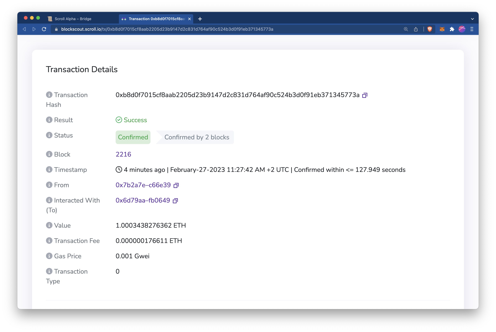

# 从Scroll Alpha 提款至 Goerli

### 使用说明

1. 首先，切换到钱包中的**Scroll Alpha网络。**
2. 在跨链桥应用程序中，确保**Scroll Alpha**在顶部，**Goerli**在底部。您可以点击“ **↓** ”按钮切换位置。
3. 选择您要从 Scroll Alpha 转移到 Goerli 的代币（`ETH`）
4. 如果这是您第一次转移代`ETH`币，您需要 **批准** Scroll Alpha 跨链桥合约才能访问您的代`ETH`币。
5. 接下来，单击 **发送** 按钮进行存款。您的钱包会弹出一个窗口，要求确认转账交易。
6. 转账交易发送并确认后，代币将从您的 Scroll Alpha 钱包中扣除。

### 代币何时会到达您的 Goerli 钱包？

包含此提现交易的 Scroll Alpha 区块被`最终确认(Fianlized)`后，转出的代币将到达您的 Goerli 钱包。在我们的 Alpha 测试网上，一个 Scroll Alpha 测试网区块的最终确定需要几十分钟到几个小时，但我们预计这个时间在主网上会大大缩短。


rollup状态为`Finalized`表明，在 Goerli 链上的有效性证明验证通过，证明了该区块中交易被正确执行。有关rollup状态的更多信息，请参阅[Scroll 的架构概述](https://scroll.mirror.xyz/nDAbJbSIJdQIWqp9kn8J0MVS4s6pYBwHmK7keidQs-k)。


您可以通过以下方式查看提现交易的进度：

1. 单击跨链桥应用程序右上角的钱包地址。

弹出面板列出了您在跨链桥应用程序中进行的最近交易（见下图）。有两种状态：L1 状态和L2 状态。此时，因为我们是从 L2 跨至 L1 ，所以我们在将交易提交到 L2 跨链桥后会很快得到一个 `success`状态。另一方面，L1 需要大约**10 分钟至若干小时**才能到达 `success`状态。

2. 点击最新的 L2 交易哈希

将会在新的标签页显示交易详情，您可以看到此笔交易已经在L2上得到确认，但仍然需要在 L1 上得到最终确认。 

3. 返回[跨链桥](https://scroll.io/prealpha/bridge)应用。一旦您的交易在 L1 上的状态显示`success`，**大约 10 分钟后**，您应该会看到 Goerli 钱包中的资金和交易哈希：

