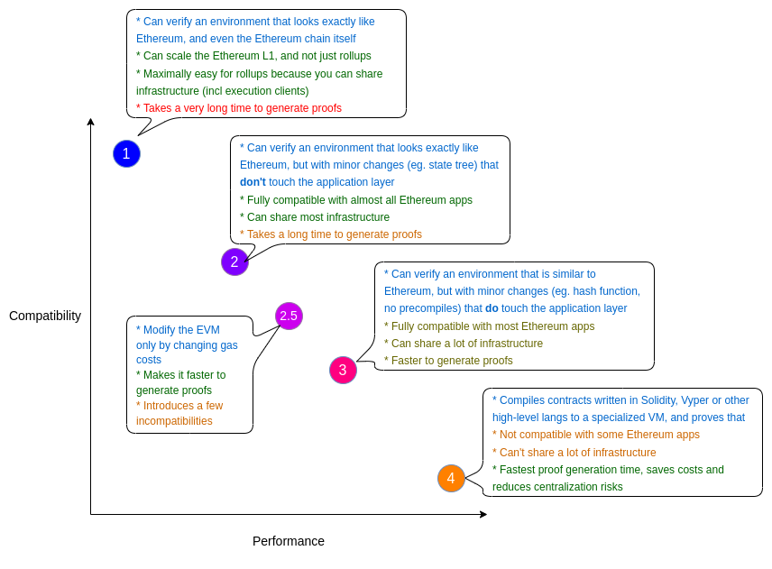

## 介绍

去年夏天，Vitalik 写了[一篇博客，概述了不同类型的 zkEVM](https://vitalik.ca/general/2022/08/04/zkevm.html)  （零知识以太坊虚拟机）。他根据性能和兼容性的权衡来定义它们。

Vitalik 在性能和兼容性之间对 zkEVM的分类

这是一种非常有启发性且有用的分类方法，可以区分支持 zkEVM 的方法。但是，zkEVM 是构建零知识应用程序的所有可能方法的一个子集。对于想要利用 zk 计算的独特属性（即 **简洁性、零知识和正确性**）的程序员来说，zkEVM 可能不是最佳选择。通过布置整套开发人员工具，我希望提供一个指南，帮助您围绕适合您的应用程序的正确 zk 堆栈做出决策。

在过去的一两年中，zk 工具取得了巨大的进步。他们正在接近普通软件开发人员可以利用 zk 的强大属性而无需深入了解令人生畏的底层数学和工程的地步。另一方面，为高级用户提供的工具激增，使 zk 专家能够极其精细地控制 zk 堆栈。

## **抽象复杂性的力量**

现代软件建立在无数的抽象层之上，以最大限度地提高专家的生产力。工程中的抽象有很多优点，有些直观——Web 开发人员不需要深入了解操作系统的工作原理。 

构建良好的、可重用的抽象层的关键是封装层的复杂性，然后为堆栈中的更高层提供简单但富有表现力的接口以供使用。如果处理得当，这使具有不同专业知识和知识领域的开发人员能够跨堆栈构建有用的工具。

毫不奇怪，这些相同的原则适用于 zk 系统，并且这些抽象层变得足够成熟，zk 新手今天就可以开始使用它们并构建应用程序。

zk Stack 在每一层都有一些示例工具/技术

## **底层zk开发**

### **方舟-rs**

[Arkworks-rs](https://github.com/arkworks-rs)是一个 Rust 库生态系统，它提供 zkSNARK 应用程序子组件的高效和安全实现。Arkworks 为开发人员提供了必要的接口来为 zk 应用程序定制软件堆栈，而无需重新实现与其他现有库的共性。

在 Arkworks 之前，创建新的 zk 应用程序的唯一方法是从头开始构建所有内容。Arkworks-rs 相对于定制的垂直集成工具的主要优势在于灵活性水平、重复工程的减少以及审计工作的减少。Arkworks 组件之间合理的接口线允许一定的升级速度，可以在 zk 技术创新的迅猛步伐中保持堆栈的相关性，而无需强迫团队从头开始重建一切。

### **它是给谁的？**

Arkworks 适用于需要对整个 zk 软件堆栈进行精细控制，但又不想从头开始构建所有冗余部分的项目。如果你正在考虑电路 DSL 的自定义版本，例如，你正在制作一个新的证明系统的原型，但不确定承诺方案或相应的椭圆曲线，arkworks 将允许你在具有共享接口的多个选项之间快速切换，而不是而不是从头开始。

**优点**

-   通过模块化实现灵活性
-   减少重复代码
    -   降低工程成本
    -   减少审计/错误表面积
-   无需重大重构即可升级任何组件
-   易于在快速发展的 zk 环境中试验新原语

**缺点**

-   需要深入了解完整的软件堆栈
    -   如果没有正确理解，太多的控制会导致脚枪
-   精细控制需要堆栈所有级别的专业知识
    -   Arkworks 确实提供了一些合理的默认设置。

## **zk 领域特定语言 (DSL)**

为了创建关于某些计算的证明，首先该计算必须以 zkSNARK 系统可以理解的形式表达。一些特定于领域的语言已经创建了允许应用程序开发人员以这种方式表达他们的计算的编程语言。其中包括 [Aztec Noir](https://aztec.network/noir/)、Starknet 的 [Cairo](https://www.cairo-lang.org/)、  [Circom](https://docs.circom.io/)、  [ZoKrates](https://zokrates.github.io/)和 Aleo 的 [Leo](https://leo-lang.org/) 等。底层证明系统和数学细节通常不会暴露给应用程序开发人员。

### **开发者体验**

zkApp 开发人员必须精通使用领域特定语言编写程序。其中一些语言看起来很像熟悉的编程语言，而另一些则可能很难学。让我们分解其中的一些：

[**Cairo——**](https://www.cairo-lang.org/) 在 Starknet 上构建应用程序所必需的 Starkware DSL。编译成 Cairo zkVM 可以解释的特定于 Cairo 的汇编语言。

[**ZoKrates**](https://zokrates.github.io/)  — ZoKrates 是一个满足常见 SNARK 需求的工具包，包括用于编写电路的高级语言。ZoKrates 在曲线、证明方案和后端方面也具有一定的灵活性，允许开发人员通过简单的 CLI 参数进行热交换。

[**Circom**](https://docs.circom.io/)  — Circom 是一种用于构建电路的专用语言。目前，它是生产电路的实际语言。该语言不是特别符合人体工程学。该语言本身使您敏锐地意识到您正在编写电路这一事实。

[**Leo**](https://leo-lang.org/)  ——Leo 被开发为 Aleo 区块链的语言。Leo 有一些类似 Rust 的语法，专门用于区块链内部的状态转换。

[**Noir**](https://aztec.network/noir/)  – 受 Rust 启发的语法。围绕 IR 而不是语言本身构建，这意味着它可以有一个任意的前端。 

值得注意的是，Aztec Noir 编译堆栈具有模块化架构

### **它是给谁的？**

任何想要在其应用程序中利用 zk 的独特属性的应用程序开发人员。其中一些语言已经过数十亿美元通过 ZCash 和 Starknet 等链在它们之间流动的实战测试。虽然我们将讨论的一些项目还没有完全准备好用于生产，但使用其中一种语言编写电路是目前最好的策略，除非您需要像 Arkworks 这样的工具包提供的更精细的控制。

**优点**

-   用户无需了解底层 zk 细节
-   具有一定生产经验的今天可用
-   链上可验证
-   生态系统不可知论者

**缺点**

-   用户需要学习新的 DSL
-   围绕每种语言的孤立工具和支持
-   几乎无法控制底层证明堆栈（目前）

## **zkEVM**

zkEVM 的主要目标是进行以太坊状态转换并使用简洁的零知识正确性证明来证明其有效性。正如 Vitalik 的帖子中提到的，有许多方法可以做到这一点，但有细微的差别和相应的权衡取舍。 

所有这些之间的主要技术差异恰恰是在语言堆栈中将计算转换为可在证明系统中使用的形式（算术）的位置。在某些 zkEVM 中，这发生在高级语言（Solidity、Vyper、Yul）中，而其他方法则试图证明 EVM 一直到操作码级别。Vitalik 的帖子中深入介绍了这些方法之间的权衡，但我将用一句话总结：堆栈中发生的转换/算术化越低，性能损失就越大。

资料来源：[https ://mirror.xyz/msfew.eth/Yl64OK3lLG48eJpVB3GxqFEhmWOm6yMlAo9sc1VrQP4](https://mirror.xyz/msfew.eth/Yl64OK3lLG48eJpVB3GxqFEhmWOm6yMlAo9sc1VrQP4)

### **为什么在 zk 中证明 EVM 操作码的成本很高？**

为虚拟机创建证明的主要挑战是电路的大小与每条执行指令的所有可能指令的大小成比例增长。出现这种情况是因为电路不知道每个程序会执行什么指令，所以它需要支持所有的指令。

在通用电路中，每条执行的指令的成本与所有支持指令的总和成正比。

这在实践中意味着您（以性能成本）为最昂贵的指令付出代价，即使您只执行最简单的指令也是如此。这导致了泛化性和性能之间的直接权衡——当你为泛化性添加更多指令时，你会为  你证明的_每条指令付出代价！_

这是通用电路的一个基本问题，但随着 IVC（增量可验证计算）等[技术的新发展，](https://eprint.iacr.org/2022/1758.pdf) 可以通过将计算分解成更小的块来改善这种限制，每个块都有专门的、更小的子电路。

今天的 zkEVM 实现使用不同的策略来减轻这个问题的影响......例如，zkSync 将更昂贵的操作（主要是密码预编译，如哈希和 ECDSA）从主要执行证明电路中剥离到单独的电路中，这些电路在通过 snark 递归结束。zkSync 在意识到他们的大部分成本来自一些复杂的指令后采用了这种方法。

交易成本主要由少数昂贵的操作决定。

从根本上说，证明 EVM 更等效的指令集成本更高的原因是 EVM 不是为 zk 计算而设计的。放弃堆栈中较早的 EVM 允许 zkEVM 在针对 zk 更优化的指令集上运行，因此证明成本更低。

### **它是给谁的？**

zkEVM 的理想客户是智能合约应用程序，这些应用程序需要比 L1 以太坊上可用的交易便宜几个数量级的交易。这些开发人员不一定具备从头开始编写 zk 应用程序的专业知识或带宽。因此，他们更喜欢用他们熟悉的高级语言编写应用程序，比如 Solidity。 

### **为什么有这么多团队在构建这个？**

**扩展以太坊** 是目前zk技术最需要的应用。

zkEVM 是一种以太坊扩展解决方案，可以无摩擦地缓解限制 L1 dApp 开发人员的拥塞问题。

### **开发者体验**

zkEVM 的目标是支持尽可能接近当前以太坊开发的开发人员体验。完全的 Solidity 支持意味着团队不必构建和维护多个代码库。完美地做到这一点有点不切实际，因为 zkEVM 需要权衡一些兼容性才能在合理的时间内生成合理大小的证明。

### **快速案例研究：zkSync 与 Scroll**

zkSync 和 Scroll 之间的主要区别在于它们在堆栈中的何处/何时执行算术运算——也就是说，它们从普通 EVM 构造转换为 SNARK 友好表示的位置。对于 zkSync，当他们将 YUL 字节码转换为他们自己的自定义 zk 指令集时，就会发生这种情况。对于 Scroll，这发生在最后，当使用实际 EVM 操作码生成实际执行跟踪时。

因此，对于 zkSync，在生成 zk 字节码之前，一切都与与 EVM 交互相同。对于 Scroll，在执行实际的字节码之前，一切都是一样的。这是一个微妙的差异，它以性能换取支持。例如，zkSync 不会像开箱即用的调试器那样支持 EVM 字节码工具，因为它是完全不同的字节码。虽然 Scroll 很难从指令集中获得良好的性能，但这并不是为 zk 设计的。这两种策略各有利弊，最终有很多外生因素会影响它们的相对成功。

## **zkLLVM 电路编译器**

>  尽管命名如此，但 LLVM 并不是 VM（虚拟机）。LLVM 是一组编译器工具的名称，它由与语言无关的中间表示 (IR) 锚定。

=无；Foundation（关于这个名字， 如果您想知道的话，这是一个 [SQL 注入笑话）正在构建一个编译器，可以将任何 LLVM 前端语言转换为可以在 SNARK 中证明的中间表示。](https://xkcd.com/327/)zkLLVM 被设计为现有 LLVM 基础设施的扩展，LLVM 基础设施是一个行业标准工具链，支持许多高级语言，如 Rust、C、C++ 等。

### **怎么运行的**

zkLLVM 架构的草图

想要证明某些计算的用户只需用 C++ 实现该计算即可。zkLLVM 采用其修改后的 clang 编译器（当前为 C++）支持的高级源代码，并生成电路的一些中间表示。此时，电路已准备好进行验证，但用户可能希望根据一些动态输入来验证电路。为了处理动态输入，zkLLVM 有一个称为分配器的附加组件，它生成一个分配表，其中包含所有输入和见证，这些输入和见证已完全预处理并准备好与电路一起进行证明。

这两个组件是生成证明所必需的。理论上，用户可以自己生成证明，但由于这是一项有点专业化的计算任务，他们可能想花钱请拥有硬件的其他人为他们做这件事。对于这种交易对手发现机制，=nil；Foundation 还建立了一个“证明市场”，证明者竞相为支付给他们的用户证明计算。这种自由市场动态将导致证明者优化最有价值的证明任务。

### **取舍**

由于每个要证明的计算任务都是独一无二的，并且会生成不同的电路，因此证明者需要能够处理的电路数量是无限的。这种强制的通用性使得单个电路的优化变得困难。证明市场的引入允许对市场认为有价值的电路进行专业化。如果没有这个市场，由于这种自然的冷启动问题，说服验证者优化该电路将是一项挑战。

另一个权衡是经典的抽象与控制。愿意采用这种易于使用的界面的用户正在放弃对底层加密原语的控制。对于许多用户来说，这是一个非常有效的权衡，因为让密码学专家为您做出这些决定通常更好。

**优点**

-   用户可以用熟悉的高级语言编写代码
-   所有 zk 内部都从用户那里抽象出来
-   不依赖于增加额外开销的特定“VM”电路

**缺点**

-   每个程序都有不同的电路。难以优化。（证明市场部分解决了这个问题）
-   交换/升级内部 zk 库非常重要（需要分叉）  
      
    

## **虚拟机**

zkVM 描述了所有 zk 虚拟机的超集，而 zkEVM 是一种特定类型的 zkVM，由于其在当今的流行，值得作为一个单独的主题进行讨论。除了定制的加密 VM 之外，还有一些其他项目正在致力于构建基于 ISA 的更通用的 zkVM。

系统可以证明不同的指令集架构 (ISA)，例如新 VM 中的 RISC-V 或 WASM，而不是证明 EVM。致力于这些通用 zkVM 的两个项目是 RISC Zero 和 zkWASM。让我们在这里深入研究一下 RISC 零，以演示该策略的工作原理以及它的一些优点/缺点。 

### **零风险**

Risc 零证明生成高层架构

RISC Zero 能够证明在 RISC-V 架构上执行的任何计算。RISC-V 是一种越来越受欢迎的开源指令集架构 (ISA) 标准。RISC（精简指令集计算机）的理念是构建一个极其简单的指令集，复杂度最低。这意味着堆栈中较高层的开发人员最终会在使用此架构实现指令时承担更大的负担，同时使硬件实现更简单。

这种理念也适用于通用计算，ARM 芯片一直在利用 RISC 式指令集，并开始主导移动芯片市场。事实证明，更简单的指令集也具有更高的能量和裸片面积效率。

这个类比非常适合生成 zk 证明的效率。如前所述，在证明 zk 中的执行跟踪时，您需要支付跟踪中每个项目的所有指令成本的总和，因此越简单越少的总指令越好。

### **怎么运行的**

从开发人员的角度来看，使用 RISC Zero 来处理 zk 证明很像使用 AWS Lambda 函数来处理后端服务器架构。开发人员只需编写代码即可与 RISC Zero 或 AWS Lambda 交互，该服务会处理所有后端复杂性。

对于 RISC 零，开发人员编写 Rust 或 C++（最终是任何以 RISC-V 为目标的语言）。然后系统将编译期间生成的 ELF 文件用作 VM 电路的输入代码。开发人员只需调用 prove 即可返回收据（其中包含执行跟踪的 zk 证明）对象，任何人都可以从任何地方调用“verify”。从开发人员的角度来看，无需了解 zk 的工作原理，底层系统会处理所有这些复杂性。

风险零实习生？

**优点**

-   便于使用。为任何程序员打开构建 zk 应用程序的大门
-   证明可专用于的单电路
    -   攻击的表面积也更少，审核也更少
-   与任何区块链兼容，您只需发布证明

**缺点**

-   承担大量开销（证明大小和生成速度）来支持这样的通用接口
-   需要对证明生成技术进行重大改进，以实现对现有库的广泛支持  
      
    

## 预制可重复使用电路

对于一些对区块链应用程序或其他地方特别有用的基本和可重用电路，团队可能已经为您构建和优化了这些电路。您可以只为您的特定用例提供输入。例如，Merkle 包含证明是加密应用程序（空投列表、Tornado Cash 等）中通常需要的东西。作为应用程序开发人员，您始终可以重复使用这些经过实战考验的合约，只需修改顶部的层即可创建独特的应用程序。

例如，Tornado Cash 的电路可以重新用于 [私人空投应用程序](https://github.com/a16z/zkdrops) 或 [私人投票应用程序](https://github.com/BlockchainCap/zk-vote)。Manta 和 Semaphore 正在构建一个完整的工具包，包括像这样的通用电路小工具，可以在 Solidity 合约中使用，而无需了解或不了解底层的 zk moon 数学。

## **指南——选择你的堆栈**

正如详细讨论的那样，开发 zk 应用程序有无数不同的选择，所有这些都有自己独特的权衡。此图表将帮助总结此决策矩阵，以便根据您的 zk 专业知识水平和性能需求，您可以选择最适合该工作的工具。这不是一个完整的列表，我计划在未来添加到这个列表中，因为我意识到这个领域会出现更多的工具。

zkGalaxy 应用开发者指南

## zk 应用开发速查表

## **1. 低级 Snark 库**

**何时使用：** 

-   您需要对整个证明堆栈进行精细控制
-   想要避免重建公共组件
-   您想尝试证明方案、曲线和其他低级原语的不同组合

**何时不使用：**

-   您是寻找高级证明接口的新手

**选项：** 

-   [方舟-rs](https://github.com/arkworks-rs)

---

## **3. zk 编译器**

**何时使用：** 

-   不愿意承担通用电路的开销
-   想用熟悉的语言编写电路 
-   需要高度定制的电路

**何时不使用：** 

-   想要控制底层加密原语
-   需要一个已经高度优化的电路

**选项：**

-   [无 zkLLVM](https://github.com/NilFoundation/zkllvm)

---

## **5. 零知识虚拟机**

**何时使用：** 

-   想用高级语言写代码 
-   需要证明这次执行的正确性 
-   需要向验证者隐藏此执行的一些输入
-   对 zk 几乎没有专业知识

**何时不使用：**

-   在极低延迟的环境中（它仍然很慢）
-   你有一个庞大的程序（目前）

**选项：**

-   [RISC 零](https://www.risczero.com/)
-   [zkWASM](https://delphinuslab.com/zk-wasm/)

## **2. zk DSL**

**何时使用：** 

-   您可以轻松学习一门新语言
-   想使用一些久经考验的语言
-   需要最小的电路尺寸，愿意放弃抽象

**何时不使用：** 

-   需要对证明后端进行精细控制（目前，可以为某些 DSL 交换后端）

**选项：**

-   [西尔康](https://docs.circom.io/)
-   [阿兹特克黑](https://aztec.network/noir/)
-   [开罗](https://www.cairo-lang.org/)
-   [佐克拉特斯](https://zokrates.github.io/)
-   [狮子座](https://leo-lang.org/)

---

## **4.zkEVM**

**何时使用：** 

-   你有一个已经在 EVM 上运行的 dApp
-   您需要为用户提供更便宜的交易 
-   您希望将部署到新链的工作量降到最低
-   只关心zk（压缩）的简洁性

**何时不使用：** 

-   您需要完美的 EVM 等效性
-   你需要 zk 的隐私属性 
-   您有一个非区块链用例 

**选项：** 

-   [zksync2.0](https://zksync.io/)
-   [多边形 zkEVM](https://polygon.technology/)
-   [滚动](https://scroll.io/)
-   [星网](https://starkware.co/starknet/)

---

## **6.预建可重复使用的电路**

**何时使用：** 

-   您有一个智能合约应用程序依赖于常见的 zk 构建块，例如 Merkle inclusion
-   你对底层 zk 东西几乎没有专业知识

**何时不使用：**

-   您有高度专业化的需求
-   预建电路不支持您的用例 

**选项：** 

-   [曼塔网络](https://github.com/Manta-Network)
-   [信号](https://semaphore.appliedzkp.org/)

## **结论**

zk 处于多项技术的前沿，构建它需要对数学、密码学、计算机科学和硬件工程有深刻的理解。然而，随着每天都有越来越多的抽象层可用，应用程序开发人员无需博士学位即可利用 zk 的强大功能。随着时间的推移，通过对堆栈的所有级别进行优化，证明时间的限制会逐渐解除，我们可能会看到针对普通开发人员的更简单的工具。

我希望我说服了你，好奇的软件开发人员，你今天可以开始在你的应用程序中使用 zk。快乐黑客 

你还在等什么，快去构建一些 zk 应用程序

---

**披露：** _Blockchain Capital 是上述几个协议的投资者。_

_每篇博文中表达的观点可能是每位作者的个人观点，并不一定反映 Blockchain Capital 及其关联公司的观点。Blockchain Capital 和作者均不保证每篇博文中所提供信息的准确性、充分性或完整性。Blockchain Capital、作者或任何其他人未就任何博客文章中包含的信息的准确性、完整性或公平性作出或提供任何明示或暗示的陈述或保证，并且不承担任何责任或义务对于任何此类信息。每篇博文中的任何内容均不构成投资、监管、法律、合规或税务或其他建议，也不应作为投资决策的依据。博客文章不应被视为当前或过去的建议或招揽购买或出售任何证券或采用任何投资策略的要约。博客文章可能包含预测或其他前瞻性陈述，这些陈述基于可能因许多可能事件或因素而改变的信念、假设和期望。如果发生变化，实际结果可能与前瞻性陈述中表达的结果存在重大差异。所有前瞻性陈述仅在作出此类陈述之日起生效，除法律要求外，Blockchain Capital 和每位作者均不承担更新此类陈述的任何义务。如果任何博客文章中引用了由 Blockchain Capital 制作、发布或以其他方式分发的任何文件、演示文稿或其他材料，_