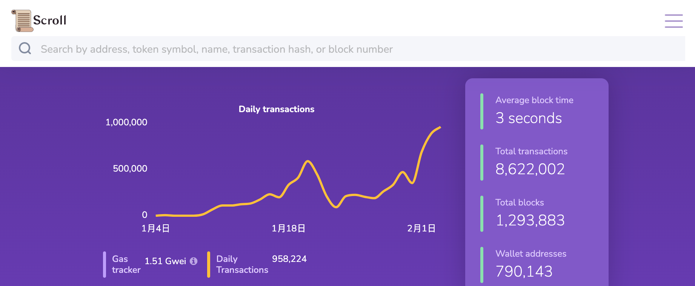
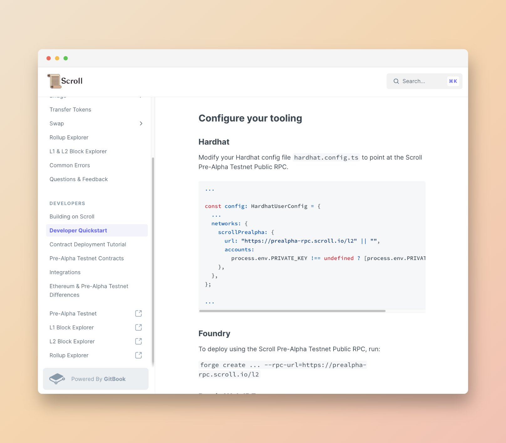

在过去的两年中，Scroll团队一直致力于构建字节码层面兼容的zkEVM。为了进一步提升社区的信息透明度，之后我们将定期发布每周更新，让社区更了解我们当前的进展。

# Pre-Alpha测试网

## 测试网现状
- 自1月9日Pre-Alpha测试网重置以来，用户数据和交易流量有了大幅跃升。
- 截至2023年2月5日00:00，Pre-Alpha测试网共有约790,143钱包地址，处理了约8,615,061笔用户交易，生成了1,293,481个区块，平均区块时间约为3秒。
- 同时我们在跨链桥的v2版本已经取得了一些进展，相信会带来更丝滑的用户体验。

## Uniswap v3实例
- 在经过Uniswap DAO的Temperature Check阶段投票后，我们希望得到社区的反馈，并将Uniswap带给更多的用户。
- 我们部署了 Uniswap v3的实例，可以方便用户和开发者进行交互体验.
- 交互页面：[https://uniswap-v3.scroll.io](https://t.co/3zYGpoxD3v)
- 合约地址
	- Core Factory: `0x3949b9b7506971CF87B8Cf21137BCB85939Fa24D`
	- NFT Position Manager: `0x569c5BcB406efC68Ea22C028058554488bfE50dd`
	- Router: `0xA207aF0eB6E87403A691f3112A4d49FC1CCd647A`
	- 更多合约地址详见：[https://guide.scroll.io/developers/pre-alpha-testnet-contracts](https://guide.scroll.io/developers/pre-alpha-testnet-contracts)

## Goerli测试网预告
后续部署在Goerli测试网的系统已经准备完毕，更多的细节将在未来公布。

# 技术架构
## 证明者网络
- 我们正在将系统的配置要求尽可能得降低，以实现去中心化证明者网络的民主化。
- 因为在ZK架构上取得了较大进展，我们将证明者的配置要求降低了近68%，memory要求从870GB降低到了275GB。

## 批处理
- 先前无论区块内包含多少笔交易，测试网为每一个L2区块单独生成一个证明。
- 在我们最新的批处理系统，区块将被聚合成Batch，Batch将提前预估Gas消耗动态调整，以在Batch中容纳尽可能多的区块。未来，我们将通过预估操作码来进一步提升效率。
- 在每一个Batch被填充满后，Batch的数据将被提交给L1。随后，证明者将提交Batch的证明，Batch中的所有区块将得到验证。
- 这一升级将提升证明者的资源利用效率，尤其是在区块空间需求比较低的情况下。
- 在ZK领域仍有许多可以优化的空间，我们将在各个方面，持续迭代升级我们的设计。

# 开发者关系

## 基础设施
- 开发者方面，我们正在为开发者提供更多的基础设施支持，The Graph(@graphprotocol) 即将支持Scroll网络。

## 开发者文档
- 我们的开发者文档已经进行了全面升级，你可以在其中([http://guide.scroll.io](http://guide.scroll.io))找到：
	- 用户文档
	- 水龙头，跨链桥和Rollup的细节
	- 全新的开发者指南
	- 合约部署教程
	- 现有内容的整合

# 以太坊社区
## 研究：账户抽象
- 一流的开发者体验与一流的用户体验一定是相伴相随的，这就是我们深入研究账户抽象的原因。
- 关于账户抽象，推荐阅读[@camiinthisthang](https://twitter.com/camiinthisthang)的文章：

## ETH Denver
- Scroll是ETH Denver的赞助商，也将在现场亮相，如果你打算在2.24~3.5期间前往科罗拉多，欢迎来到我们的展位与我们交流。

## Gitcoin资助
对于生态发展非常关注，一直致力于发掘并支持优秀的生态项目，因此参与了本轮[@gitcoin](https://twitter.com/gitcoin)的Alpha Grants，该轮专注于资助以太坊生态发展和开源软件。
Scroll本轮支持了如下的项目
1. [@EthereumOnARM](https://twitter.com/EthereumOnARM)
	- 针对ARM定制Linux镜像，提供即插即用的ARM工具，它以Systemd服务的形式运行Ethereum客户端，并自动将这类设备变成完整/稳定的Ethereum节点，从而为#Ethereum网络的去中心化做出贡献。
	- 详细文档：https://ethereum-on-arm-documentation.readthedocs.io/en/latest/
2. [@beaconcha_in](https://twitter.com/beaconcha_in)
	- 开源的Ethereum explorer，为以太坊信标链提供了一个全面和易于使用的界面，让用户在信标链的体验变得便捷。
3. [@rotkiapp](https://twitter.com/rotkiapp)
	- 通过开源将透明度引入加密货币和金融领域，它是一个开源的投资组合跟踪、分析、会计和税务报告工具，同时为用户的隐私保驾护航！
4. [@blockscoutcom](https://twitter.com/blockscoutcom)
	- 多链、高度可配置和开源的浏览器，，作为新一代以太坊区块链浏览器，为用户提供了多元化的数据。
5. [@EthMagicians](https://twitter.com/EthMagicians)
	- 加密社区论坛，任何人都可以加入，创建话题并讨论关于EIP和以太坊生态系统等技术话题。
6. [@wagmi_sh](https://twitter.com/wagmi_sh)
	- React Hook 集合，包含了开发者&用户与以太坊交互所需的一切。
7. [@buidlguidl](https://twitter.com/buidlguidl)
	- 开发者，为现有的以太坊开发者创造有价值的教程、软件和产品，同时也培养了一个很强大的开发者社区。
8. [@l2beat](https://twitter.com/l2beat)
	- 专业的#L2 分析和研究平台
9. [@SomerEsat](https://twitter.com/SomerEsat)
	- 开发者，使用其编写的指南可以更轻松地设置验证器。
10. [@defillama](https://twitter.com/DefiLlama)
	- DeFi 数据追踪，提供了出色的仪表盘。
11. [@ethStaker](https://twitter.com/ethStaker)
	- 作为以太坊质押的前行者，提供了质押指南和信息的绝佳资源。

