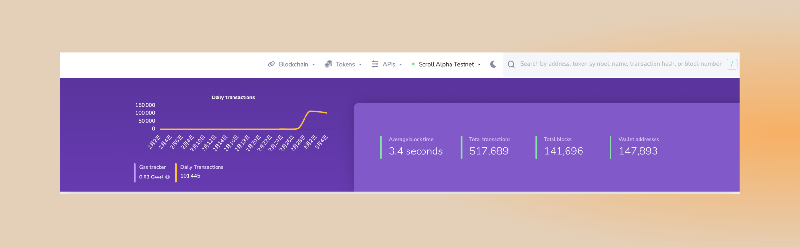
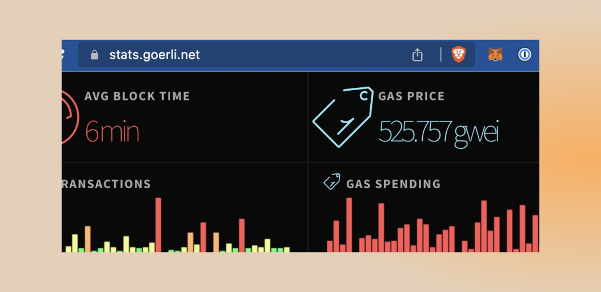
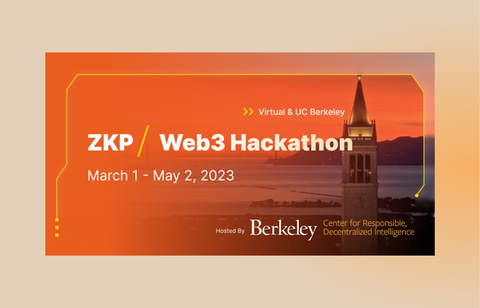
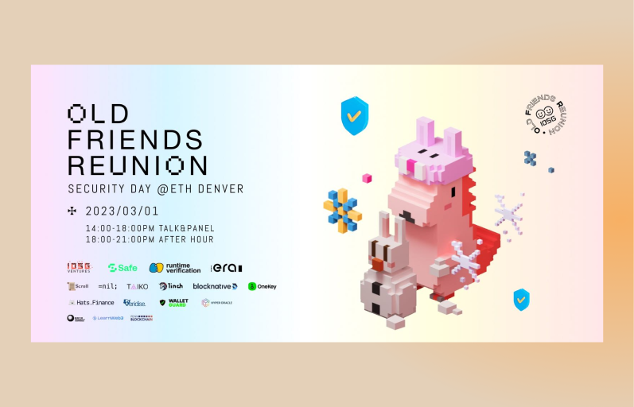
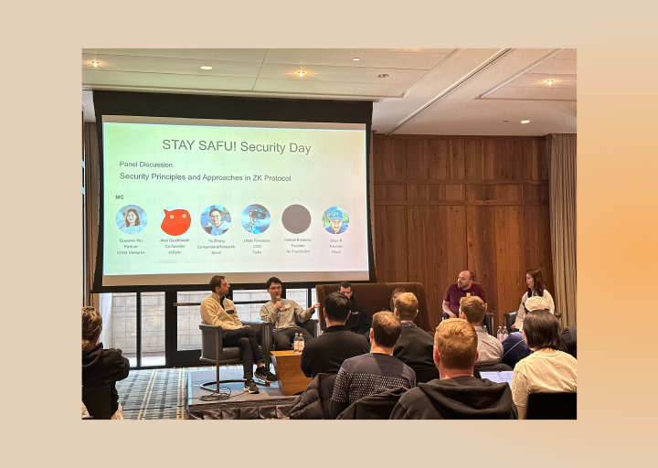
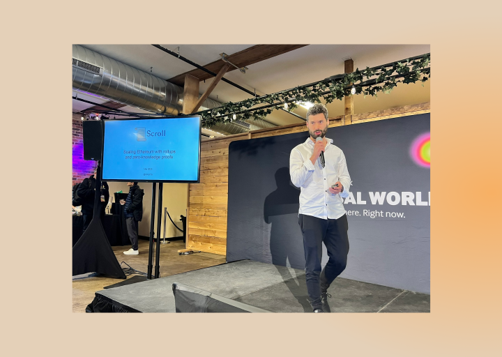

# Alpha测试网

## 测试网现状
- 本周Alpha测试网上线以来，截至 2023 年 3 月 5 日 10:00，Alpha测试网共有约 147,893 个钱包地址，处理了约 517,689 笔用户交易，生成了 141,696 个区块，平均区块时间约为 3.4 秒。

- 感谢大家对我们测试网的关注。我们正在努力维护它，即使 Goerli 的 Gas 已经到了 500 gwei！

 

## Guild公会
- 为了庆祝 ETHDenver #BUIDLathon ，我们创建了Scroll的公会: https://guild.xyz/scrollzkp 。赶紧加入，参与社区活动，会有神秘角色出现！
- 加入方式：连接Twitter，Wallet
	- Twitter账号要求：
		- 注册时间：2022/10/1之前
		- 关注 @Scroll_ZKP

# 合作
## ZKP | Web3 Hackathon
- Scroll 赞助了 ZKP / Web3 黑客松活动，本次活动由 Berkeley [RDI主办，并与](https://rdi.berkeley.edu/)[ZKP MOOC](https://zk-learning.org/) （全球约有 3500 人注册）合作，旨在汇集所有学生、研究人员和从业者，以建立和展示他们在 ZKP 中的创新工作，发展 ZKP 社区，并推进 ZKP 技术。本次活动向公众开放，并在加州大学伯克利分校以线上和面对面的方式举行。共分为四个赛道
	- zk应用：任何开发人员都可以在不同领域使用 ZKP 构建和展示创新应用程序。
	- zk跨链桥：通过去中心化社区协作，使用 ZKP 为多链互操作性构建安全通用的基础。
	- zk电路：通过去中心化的社区协作优化和改进常用电路。
	- zk基准测试：构建一个统一的 ZKP 基准测试框架，具有用于集成不同组件、ZKP 框架和工作的标准化接口，使任何人都可以在实践中促进对 ZKP 性能的理解和改进。
- 报名链接： https://rdi.berkeley.edu/zkp-web3-hackathon/#

## Ecorave
- Scroll 赞助了由 ECODAO和 Developer DAO 举办的Ecorave活动，本次活动的所有收入都将捐给 Rainforest Foundation US

# 以太坊社区

## ETHDenver
**Scroll展位**
- 如果你在ETHDenver，欢迎来 Scroll 的展位与我们交流，我们正在赠送Scroll的 T恤和贴纸

**zkDay圆桌**
- 在zkDay的zk(E)VMs圆桌环节，Scroll 的联合创始人张烨，同Modulus Labs的CFO/CTO，Verdise的联合创始人，Eclipse的联合创始人，探讨了的 zk(E)VM 所带来的链上扩容和安全问题。

**Layer 2 Day圆桌: Defining Rollup Finality**
- Scroll的开发者关系工程师 Daniel Helm在Layer 2 Day的圆桌中，同其他嘉宾探讨了 rollup 的最终确认问题。

- 现场图

**Layer 2 Day圆桌: Alternate VMs vs EVM**
- Scroll的联合创始人 Haichen Shen 在Layer 2 Day的圆桌中，同来自 Fuel Labs，Starkware，Eclipse，Arbitrum的其他嘉宾，一起探讨了对比其他虚拟机和EVM的话题。

**Security Day圆桌：STAY SAFU!**
- 在Security Day的STAY SAFU!圆桌环节，Scroll 的联合创始人张烨同 zkSync 的联合创始人, Taiko的COO, Nil Foundation的创始人, Risc0的创始人，探讨了在零知识协议中的安全原则和解决方案。

- 现场图

**Devtopia Stage: Scroll构建zkEVM和zk Rollup的挑战**
- 在Devtopia舞台上，Scroll的联合创始人发表了主题为 Scroll 构建 zkEVM 和 zk Rollup 的挑战的演讲，并同步了最新 Alpha 测试网的情况。
- 现场图

**R3al World：Scroll扩容以太坊**
- 在R3al World的活动现场，Scroll基础设施工程师 Orest Tarasiuk，发表了主题为Scroll扩容以太坊的演讲
- 现场图

**Scroll x Antalpha Labs 中文开发者线下聚会**
- 在 Antalpha Labs 的 Hacker house，Scroll 联合举办了小型的线下聚合，团队成员和 ETHDenver 现场的中文开发者进行了深入密切的交流。
- 现场图

## Danny Ryan：反思以太坊

